```{r setup, include=FALSE}
## libraries
library(learnr)
library(tidyr)
library(dplyr)
library(ggplot2)
library(scales)
library(RMariaDB)
library(DBI)
library(pool)


### FILL IN YOUR DATABASE DETAILS HERE ###

################################################################################

pool <- dbPool(
  drv = RMySQL::MySQL(), ## Check that this corresponds to the type of database you are using (MySQL/MariaDB, etc.)
  dbname = "YOUR DATABASE NAME",
  host = "DATABASE IP", 
  username = "USERNAME", ## Make sure the user has read & write rights for the selected database
  password = "PASSWORD"
)

dbtable = "THE TABLE YOU WANT TO STORE QUIZ/EXERCISE DATA IN FOR THIS MODULE"
################################################################################

select_query = paste("SELECT * FROM", dbtable)

## options
knitr::opts_chunk$set(echo = TRUE)
tutorial_options(exercise.eval = FALSE, exercise.checker=FALSE)

## recording data
new_recorder <- function(tutorial_id, tutorial_version, user_id, event, data) {
    cat(user_id, ", ", event, ",", data$label, ", ", data$answer, ", ", data$correct, "\n", sep = "", append = TRUE)
  
d_tibble <- tibble::tibble(
user_id  = user_id, 
event = event,
label = data$label,
correct = data$correct,
question = data$question,
answer = data$answer
  )

## send to mysql
dbWriteTable(pool, "module12", d_tibble, append=TRUE, row.names = FALSE)}

options(tutorial.event_recorder = new_recorder)

## EXCERCISE SETUP


```

## Introduction

```{r, echo=FALSE, out.width="100%", fig.align = "center"}
## HEADER ###
HTML("  <div class='jumbotron jumbotron-fluid'>
    <div class='container'>
    <h2 class='mb-3' style='color:rgba(31, 56, 100, 0.85);'><u>Introduction</u></h2>
    <h4 class='mb-3'>Statistics for CSAI II</h4>
    <h6 class='mb-3'>Travis J. Wiltshire, Ph.D.</h6>
    </div>
  </div>")
```

### Outline

What we will cover today:

1. Course Expectations
2. R, Rstudio
3. Probability Basics

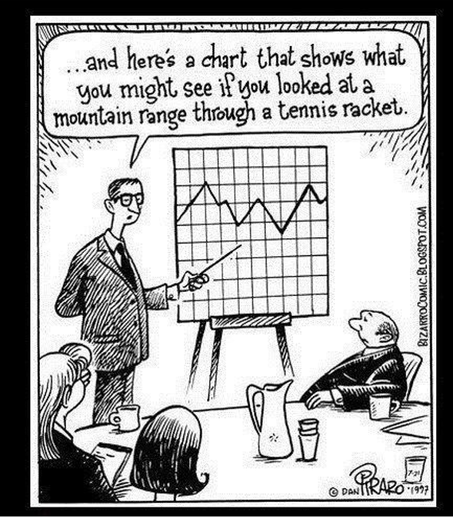

### About Me

- B.S. in **Psychology**, University of Central Florida, USA
- M.S. in **Human Factors & Systems**, Embry-Riddle Aeronautical University, USA
- PGC in **Cognitive Science**, University of Central Florida, USA
- Ph.D.  in **Modeling & Simulation**, University of Central Florida, USA
- Postdoctoral Fellowship, **Quantitative Psychology and Dynamical Systems**, University of Utah, USA
- Postdoctoral Fellow,  Carlsberg Foundation,  Department of Language and Communication, SDU, DK


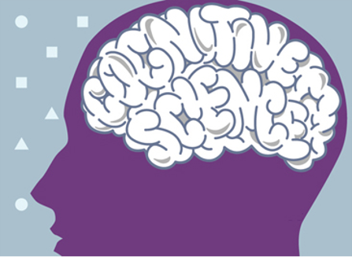
 
### About me
     


**Dr. Steve M. Fiore:**


 | 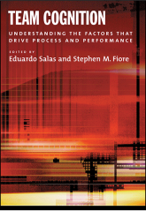
     
**Dr. Jonathan Butner**
    
 | 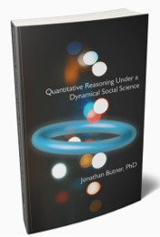

### Research interests

- **Research Interests:** 
  - Team cognition and dynamics
  - Collaboration
  - Interpersonal coordination
  - Social cognition and interaction
  - Complex systems
  - Quantitative methods and statistical modeling
  - Learning and training science

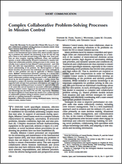 | 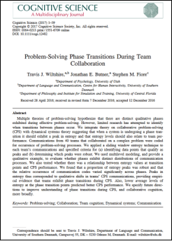
     
 | 

### Personal interests

- **Personal interests:** 
  - Music
  - Outdoors/Photos
  - Culture and travel
  
 |  | 

### Dr. Silvy Collin


- BSc in Biology (Radboud Univ. Nijmegen)
- MSc in Medical Biology / Neurobiology (Radboud Univ. Nijmegen)
- PhD in Cognitive Neuroscience/Neuroimaging (Donders Institute)
- Postdoctoral researcher in Cognitive Neuroscience at Princeton University
- Assistant Professor at TiU since August 2020


**Research:** Already in my BSc I had an interest in both biology and psychology. Cognitive Neuroscience/neuroimaging has both of these represented which is why I chose that field. I study memory, and in particular episodic memory, using cognitive tasks and functional MRI. I find it intriguing to discover how people remember the world around them and their experiences, and how they learn from it. 

**Personal:** In my spare time I enjoy reading, pretty much anything from detectives to romance to sci-fi, and I like to bake, cakes, cookies, etc :)

## Course Expectations

### Course Expectations

- Read the Syllabus!
- Follow the course schedule. 

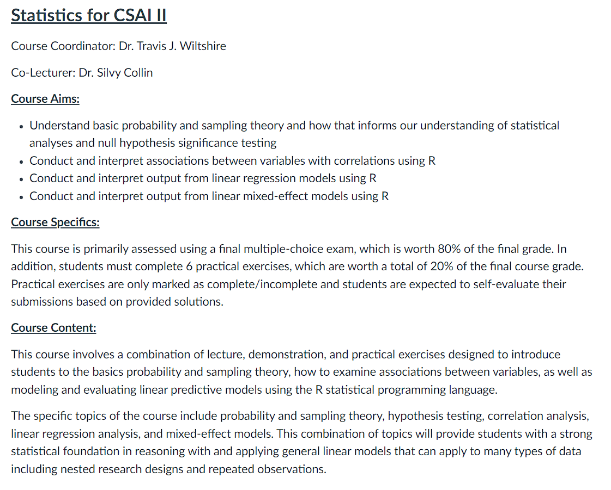

### Course Expectations


- 6 EC course:
  - 29 hours per EC
  
| **Total hours for course**  | **168**   | 
| ----------------- |:-------------:|
| Time in Lecture   | 21           | 
| Time in Practical Sessions               | 10         | 
| Time for reading        | 45    | 
| Time for practicing in R          | 40  | 
| Time for Completing Practical Assignments| 22   | 
| Time to prepare for Exams  | 30        |

### How to spend your time

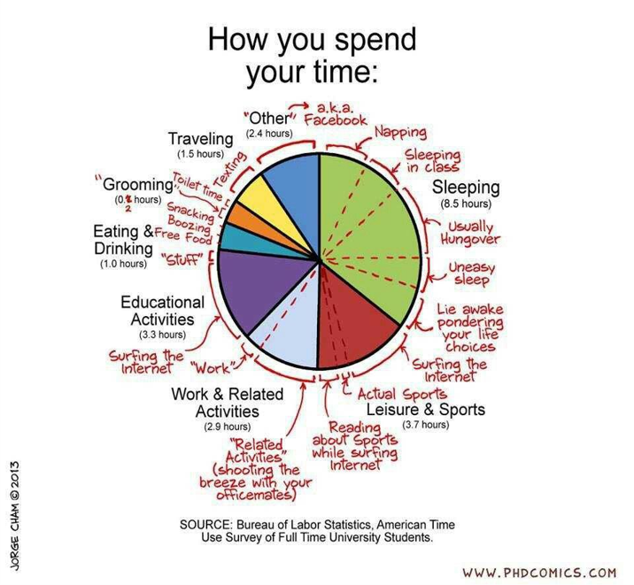


### How to get the most from this course (and be good at statistics in the future):

- To get the most out of this course, I recommend for each topic/module you:
  - Read the Required Text
  - Complete Swirl/LearnR Tutorials
  - Complete Pre-Class Quizzes
  - Attend/Watch Lectures
  - Engage in in Class Exercises
  - Check your Understanding (Reread if necessary, post questions on Canvas)
  - Complete Required Practical Exercises
  - Evaluate Practical Exercise Solutions (Post questions on Canvas, ask Questions in Practical Sessions)
  - (Optional) Complete Associated Open Stats Lab)

- Dunlosky, J., Rawson, K. A., Marsh, E. J., Nathan, M. J., & Willingham, D. T. (2013). Improving students’ learning with effective learning techniques: Promising directions from cognitive and educational psychology. Psychological Science in the Public Interest, 14(1), 4-58.


### Course Expectations

- Our Textbook is free!
  - Download it from here: https://compcogscisydney.org/learning-statistics-with-r/
  
- Other reading materials are uploaded on Canvas.

**<u>Required readings must be completed before class on the date listed in the schedule!</u>**

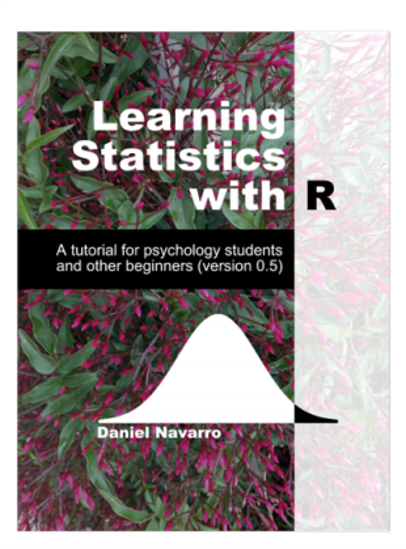

### Practical Exercises

- 6 exercises on Canvas and self-evaluated
- Must be submitted on Canvas
- Will be checked for completeness/valid attempt by our student assistants 
- No resubmission or resits
- Discussed during practical sessions 
- Practical Sessions (more details soon) 

### Course Learning Objectives

- Understand basic probability and sampling theory and how that informs our understanding of statistical analyses and null hypothesis significance testing
- Conduct and interpret associations between variables with correlations using R
- Conduct and interpret output from linear regression models using R
- Conduct and interpret output from linear mixed-effect models using R


### Course expectations

- Course meeting time/location: See My Timetable, location and time can vary. 
- Practical Session: Typically on Fridays.


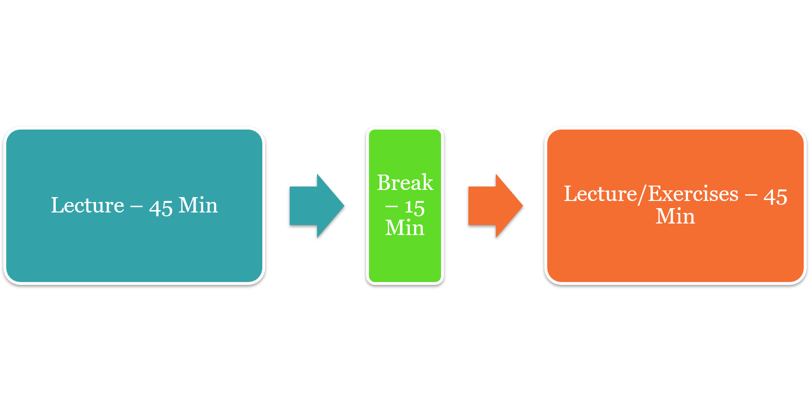

### Course Expectations

- Canvas
  - All course information and materials will be posted here
  - Submitting Practical Exercises
  - Your grades from exams will be posted here first (These are unofficial)
  - Questions should be primarily through practical sessions or in class, but can be posted on Canvas.


### Course Expectations

- **Exams (80% of your grade)**
  - Final – 80%
  - Multiple choice*
  - **<u>Date and times for exams and resits will be posted in your time table</u>**
  - **<u>You must make sure to register for the exams!</u>**

- **Practical Exercises (20% of your grade)**
  - 6 assignments submitted through Canvas 
  - Deadlines are listed in syllabus and will be in the assignments section of Canvas
  - No extensions
  - Will be checked for completeness by our student assistants

- **Recommended Exercises (in LearnR)**
  - Listed in schedule 


### Course Expectations

- **Preferred question time is during the practical sessions. **
- **Questions about statistical theory or analyses:** 	
  - Check the syllabus, the required readings, or in the lecture slides. 
- **Questions about R Programming: **
  - Can’t help much when your R code/script does not work. 
  - Use Google, GitHub, StackOverflow, and the built-in help functions to figure out your code. 
  - Form peer groups to learn from each other and check each other’s code. 
- **Questions during Class: **
  - I encourage questions in class. Before, after, during practical sessions

### Semester Plan 

**Semester Plan is in Canvas**


## R, R studio

### Make sure R, R studio, and Swirl are working on your computers!

- Go here and follow the directions:
  - 
  - https://swirlstats.com/students.html (Do we still use swirl?)

**Complete the required reading! **

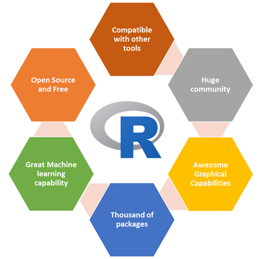

### Where are we going in this course?

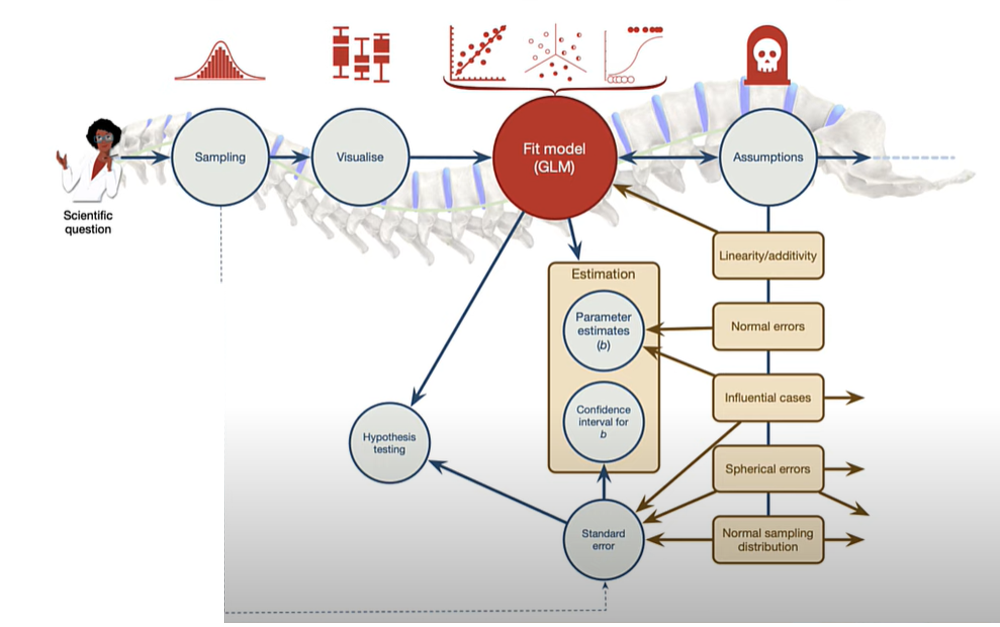

### Questions?

**Asking questions in encouraged**

## Quiz

### What do you remember from stats I?

### Question 1

```{r Quiz1,  echo=FALSE}
question("If I measure your knowledge of statistics before and at the end of the course, and I wan't to see if you improved, what would be an appropriate test to make this comparison?",
    answer("Factorial ANOVA"),
    answer("Paired-samples t-test", correct = TRUE),
    answer("Chi-square"),
    answer("Independent samples t-test"),
    answer("Correlation"),
    incorrect = "Hint: Try again, you can pick another answer!",
    allow_retry = TRUE
    )
```

### Results

#### 1. If I measure your knowledge of statistics before and at the end of the course, and I wan't to see if you improved, what would be an appropriate test to make this comparison?

```{r, Quiz1O, echo = FALSE}
plotOutput("Q1")
```

```{r, Quiz1R, context="server", echo = FALSE, warning = FALSE, message=FALSE, out.width="100%", fig.align = "center"}
output$Q1 <- renderPlot({
  
  data <- dbGetQuery(pool, select_query)
  answers <- subset(data, data$label == "Quiz1",)
  answers[answers==""] <- NA
  answers <- na.omit(answers)

  answers_count <- as.data.frame(answers %>% 
  count(answer))
  total_n = nrow(answers)
  answers_count$percentage <- (answers_count$n/total_n)*100
  answers_count$correct <- ifelse(answers_count$answer == "Paired-samples t-test", "Correct", "Incorrect")

  ggplot(answers_count,
         aes(x = percentage,
             y = answer,
             fill=correct
             )
         ) +
    geom_col(width=0.6) +theme_minimal() + scale_fill_brewer(palette="Paired", direction=-1)  +
    xlab("Percentage (%)") + ylab("Answer") + labs(fill = "Correct")
})
```


### Question 2

```{r Quiz2,  echo=FALSE}
  question("When would you apply a Bonferonni correction?",
    answer("The dependent variable is non-normal"),
    answer("The independent variable is highly skewed"),
    answer("To control for making multiple comparisons", correct = TRUE),
    incorrect = "Hint: Try again, you can pick another answer!",
    allow_retry = TRUE
    )
```

### Results

#### 2. What is the common goal of doing empirical work utilizing statistics in CSAI?

```{r, Quiz2O, echo = FALSE}
plotOutput("Q2")
```

```{r, Quiz2R, context="server", echo = FALSE, warning = FALSE, message=FALSE, out.width="100%", fig.align = "center"}

output$Q2 <- renderPlot({
  
  data <- dbGetQuery(pool, select_query)
  answers <- subset(data, data$label == "Quiz2",)
  answers[answers==""] <- NA
  answers <- na.omit(answers)

  answers_count <- as.data.frame(answers %>% 
  count(answer))
  total_n = nrow(answers)
  answers_count$percentage <- (answers_count$n/total_n)*100
  answers_count$correct <- ifelse(answers_count$answer == "To control for making multiple comparisons", "Correct", "Incorrect")

  ggplot(answers_count,
         aes(x = percentage,
             y = answer,
             fill=correct
             )
         ) +
    geom_col(width=0.6) +theme_minimal() + scale_fill_brewer(palette="Paired", direction=-1)  +
    xlab("Percentage (%)") + ylab("Answer") + labs(fill = "Correct")
})
```


## Probability Basics

### Taco Literacy

- What if I told you a recent survey of 1000 Europeans showed that  72% of people were taco illiterate? 
  - 720 out of 1000 did not understand the important anatomical components and historical lineage of tacos. 
  - Would you expect 72% if you were to sample 10,000 Europeans? 
  - What if we found the number went down to 43%? 

- https://tacoliteracy.com/

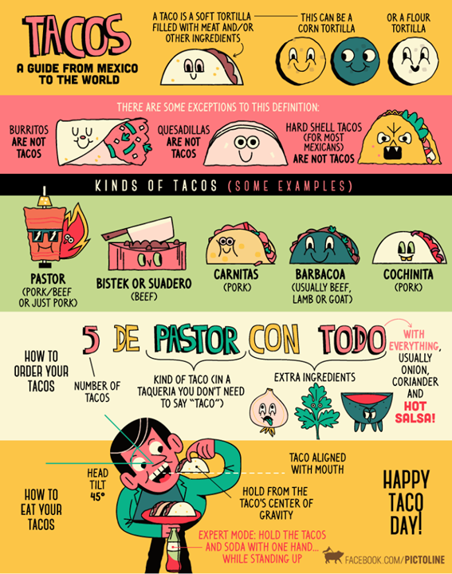


### Why do we need probability theory? 


- We use inferential statistics to answer questions about how representative our data are of  the population
- The core of the science 
- Probabilities form the basis for statistical inference. 

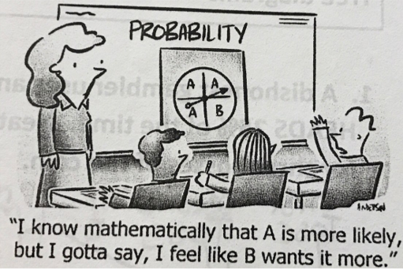


### Probability vs Statistics


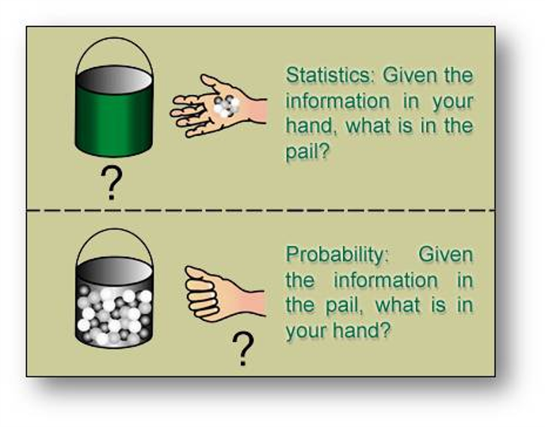

### Frequentist vs Bayesian view

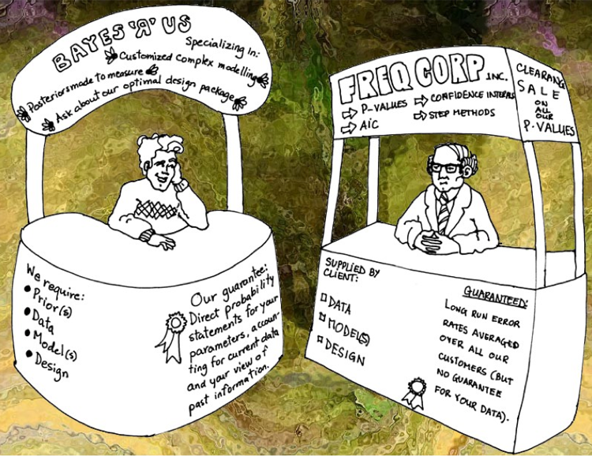

### Probability Distributions


- Elementary events – For a given observation, the outcome will be one and only one of these events. 
- Sample space – the set of total possible events

- P(X) = 0-1

- <u>Sum of all probabilities is 1</u>

- Non elementary events
  - E.g. wearing jeans
  - P(E)= P(X1)+ P(X2)+ P(X3)

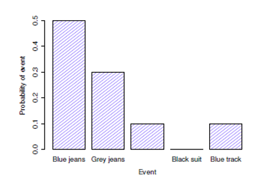
     
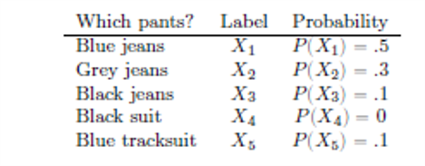
     
### Binomial distribution


- Based on $\theta$ **success probability** 
  - E.g., number of successful tails in a coin flip, number during a dice roll
- N = number of observations or size parameter
- X is generated randomly from the distribution

$$P(X|\theta,N)$$

$$X \sim Bionomial(\theta,N)$$

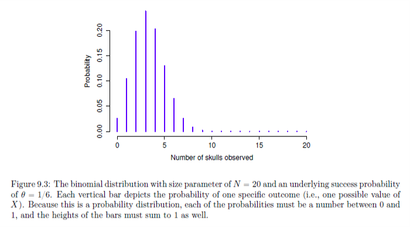


### Binomial Distribution in R

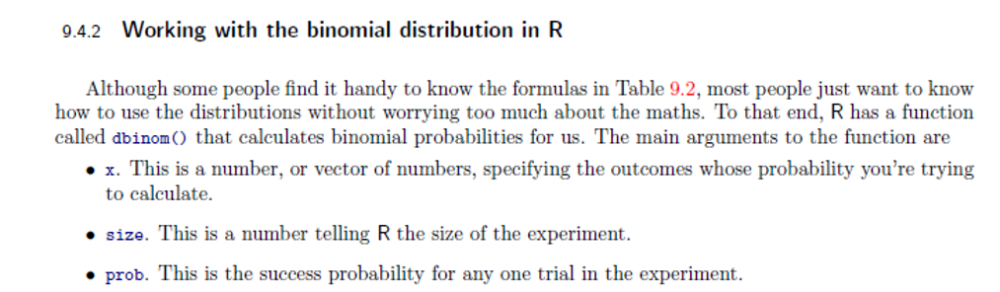


```{r}
dbinom(x=4,size=20, prob=1/6)

```     


| What it does   | Prefix   | Normal distribution  | Binomial distribution |
| ----------------- |:-------------:|:-----:|--------|
| probability(density) of  | d      | `dnorm()`    | `dbinom()` |
| cumulative probability of  | p         | `pnorm()` | `pbinom()` |
| generate random number from | r        | `rnorm()` |  `rbinom()` |
| quantile of      | q  | `qnorm()` | `qbinom()` |


### Visualize the binomial distribution:

```{r ex11, exercise=TRUE}
dbinom(x=4,size=20, prob=1/6)

```
```{r ex11-hint}
#run the code
x <- seq(0,50,by=1) #Generate a series of values 0-50
y <- dbinom(x,50,prob=1/2)
plot(x,y, type='h', col='blue')

```
```{r ex11-check}
#store
```

### Give it a try:

1. If I request 50 tacos from a restaurant that serves both hard shell and soft shell tacos, what is the probability that 25 of them are soft shell?

2. I want to have a pizza party and order 20 pizzas. Pizzas can either have meat on them or not meat. What is the probability that 6 of the pizzas are vegetarian friendly? 

3.  I spend too much time trying to pick a movie to watch on Netflix so I create a program to choose something for me at random. I only allow my program to choose the following genres: comedy, action, sci-fi, drama, or thriller. If I watch 50 movies using my program, what is the probability that I watch 17 comedies? 


### Exercise 1: 

- If I request 50 tacos from a restaurant that serves both hard shell and soft shell tacos, what is the probability that 25 of them are soft shell?


```{r ex12, exercise=TRUE}


```
```{r ex12-hint}
y <- dbinom(x=25,size=50,prob=1/2)
print(y)

```
```{r ex12-check}
#store
```


### Exercise 2:

- I want to have a pizza party and order 20 pizzas. Pizzas can either have meat on them or not meat. What is the probability that 6 of the pizzas are vegetarian friendly?

```{r ex13, exercise=TRUE}


```
```{r ex13-hint}
x <- seq(0,20,by=1) #Generate a series of values 0-20
y <- dbinom(x,20,prob=1/2)
plot(x,y, type='h', col='blue')

y<-dbinom(x=6,size=20,prob=1/2)
print(y)

```
```{r ex13-check}
#store
```


### Exercise 3: 

- I spend too much time trying to pick a movie to watch on Netflix so I create a program to choose something for me at random. I only allow my program to choose the following genres: comedy, action, sci-fi, drama, or thriller. If I watch 50 movies using my program, what is the probability that I watch 17 comedies? 


```{r ex14, exercise=TRUE}


```
```{r ex14-hint}
x <- seq(0,50,by=1) #Generate a series of values of 0-50
y <- dbinom(x,50,prob=1/5)
plot(x,y, type='h', col='blue')

y<- dbinom(x=17,size=50,prob=1/5)
print(y)
```
```{r ex14-check}
#store
```


### Normal distribution

- Most important in statistics!
- Called Bell Curve of Gaussian distribution
- Continuous distribution vs discrete case for binomial


$$X \sim Normal(\mu, \sigma)$$

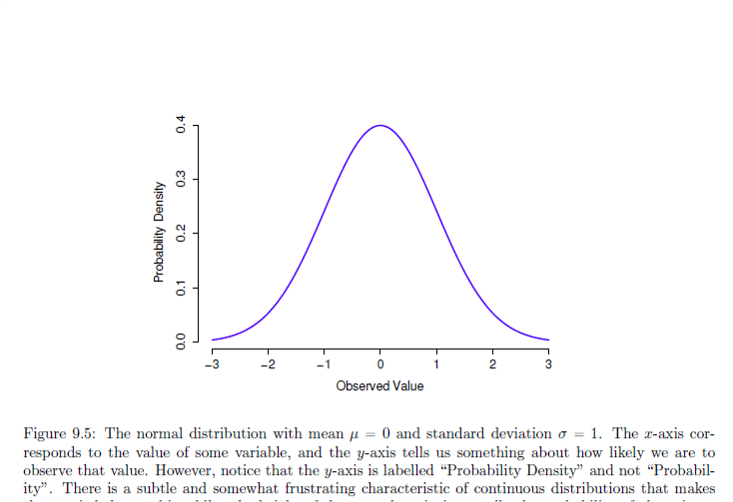


### Normal distribution 

$X \sim Normal(\mu, \sigma)$

- What happens when we change, the mean or the SD of a normal distribution?


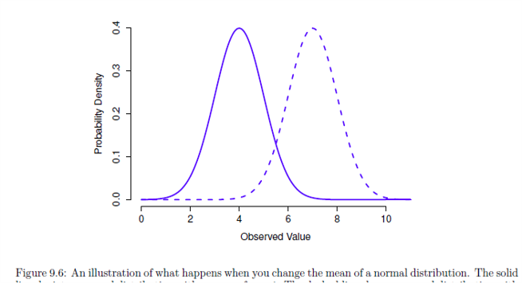 | 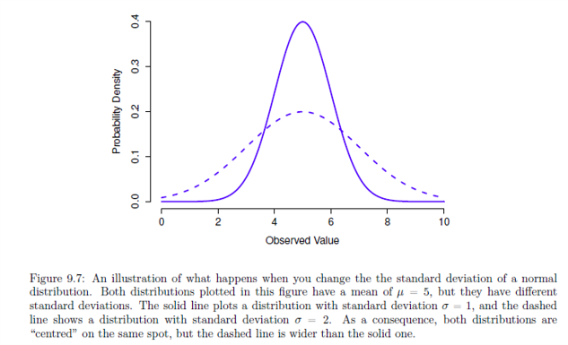 
     
     
### Normal distribution

- **Area under the curve must equal 1**

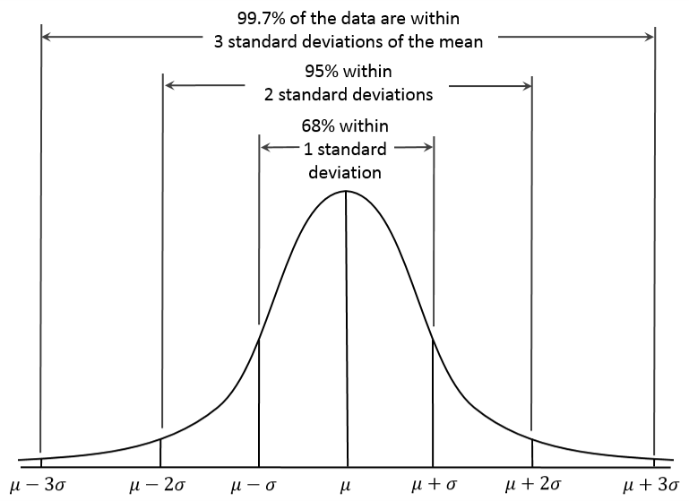


### t distribution

- Similar to normal
- Heavy tails
- Used in t-tests, regression, and more
- Used when you expect data are normally distributed, but don’t know mean or SD
- R code:
  - `dt()`, `pt()`,`qt()`,`rt()`

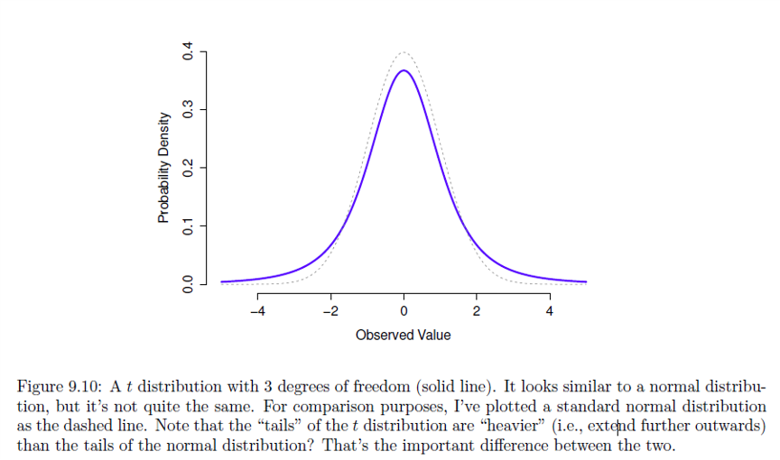

### Chi-squared distribution 

$\chi^2$

- Often used in categorical data analysis
- Shows up everywhere
- ‘Sum of squares’ follow this distribution
- R code:
  - `dchisq()`, `pchisq ()`,`qchisq ()`,`rchisq ()`

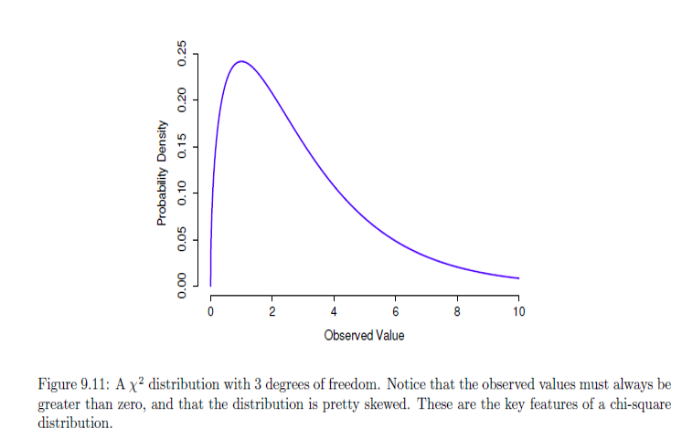

### F distribution 

- When you need to compare two chi-square distributions
- Comparing two sums of squares
- R code:
  - `df()`, `pf()`,`qf()`,`rf()`

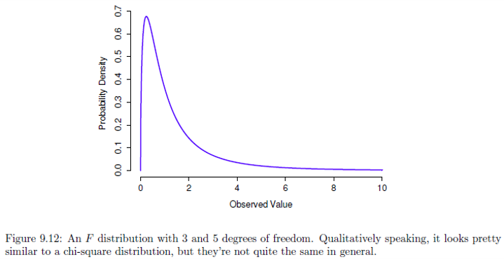


## Exercises

### Questions (use R below if you need it)

- What is the probability of drawing the queen of hearts from a deck of cards?
- What is the probability that I will draw a card with a black figure on it?
- If I draw 30 cards from the deck and replace each card afterward, what is the probability that I will draw the jack of spades 5 times? 

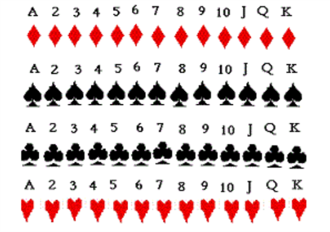


```{r ex15, exercise=TRUE}
# Your code here

```
```{r ex15-hint}
queen<-dbinom(x=1,size=1,prob=1/52)
blck<-dbinom(x=1,size=1,prob=1/2)
jack<-dbinom(x=5,size=30,prob=1/52)
```
```{r ex15-check}
#store
```


### Exercise: Use R

- Generate 1000 random numbers that follow a normal distribution with a mean of 5 and a sd of 2. 
  - Plot the histogram of these values
- What is the cumulative probability of me getting 25 soft shell tacos when I order 50 tacos from a restaurant that serves both hard shell and soft shell tacos?
  - What does this number mean? 
  - Make a plot of this distribution

- Check out the following links:
  - https://www.cyclismo.org/tutorial/R/probability.html
  - http://www.r-tutor.com/elementary-statistics/probability-distributions

### Generate 1000 random numbers with a mean of 5 and an sd of 2 and plot a histogram of these values.

```{r ex16, exercise=TRUE}
# Your code here

```
```{r ex16-hint}
x<-rnorm(n=1000,mean=5,sd=2)
hist(x)
```
```{r ex16-check}
#store
```


### Find the cumulative probability of getting 25 soft tacos when I order 50 (hard or soft only) and plot the distribution.

```{r ex17, exercise=TRUE}
# Your code here

```
```{r ex17-hint}
sfttac<-pbinom(q=25,size=50,prob=1/2)
print(sfttac)
```
```{r ex17-check}
#store
```

## Conclusion

### Preparing for Module 2

- Complete Module 1 readings, tutorials
- Complete Module 2 readings (CH 10 (Navarro)) and Tutorials

### Thanks!

See you next week!
**Questions?**
