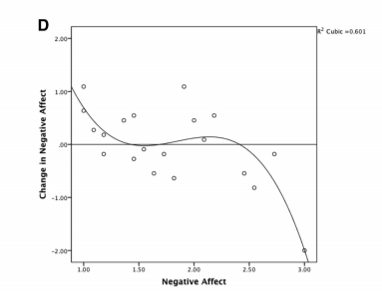
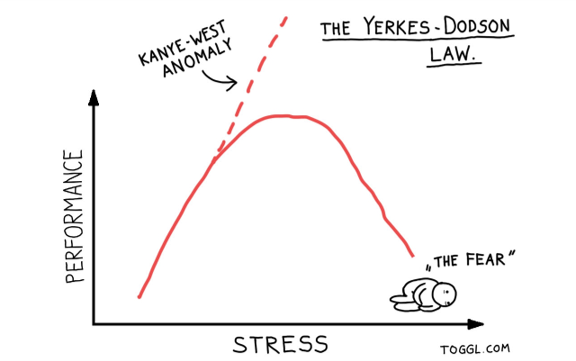
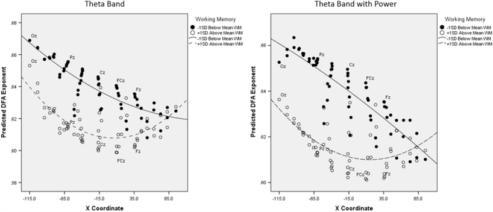
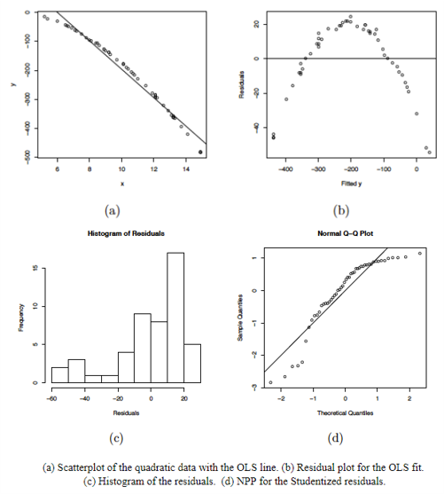
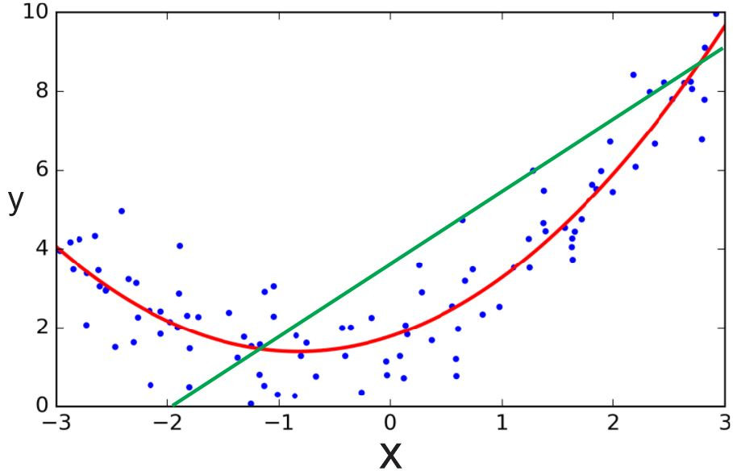
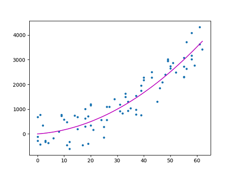
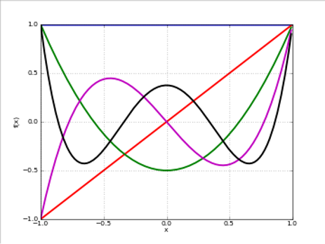
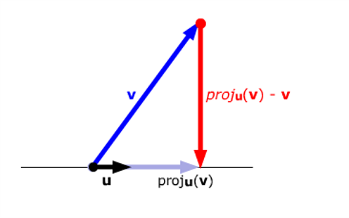
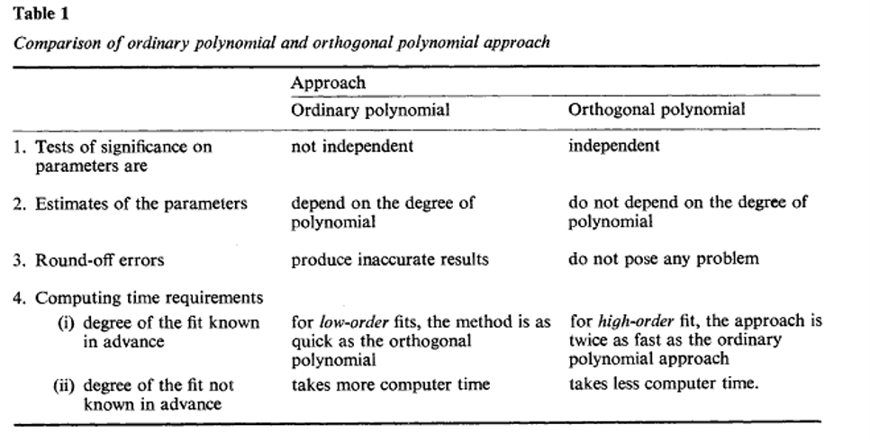
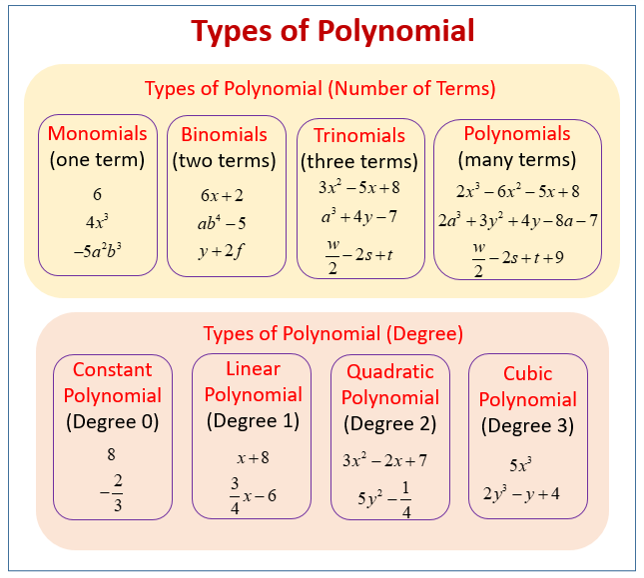

```{r setup, include=FALSE}
## libraries
library(learnr)
library(tidyr)
library(dplyr)
library(ggplot2)
library(scales)
library(RMariaDB)
library(DBI)
library(pool)

pool <- dbPool(
  drv = RMySQL::MySQL(),
  dbname = "statistics_II",
  host = "185.57.8.99",
  username = "admin",
  password = "SeamlessAdmin2022!"
)

## options
knitr::opts_chunk$set(echo = TRUE)
tutorial_options(exercise.eval = FALSE)

## recording data
new_recorder <- function(tutorial_id, tutorial_version, user_id, event, data) {
    cat(user_id, ", ", event, ",", data$label, ", ", data$answer, ", ", data$correct, "\n", sep = "", file = "student_progress.txt", append = TRUE)
  
d_tibble <- tibble::tibble(
user_id  = user_id, 
event = event,
label = data$label,
correct = data$correct,
question = data$question,
answer = data$answer
  )

## send to mysql
dbWriteTable(pool, "module10", d_tibble, append=TRUE, row.names = FALSE)}

options(tutorial.event_recorder = new_recorder)

## exercise setup
library(MASS)
library(gvlma)
library(lme4)
library(lmtest)
library(emmeans)
library(rockchalk)
library(interactions)

yerkes.dods <- read.csv("data/yerkes.dods.csv", header=TRUE)
cub <- read.csv("data/cub.csv", header=TRUE)
GPA.Data <- read.csv("data/GPA.DATA.csv", header=TRUE)

mod.lin<-lm(perf~arous,data=yerkes.dods)
mod.quad<-lm
gpa.mod1<-lm(GPA~IQ+Work.Ethic,data=GPA.Data)
gpa.mod2<-lm(GPA~IQ+Work.Ethic+IQ,data=GPA.Data)
summary(gpa.mod2)
gpa.mod3<-lm(GPA~IQ*Work.Ethic,data=GPA.Data)
summary(gpa.mod3)


```


## Introduction

```{r, echo=FALSE, out.width="100%", fig.align = "center"}
## HEADER ###
HTML("  <div class='jumbotron jumbotron-fluid'>
    <div class='container'>
    <h2 class='mb-3' style='color:rgba(31, 56, 100, 0.85);'><u>Polynomial Regression</u></h2>
    <h4 class='mb-3'>Statistics for CSAI II</h4>
    <h6 class='mb-3'>Travis J. Wiltshire, Ph.D.</h6>
    </div>
  </div>")
```

### Outline

What we will cover today:

1. Polynomial regression
2. When to use it
3. How to do it in R
4. Orthogonal polynomials


## Quiz

### Question 1

```{r Quiz1,  echo=FALSE}
  question("Which of the following would be a good coding system to use for categorical regression when you want to ensure your sample reflects the distribution of a group in the population?",
    answer("Dummy coding"),
    answer("Unweighted effects"),
    answer("Contrast coding"),
    answer("Weighted effects", correct = TRUE),
    allow_retry = FALSE
    )
```

### Results

#### 1. Which of the following would be a good coding system to use for categorical regression when you want to ensure your sample reflects the distribution of a group in the population?

```{r, Quiz1O, echo = FALSE}
plotOutput("Q1")
```

```{r, Quiz1R, context="server", echo = FALSE, warning = FALSE, message=FALSE, out.width="100%", fig.align = "center"}

output$Q1 <- renderPlot({
  
  data <- dbGetQuery(pool, "SELECT * FROM module10")
  
  answers <- subset(data, data$label == "Quiz1",)
  answers[answers==""] <- NA
  answers <- na.omit(answers)

  answers_count <- as.data.frame(answers %>% 
  count(answer))
  total_n = nrow(answers)
  answers_count$percentage <- (answers_count$n/total_n)*100
  answers_count$correct <- ifelse(answers_count$answer == "Weighted effects", "Correct", "Incorrect")

  ggplot(answers_count,
         aes(x = percentage,
             y = answer,
             fill=correct
             )
         ) +
    geom_col(width=0.6) +theme_minimal() + scale_fill_brewer(palette="Paired", direction=-1)  +
    xlab("Percentage (%)") + ylab("Answer") + labs(fill = "Correct")
})
```


## Polynomial Regression

### Polynomial Regression

**Multiple**

$$Y_i=b_0+b_1X_2+b_2X_2+ ...+b_nX_n+\epsilon_i$$
- One dependent variable Y predicted from **a set of** independent variables ($X_1, X_2, …X_k$)
- One regression coefficient for each independent variable
- $R^2:$ proportion of variation in dependent variable Y predictable by <u>**set of**</u> independent variables (X’s)

**Polynomial:**

$$Y_i=b_0+b_1X+b_2X^2+ ...+b_nX^n+\epsilon_i$$

- One dependent variable Y predicted from a set of independent variables ($X_1, X_2, …X_k$)
- One regression coefficient for each independent variable
- Independent variables become <u>**variables raised to increasing degrees of the polynomial (the exponent they are raised to)**</u>

### When to consider polynomial regression

- **Theoretically:** When you have theory or a reason to expect the relationship between your predictor and your outcome to be <u>**curvilinear**</u>





### When to consider polynomial regression

- **Theoretically:** When you have theory or a reason to expect the relationship between your predictor and your outcome to be <u>**curvilinear**</u>


Image from: 
Euler, M. J., Wiltshire, T. J., Niermeyer, M. A., & Butner, J. E. (2016). Working memory performance inversely predicts spontaneous delta and theta-band scaling relations. Brain research, 1637, 22-33.

### When to consider polynomial regression

- **Empirically:** When you check out your scatterplots and other plots for checking the assumptions of your linear model
  - Residuals vs fit
  - Histogram of residuals
  - QQ plot




### Polynomial Regression

- The degree of the polynomial determines the number of points of inflection (-1)
- <u>**Must include all lower order terms**</u>
- Careful of over fit (generalizability of the model) 
- Practical significance vs statistical significance
- Coefs tell us direction and strength/depth of curve(s)



### Interpreting Polynomial Regression Results

- Plot them! 
- Quadratic term
  - Positive = curve opens upward (apex is lowest value)
  - Negative = curve opens downward (apex is highest values)
- Focus is more on overall model comparisons and the shape of the trend vs interpretation of individual coefs



### Running the model in R

- Manually create the polynomial terms
  - E.g., `arousal2<-arousal*arousal`
  - `arousal3<-arousal*arousal*arousal`

- Add directly into `lm()` formula
  - `outcome ~ pred + I(pred^2)`



## Exercise 1

### Run multiple regression on the data

- Load the `yerkes.dods` data (stored in a variable called `yerkes.dods`)
- Inspect the data and generate descriptives
- Run and save linear model with `perf` as the outcome and `arous` as the predictor
- Interpret the results
- Generate and inspect the following fitted vs residual plot, histogram of the residuals, and the qq plot
- Now run and save the model adding a quadratic term (you can decide which method you want to do to add this)
- Interpret the results


```{r ex1, exercise=TRUE}
## The data is preloaded in a variable called yerkes.dods, when running this locally you will need to download the dataset from Canvas and load it


## Inspect the data and generate descriptives


## Run and save a linear model with perf as the outcome and arous as the predictor. Store the result in a variable called mod.lin


## Interpret the results


## Generate and inspect the following fitted vs residual plot, histogram of the residuals, and the qq plot


## Now run and save the model adding a quadratic term (you can decide which method you want to do to add this). Store the result in a variable called mod.quad


## Interpret the results


```
```{r ex1-hint}

# Inspect the data
psych::describe(yerkes.dods)
plot(yerkes.dods$arous,yerkes.dods$perf)
mod.lin<-lm(perf~arous,data=yerkes.dods)
summary(mod.lin)
#Check linearity and homscedasticity
plot(fitted(mod.lin),residuals(mod.lin), pch=20)
abline(a=0,b=0, lty=2)
#Check normality of residuals
hist(residuals(mod.lin))
qqnorm(residuals(mod.lin))
car::qqPlot(mod.lin)
##Visual Check
performance::check_model(mod.lin)

##Visual Check
performance::check_model(mod.lin)

#Quad. model
mod.quad<-lm(perf~arous+I(arous^2),data=yerkes.dods)
summary(mod.quad)
```

## Exercise 2

### Compare your models

- Compare your models using `anova()` and AIC
- Which model fits better?
- What is the change in the $R^2$?
- Now check out if you have any problems with multicollinearity (you may need to manually create the quadratic variable)


```{r ex2, exercise=TRUE}

## Compare your models stored in the variables mod.lin and mod.quad using `anova()` and AIC
mod.lin<-lm(perf~arous,data=yerkes.dods)
mod.quad<-lm(perf~arous+I(arous^2),data=yerkes.dods)


## Which model fits better?


## What is the change in the $R^2$?


## Now check out if you have any problems with multicollinearity (you may need to manually create the quadratic variable)


```
```{r ex2-hint}
anova(mod.lin,mod.quad)
extractAIC(mod.lin)
extractAIC(mod.quad)

performance::compare_performance(mod.lin,mod.quad)
plot(performance::compare_performance(mod.lin,mod.quad))
performance::check_model(mod.quad)
```


## Orthogonal polynomials 

### Orthogonal polynomials 

- Centering could work to reduce multicollinearity
- A transformation of the polynomial terms that reduces correlation
- But poses a challenge for interpretability because the b values are no longer in original metric
- Easy to do in R using `poly()` function in `lm()` formula
- See here for more but this is non-essential: [Video](https://www.youtube.com/watch?v=lrSQH_69MTM&ab_channel=MathTheBeautiful) or [visualizations](http://thejuniverse.org/PUBLIC/LinearAlgebra/LOLA/dotProd/proj.html) or [Paper](https://www.jstor.org/stable/1403204?seq=1#metadata_info_tab_contents) 



### Narula (1979) 



## Exercise 3

### Run multiple regression on the data

- Load the `cub.csv` data file and call it 'cub'
- Inspect the data and generate descriptives (this is simulated data)
- Make a scatterplot

```{r ex3, exercise=TRUE}

## The data is preloaded in a variable called cub, when running this locally you will need to download the dataset from Canvas and load it
head(cub)


## Inspect the data and generate descriptives (this is simulated data)


## Make a scatterplot


```
```{r ex3-hint}
#
head(cub)

psych::describe(cub)

plot(cub$q,cub$noisy.y)

```

### Find the best fitting model

- Run and save 3 models (`noisy.y` is outcome, `q` is predictor), interpret output along the way
  - Start with just a linear model
  - Then add a quadratic term using the `poly()` function in your `lm()` formula
  - Then a cubic term using the `poly()` function in your `lm()` formula
- Compare the models to see which one fits best (you need to make 3 comparisons)
- Make a plot of the fitted values of the best fitting model with the observed data as well
- Check assumptions of the best fitting model

```{r ex4, exercise=TRUE}

## The data is preloaded in a variable called cub, when running this locally you will need to download the dataset from Canvas and load it
head(cub)

## Run and save 3 models (`noisy.y` is outcome, `q` is predictor), interpret output along the way


## Start with just a linear model


## Then add a quadratic term using the `poly()` function in your `lm()` formula


## Then a cubic term using the `poly()` function in your `lm()` formula


## Compare the models to see which one fits best (you need to make 3 comparisons)


## Make a plot of the fitted values of the best fitting model with the observed data as well


## Check assumptions of the best fitting model

```
```{r ex4-hint}
#
mod2.lin<-lm(noisy.y~q, data=cub)#Refer to dataset in these if you load it
summary(mod2.lin)

mod2.quad<-lm(noisy.y~poly(q,2))
summary(mod2.quad)

mod2.cub<-lm(noisy.y~poly(q,3))
summary(mod2.cub)

#Compare models
anova(mod2.lin,mod2.quad)
anova(mod2.lin,mod2.cub)
anova(mod2.quad,mod2.cub)
extractAIC(mod2.quad)
extractAIC(mod2.cub)

performance::compare_performance(mod2.lin,mod2.quad,mod2.cub)
plot(performance::compare_performance(mod2.lin,mod2.quad,mod2.cub))

# Make a plot of the fitted values and the observed data
plot(q,noisy.y,col='deepskyblue4',xlab='q',main='Observed data')
predicted.intervals <- predict(mod2.cub,data.frame(x=q),interval='confidence',level=0.99)
lines(q,predicted.intervals[,1],col='green',lwd=3)
lines(q,predicted.intervals[,2],col='black',lwd=1)
lines(q,predicted.intervals[,3],col='black',lwd=1)

# Check assumptions of model
performance::check_model(mod2.cub)
gvlma::gvlma(mod2.cub)
```

## Conclusion

### Recap

- Polynomial regression is useful when:
  - Predict the relationship between variables is curvilinear
  - Checking assumptions and observe curve-like patterns 
- Must iteratively add polynomial terms of increasing order and all lower order terms
- Compare model fit
- Sometimes polynomial terms can be too highly correlated with each other
  - Create orthogonal polynomials
  - **In practice, patterns of results should be the same**
- Next time:
  - Mixed models



### Thanks!

See you next week!
**Questions?**
