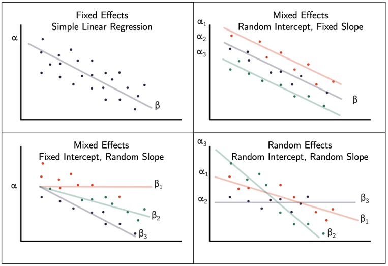

```{r setup, include=FALSE}
## libraries
library(learnr)
library(tidyr)
library(dplyr)
library(ggplot2)
library(scales)
library(RMariaDB)
library(DBI)
library(pool)

library(gvlma)
library(lme4)
library(lmtest)
library(emmeans)
library(rockchalk)
library(interactions)
library(performance)

pool <- dbPool(
  drv = RMySQL::MySQL(),
  dbname = "statistics_II",
  host = "185.57.8.99",
  username = "admin",
  password = "SeamlessAdmin2022!"
)

## options
knitr::opts_chunk$set(echo = TRUE)
tutorial_options(exercise.eval = FALSE, exercise.checker=FALSE)

## recording data
new_recorder <- function(tutorial_id, tutorial_version, user_id, event, data) {
    cat(user_id, ", ", event, ",", data$label, ", ", data$answer, ", ", data$correct, "\n", sep = "", append = TRUE)
  
d_tibble <- tibble::tibble(
user_id  = user_id, 
event = event,
label = data$label,
correct = data$correct,
question = data$question,
answer = data$answer
  )

## send to mysql
dbWriteTable(pool, "module11", d_tibble, append=TRUE, row.names = FALSE)}

options(tutorial.event_recorder = new_recorder)

## exercise setup
library(lmtest)
library(lme4)
library(lmerTest)
##data
politeness <- read.csv("data/politeness_data.csv", header=TRUE)
## model 2
mod.2<-lmer(frequency~attitude + (1|subject)+(1|scenario),data=politeness)
## model 3
mod.3<-lmer(frequency~attitude + gender + (1|subject)+(1|scenario),data=politeness)
# model 4
mod.4<-lmer(frequency~attitude + gender+ (1+attitude|subject)+(1+attitude|scenario),data=politeness,REML=FALSE)


```

## 1. Introduction


```{r, echo=FALSE, out.width="100%", fig.align = "center"}
## HEADER ###
HTML("  <div class='jumbotron jumbotron-fluid'>
    <div class='container'>
    <h2 class='mb-3' style='color:rgba(31, 56, 100, 0.85);'><u>Mixed Models</u></h2>
    <h4 class='mb-3'>Statistics for CSAI II</h4>
    <h6 class='mb-3'>Travis J. Wiltshire, Ph.D.</h6>
    </div>
  </div>")
```


### Outline

Mixed models, Multilevel 	models, random coefficient 	regression models, hierarchical 	linear modeling…

- What is it?
- Random Intercepts
- Random Slopes 
- Assumptions

## Quiz

### Question 1

```{r Quiz1,  echo=FALSE}
  question("Which of the following models shows polynomial regression?",
    answer("`lm(affect ~ stress + performance)`"),
    answer("`lm(affect ~ stress * performance)`"),
    answer("`lm(affect ~ stress + performance + stress$^2$)`", correct = TRUE),
    answer("`lm(affect ~ stress:performance)`"),
    allow_retry = FALSE
    )
```

### Results

#### 1. Which of the following models shows polynomial regression?

```{r, Quiz1O, echo = FALSE}
plotOutput("Q1")
```

```{r, Quiz1R, context="server", echo = FALSE, warning = FALSE, message=FALSE, out.width="100%", fig.align = "center"}

output$Q1 <- renderPlot({
  
  data <- dbGetQuery(pool, "SELECT * FROM module11")
  
  answers <- subset(data, data$label == "Quiz1",)
  answers[answers==""] <- NA
  answers <- na.omit(answers)

  answers_count <- as.data.frame(answers %>% 
  count(answer))
  total_n = nrow(answers)
  answers_count$percentage <- (answers_count$n/total_n)*100
  answers_count$correct <- ifelse(answers_count$answer == "`lm(affect ~ stress + performance + stress$^2$)`", "Correct", "Incorrect")

  ggplot(answers_count,
         aes(x = percentage,
             y = answer,
             fill=correct
             )
         ) +
    geom_col(width=0.6) +theme_minimal() + scale_fill_brewer(palette="Paired", direction=-1)  +
    xlab("Percentage (%)") + ylab("Answer") + labs(fill = "Correct")
})
```

### Question 2

```{r Quiz2,  echo=FALSE}
  question("Which of the following orders of polynomial regression should be used when you want to test for a cubic relationship between affect and stress?",
    answer("First"),
    answer("Second"),
    answer("Third"),
    answer("All of the above", correct = TRUE),
    allow_retry = FALSE
    )
```

### Results

#### 2. Which of the following orders of polynomial regression should be used when you want to test for a cubic relationship between affect and stress?

```{r, Quiz2O, echo = FALSE}
plotOutput("Q2")
```

```{r, Quiz2R, context="server", echo = FALSE, warning = FALSE, message=FALSE, out.width="100%", fig.align = "center"}

output$Q2 <- renderPlot({
  
  data <- dbGetQuery(pool, "SELECT * FROM module11")
  
  answers <- subset(data, data$label == "Quiz2",)
  answers[answers==""] <- NA
  answers <- na.omit(answers)

  answers_count <- as.data.frame(answers %>% 
  count(answer))
  total_n = nrow(answers)
  answers_count$percentage <- (answers_count$n/total_n)*100
  answers_count$correct <- ifelse(answers_count$answer == "All of the above", "Correct", "Incorrect")

  ggplot(answers_count,
         aes(x = percentage,
             y = answer,
             fill=correct
             )
         ) +
    geom_col(width=0.6) +theme_minimal() + scale_fill_brewer(palette="Paired", direction=-1)  +
    xlab("Percentage (%)") + ylab("Answer") + labs(fill = "Correct")
})
```

### Question 3

```{r Quiz3,  echo=FALSE}
  question("Which of the following is TRUE about mixed models?",
    answer("They allow us to model interdendence in our data.", correct = TRUE),
    answer("They do not assume normality of residuals."),
    answer("Mixed models can be compared with F-tests."),
    answer("Mixed models require that intercepts and slopes vary for all random effects."),
    allow_retry = FALSE
    )
```

### Results

#### 3. Which of the following is TRUE about mixed models?

```{r, Quiz3O, echo = FALSE}
plotOutput("Q3")
```

```{r, Quiz3R, context="server", echo = FALSE, warning = FALSE, message=FALSE, out.width="100%", fig.align = "center"}

output$Q3 <- renderPlot({
  
  data <- dbGetQuery(pool, "SELECT * FROM module11")
  
  answers <- subset(data, data$label == "Quiz3",)
  answers[answers==""] <- NA
  answers <- na.omit(answers)

  answers_count <- as.data.frame(answers %>% 
  count(answer))
  total_n = nrow(answers)
  answers_count$percentage <- (answers_count$n/total_n)*100
  answers_count$correct <- ifelse(answers_count$answer == "Which of the following is TRUE about mixed models?", "Correct", "Incorrect")

  ggplot(answers_count,
         aes(x = percentage,
             y = answer,
             fill=correct
             )
         ) +
    geom_col(width=0.6) +theme_minimal() + scale_fill_brewer(palette="Paired", direction=-1)  +
    xlab("Percentage (%)") + ylab("Answer") + labs(fill = "Correct")
})
```


## Multiple and Mixed Models

### **Multiple**

$$Y_i=b_0+b_1X_2+b_2X_2+ ...+b_nX_n+\epsilon_i$$
- One dependent variable Y predicted from **a set of** independent variables ($X_1, X_2, …X_k$)
- One regression coefficient for each independent variable
- $R^2:$ proportion of variation in dependent variable Y predictable by <u>**set of**</u> independent variables (X’s)


### **Mixed**

$$Y_i=b_{oj}+b_1X_{ij}+\epsilon_{ij}$$

$b_{oj}=b_o+u_{oj}$|<p style="color:Red;">Random intercept</p>
$b_{1j}=b_1+u_{1j}$|<p style="color:Red;">Random slopes</p>


- Can model hierarchical/nested/clustered data
  - Groups, cohorts, schools, organizations, hospitals, etc.
- We can include fixed and random effects to predict an outcome variable

### Data Types

- Nested Data
- Repeated Measures Data
- Longitudinal Data


### Why should we use this? 

- We can ‘ignore’ some of the assumptions of regression
- Homogeneity of regression slopes
  - Model the variability in regression slopes
- Assumption of independence
  - You can model the relationships between cases
  - Regression for repeated observations
- Missing data
  - MLMs can cope with missing data

  
## Fixed vs random effects 

### Intercepts and slopes can be fixed or random
  - In OLS regression they are fixed
  
  
 

### Fixed coefficients
  - Intercepts/slopes are assumed to be the same across different contexts
  


### Random coefficients
  - Intercepts/slopes are allowed to vary across different contexts
  


### Fixed effects vs random effects



[https://bookdown.org/steve_midway/DAR/random-effects.html#fixed-and-random-effects](https://bookdown.org/steve_midway/DAR/random-effects.html#fixed-and-random-effects)


### Illuminating our error term ε

- These additional terms account for non-independence 
- And things that were previously all relegated to ‘error’ 
- Now can become random effects
  - E.g., differences due to subjects or certain question items, schools, groups, etc


### Changes to R squared in mixed effects modeling

- $R^2$ conditional
  - Includes variance explained by fixed and random effects
- $R^2$ marginal
  - Includes only variance explained by fixed effects

Nakagawa, S., Johnson, P. C. D., & Schielzeth, H. (2017). The coefficient of determination R2 and intra-class correlation coefficient from generalized linear mixed-effects models revisited and expanded. Journal of The Royal Society Interface, 14(134), 20170213. doi: 10.1098/rsif.2017.0213


### Interpreting Random Effects 

#### Random effects

  - Variance tells you how much variability between individuals in a group is explained relative to residual
  - SD tells you about between-person differences within the group
  - Corr – is correlation between slope and intercept 

### Interpreting Intraclass Correlation

#### Intraclass correlation
  - Ratio of the random intercept variance (between-person) to the total variance, defined as the sum of the random intercept variance and residual variance (between + within).
  - Correlation coefficient of observations in the same cluster
  - Can tell you:
      + If mixed model is even necessary (if ICC is near 0, maybe not)
      + How much variation is explained due to clustering/grouping variable(s) - i.e., the random effects
      + Compare how ICC changes with different changes to model
  
### Running the model in R with random intercepts

- Load the `lme4` package and `lmerTest` package
- Using the `lmer()` function we specify our model
  - `outcome ~ pred1 + (1|pred2)`
- Where pred2 has multiple observations associated with some higher level group (e.g., participant, school, team)
- Pred2 also isn’t necessarily something we are interested in using as a predictor, but we know it is having some influence on our outcome and we want to ‘control’ for that

## Exercise 1

### Run a mixed model with random intercepts

- Load the `lme4` and `lmerTest` packages
- Load the `politeness` data
- Check out the politeness data set (get a summary, make some plots, etc.)
- Make a prediction about the relationship between attitude and vocal frequency
- Run a mixed effects model to predict vocal frequency from attitude while allowing random intercepts for subject and scenario
  - Remember to add these to the equation `(1|pred)`
- Get $R^2$ values using `performance()` function
- Generate and inspect the random intercepts using `coef(yourmodelhere)`
- Interpret the output 
- Bonus: use `parameters::model_parameters()` function to get standardized coefficients

### Load packages and load politeness data
```{r ex11, exercise=TRUE}
politeness <- read.csv("data/politeness_data.csv", header=TRUE)

## Load the lme4 and lmerTest packages


## Load the politeness data
##(stored in the data folder)


## Check out the politeness data set 
## (get a summary, make some plots, etc.)

```
```{r ex11-hint}
summary(politeness)
#attitude - inf = informal
#attitude - pol = polite
#example scenarios include asking for a favor from a professor (polite) vs a peer (informal)
```
```{r ex11-check}
#store
```


### Run a mixed effects model 
```{r ex13, exercise=TRUE}

## Make a prediction about the relationship between
## attitude and vocal frequency


## Run a mixed effects model to predict vocal frequency 
## from attitude while allowing random 
## intercepts for subject and scenario.
## Save your model in a variable called mod.2!


## Remember to add these to the equation (1|pred)


## Get r-squared values using `performance()` function


## Generate and inspect the random intercepts using `coef(yourmodelhere)`


## Interpret the output 


## Bonus: use `parameters::model_parameters()` function to get standardized coefficients


```
```{r ex13-hint}
mod.2<-lmer(frequency~attitude + (1|subject)+(1|scenario),data=politeness)
summary(mod.2)
performance(mod.2)
coef(mod.2)
summary(mod.2)

```
```{r ex13-check}
#store
```


## Exercise 2
- Make a prediction about the relationship between attitude and vocal frequency and gender and vocal frequency
- Run a mixed effects model to predict vocal frequency from attitude and gender while allowing random intercepts for subject and scenario
  - Remember to add these to the equation (1|pred)
- Get $R^2$ values using `performance()` function
- Generate the random intercepts using `coef(yourmodelhere)`
- Compare the 2 models using AIC, BIC, -2LL, ANOVA
- Interpret the output
- Bonus: use `parameters::model_parameters()` function to get standardized coefficients

### Repeat the same mixed model with random intercepts and a new predictor
```{r ex12, exercise=TRUE}

## Make a prediction about the relationship between attitude and vocal frequency and gender and vocal frequency


## Run a mixed effects model to predict vocal frequency 
## from attitude and gender while allowing random 
## intercepts for subject and scenario
## Save your model in a variable called mod.3!


## Remember to add these to the equation (1|pred)


## Get R-squared values using performance() function


## Generate the random intercepts using coef(yourmodelhere)


## Compare mod.2 and mod.3 using AIC, BIC, -2LL, ANOVA


## Interpret the output


## Bonus: use parameters::model_parameters() function to get standardized coefficients


```
```{r ex12-hint}
#plot(politeness$frequency,politeness$gender)
boxplot(frequency~attitude*gender,col=c('white','lightgray'),politeness)


mod.3<-lmer(frequency~attitude + gender + (1|subject)+(1|scenario),data=politeness)
summary(mod.3)
performance(mod.3)
coef(mod.3)
anova(mod.2,mod.3)
compare_performance(mod.2,mod.3)
plot(compare_performance(mod.2,mod.3))

```
```{r ex12-check}
#store
```

## Random slopes

### Running the model in R with random intercepts and slopes


- Load the `lme4` package and `lmerTest` package
- Using the `lmer()` function we specify our model
  - `outcome ~ pred + (1+pred|pred2)`
- Telling R to expect the slope to vary for the fixed effect (pred) as a function of pred2

### Comparing models

- Chi-Square test (using `anova()` function)
- AIC – Lower value is better model
- BIC – Lower value is better model
- Loglikelihood  - Higher is better model
  - Model 1 LL – Model 2 LL
- Conditional vs Marginal $R^2$


## Exercise 3

### Run a  mixed model with random intercepts and slopes
- Run a mixed effects model to predict vocal frequency from attitude and gender while allowing random intercepts for subject and scenario and random slopes based on attitude
  - Remember to add these to the equation (1+pred|pred2)
- Get $R^2$ values using `performance()` function
- Generate the random intercepts and slopes using `coef(yourmodelhere)`
- Compare the 2 models
- Interpret the output

### Run a mixed model with random intercepts and slopes
```{r ex21, exercise=TRUE}
## Run a mixed effects model to predict vocal frequency 
## from attitude and gender while allowing random intercepts 
## for subject and scenario and random slopes based on attitude
## Save your model in a variable called mod.4!


## Remember to add these to the equation (1+pred|pred2)


## Get $R^2$ values using `performance()` function


## Generate the random intercepts and slopes using `coef(yourmodelhere)`


## Compare mod.3 and mod.4


## Interpret the output


```
```{r ex21-hint}
#Model with random intercepts and random slopes
mod.4<-lmer(frequency~attitude + gender+ (1+attitude|subject)+(1+attitude|scenario),data=politeness,REML=FALSE)
summary(mod.4)
performance(mod.4)
coef(mod.4)
anova(mod.3,mod.4)
plot(compare_performance(mod.3,mod.4))

```
```{r ex21-check}
#store
```

### Perform additional statistics:  
- Get $R^2$ values using `performance()` function
- Generate the random intercepts and slopes using `coef(yourmodelhere)`
- Compare the 2 models
- Interpret the output

### Perform additional statistics:  
```{r ex22, exercise=TRUE}

## Get R-squared values for mod.4 using the `performance()` function


## Generate the random intercepts and slopes for mod.4 using `coef(yourmodelhere)`


## Compare mod.3 and mod.4


## Interpret the output


```
```{r ex22-hint}
performance(mod.4)
coef(mod.4)
anova(mod.3,mod.4)
plot(compare_performance(mod.3,mod.4))

```
```{r ex22-check}
#store
```


## Fixed or random?

- Rules of thumb for random effects
  + Include random intercepts for all ‘control’ variables (subject ID, school, observation number, teamID, etc. )
  + Only include random slopes that are interesting to test
- Maximal model with step down (to reduce Type 1 error rate)
  + Maximal possible random slopes and intercepts  if possible
  + See also examples here: [http://www.alexanderdemos.org/Mixed7.html#1_random_items_(stimulus)](http://www.alexanderdemos.org/Mixed7.html#1_random_items_(stimulus))

Barr, D. J., Levy, R., Scheepers, C., & Tily, H. J. (2013). Random effects structure for confirmatory hypothesis testing: Keep it maximal. Journal of memory and language, 68(3), 255-278.


## Assumptions

### Assumptions

- Linearity and ~~homoscedasticity~~ of the model
- Normality of residuals
- Multicollinearity
- Influential data points
- Independence (What?)
  - You could accidentally leave out an important dependency in your model. 

### Leverage and influence

- **Leverage** is a measure of how far an observation on the predictor variable (Let it be X) from the mean of the predictor variable. Its potential to influence the model results.
- [http://omaymas.github.io/InfluenceAnalysis/](http://omaymas.github.io/InfluenceAnalysis/)
- [https://omaymas.shinyapps.io/Influence_Analysis/](https://omaymas.shinyapps.io/Influence_Analysis/)


## Exercise 4 

### Check your assumptions for mod.3


```{r ex31, exercise=TRUE}

## Check the following for mod.3:


## Linearity and homoscedasticity of the model


## Normality of residuals


```
```{r ex31-hint}
#Check our assumptions for model 3
#Check linearity and homoscedasticity
plot(fitted(mod.3),residuals(mod.3), pch=20)
abline(a=0,b=0, lty=2)
hist(residuals(mod.3))
car::qqPlot(residuals(mod.3))

```
```{r ex31-check}
#store
```


### Influential data points 

- Try to `plot(hatvalues(mod.3))` and see if there is a cut-off you would use to exclude the potentially influential values from the model


```{r ex33, exercise=TRUE}

## The model is stored in a variable called mod.3


```
```{r ex33-hint}
#Check for values with high leverage and potential influence
require(ggplot2)
# https://omaymas.shinyapps.io/Influence_Analysis/

ggplot(data.frame(lev=hatvalues(mod.3),pearson=residuals(mod.3,type="pearson")),
       aes(x=lev,y=pearson)) +
  geom_point() +
  theme_bw()


```
```{r ex33-check}
#store
```

### Figure out a way to find that/those values from the dataset (in a new object) and re-run model without these points


```{r ex34, exercise=TRUE}

## The model is stored in a variable called mod.3


## Save new model omitting cases with
## high leverage as mod.5


```
```{r ex34-hint}
# Get ids for values with 'high' leverage
levId <- which(hatvalues(mod.3) >= .15)

# Run the model with those data points excluded
# This is not really good science to simply omit these values based on leverage alone
mod.5<-lmer(frequency~attitude + gender+ (1|subject)+(1|scenario),data=politeness[-c(levId),])
summary(mod.5)
performance(mod.5)
coef(mod.5)
check_model(mod.5)

```
```{r ex34-check}
#store
```

## Examples

### Some example write ups of mixed models

- Wiltshire, T. J., Euler, M. J., McKinney, T. L., & Butner, J. E. (2017). Changes in Dimensionality and Fractal Scaling Suggest Soft-Assembled Dynamics in Human EEG. Frontiers in physiology, 8, 633.
  - [https://www.ncbi.nlm.nih.gov/pmc/articles/PMC5585189/pdf/fphys-08-00633.pdf](https://www.ncbi.nlm.nih.gov/pmc/articles/PMC5585189/pdf/fphys-08-00633.pdf)
- Paxton, A., Abney, D. H., Kello, C. T., & Dale, R. K. (2014, January). Network analysis of multimodal, multiscale coordination in dyadic problem solving. In Proceedings of the Annual Meeting of the Cognitive Science Society (Vol. 36, No. 36).
  - [https://cloudfront.escholarship.org/dist/prd/content/qt7xz2z06w/qt7xz2z06w.pdf](https://cloudfront.escholarship.org/dist/prd/content/qt7xz2z06w/qt7xz2z06w.pdf)
  - Baayen, R. H., Davidson, D. J., & Bates, D. M. (2008). Mixed-effects modeling with crossed random effects for subjects and items. *Journal of memory and language*, 59(4), 390-412.
  - [https://www.sciencedirect.com/science/article/pii/S0749596X07001398](https://www.sciencedirect.com/science/article/pii/S0749596X07001398)
- Peugh, J. L. (2010). A practical guide to multilevel modeling. *Journal of school psychology*, 48(1), 85-112.
  - [https://www.sciencedirect.com/science/article/pii/S0022440509000545?via%3Dihub](https://www.sciencedirect.com/science/article/pii/S0022440509000545?via%3Dihub)

### Some additional resources

- https://seantrott.github.io/mixed_models_R/#Why_use_mixed_models
- [https://rpsychologist.com/r-guide-longitudinal-lme-lmer](https://rpsychologist.com/r-guide-longitudinal-lme-lmer)
- [(http://www.floppybunny.org/robin/web/virtualclassroom/stats/statistics2/articles/mixed_models/Introduction-to-LMER.pdf](http://www.floppybunny.org/robin/web/virtualclassroom/stats/statistics2/articles/mixed_models/Introduction-to-LMER.pdf)
- [https://freshbiostats.wordpress.com/2013/07/28/mixed-models-in-r-lme4-nlme-both/http://davidakenny.net/papers/k&h/MLM_R.pdf](https://freshbiostats.wordpress.com/2013/07/28/mixed-models-in-r-lme4-nlme-both/http://davidakenny.net/papers/k&h/MLM_R.pdf)
- Maximum Likelihood Estimation: [https://youtu.be/XepXtl9YKwc](https://youtu.be/XepXtl9YKwc)
- McNeish, D., Stapleton, L. M., & Silverman, R. D. (2017). On the unnecessary ubiquity of hierarchical linear modeling. Psychological methods, 22(1), 114.


## Conclusion


### Thanks!

See you next week!
**Questions?**


