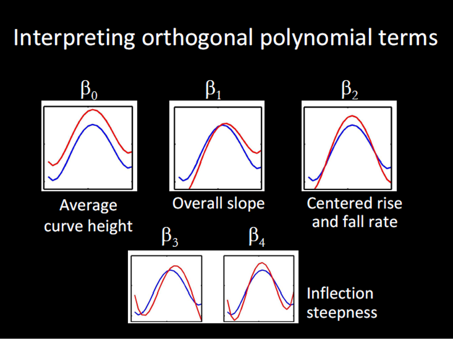
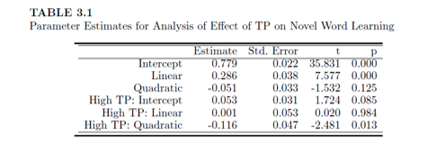
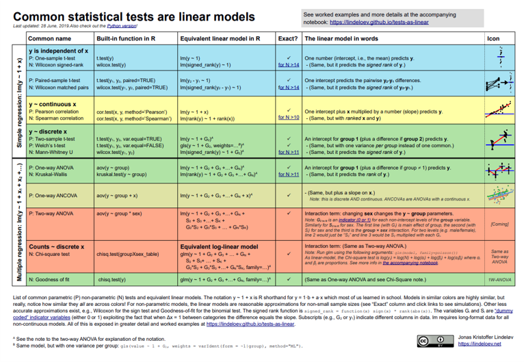

```{r setup, include=FALSE}
## libraries
library(learnr)
library(tidyr)
library(dplyr)
library(ggplot2)
library(scales)
library(RMariaDB)
library(DBI)
library(pool)


pool <- dbPool(
  drv = RMySQL::MySQL(),
  dbname = "statistics_II",
  host = "185.57.8.99",
  username = "admin",
  password = "SeamlessAdmin2022!"
)

## options
knitr::opts_chunk$set(echo = TRUE)
tutorial_options(exercise.eval = FALSE, exercise.checker=FALSE)

## recording data
new_recorder <- function(tutorial_id, tutorial_version, user_id, event, data) {
    cat(user_id, ", ", event, ",", data$label, ", ", data$answer, ", ", data$correct, "\n", sep = "", append = TRUE)
  
d_tibble <- tibble::tibble(
user_id  = user_id, 
event = event,
label = data$label,
correct = data$correct,
question = data$question,
answer = data$answer
  )

## send to mysql
dbWriteTable(pool, "module12", d_tibble, append=TRUE, row.names = FALSE)}

options(tutorial.event_recorder = new_recorder)

## EXCERCISE SETUP

## packages
require(lme4)
require(lmerTest)
require(ggplot2)
require(Rcpp)
library(performance)
## data ex.1
data(ChickWeight)
## models ex.1
m.base <- lmer(weight ~ Time + (1 | Chick), data=ChickWeight, REML=F) #Unconditional Model
m.0 <- lmer(weight ~ Time + Diet + (1 | Chick), data=ChickWeight, REML=F) #Fixed effects
m.1 <- lmer(weight ~ Time * Diet + (1 | Chick), data=ChickWeight, REML=F) #Interaction
## data ex.2 and ex.3
load("data/GrowthCurve_Examples.Rdata")


```

## Introduction

```{r, echo=FALSE, out.width="100%", fig.align = "center"}
## HEADER ###
HTML("  <div class='jumbotron jumbotron-fluid'>
    <div class='container'>
    <h2 class='mb-3' style='color:rgba(31, 56, 100, 0.85);'><u>Growth Curve Models</u></h2>
    <h4 class='mb-3'>Statistics for CSAI II</h4>
    <h6 class='mb-3'>Travis J. Wiltshire, Ph.D.</h6>
    </div>
  </div>")
```

### Outline


What we will cover today:

1. What is it?
2. Example with modeling time with straight line
3. Adding polynomials
4. Orthogonal polynomials
5. Reporting
6. Graphing
7. Wrap up


## Quiz

### Question 1

```{r Quiz1,  echo=FALSE}
  question("Which of the following models shows orthogonal polynomial regression with a quadratic term?",
    answer("`lm(affect ~ stress + I(stress^2))`"),
    answer("`lm(affect ~ stress * performance)`"),
    answer("`lm(affect ~ poly(stress, 2) + performance)`", correct = TRUE),
    answer("`lm(affect ~ poly(stress, 3) + performance)`"),
    allow_retry = FALSE
    )
```

### Results

#### 1. Which of the following models shows orthogonal polynomial regression with a quadratic term?

```{r, Quiz1O, echo = FALSE}
plotOutput("Q1")
```

```{r, Quiz1R, context="server", echo = FALSE, warning = FALSE, message=FALSE, out.width="100%", fig.align = "center"}

output$Q1 <- renderPlot({
  
  data <- dbGetQuery(pool, "SELECT * FROM module12")
  
  answers <- subset(data, data$label == "Quiz1",)
  answers[answers==""] <- NA
  answers <- na.omit(answers)

  answers_count <- as.data.frame(answers %>% 
  count(answer))
  total_n = nrow(answers)
  answers_count$percentage <- (answers_count$n/total_n)*100
  answers_count$correct <- ifelse(answers_count$answer == "`lm(affect ~ poly(stress, 2) + performance)`", "Correct", "Incorrect")

  ggplot(answers_count,
         aes(x = percentage,
             y = answer,
             fill=correct
             )
         ) +
    geom_col(width=0.6) +theme_minimal() + scale_fill_brewer(palette="Paired", direction=-1)  +
    xlab("Percentage (%)") + ylab("Answer") + labs(fill = "Correct")
})
```

### Question 2

```{r Quiz2,  echo=FALSE}
  question("Which of the following is the most accurate interpretation of intra-class correlation (ICC) in mixed modeling?",
    answer("How much variation in the model is due to random effects", correct = TRUE),
    answer("How correlated the random effects are with the fixed effects"),
    answer("How much variation in the model is due to the fixed effects"),
    answer("How much correlation there is between the random intercepts and random slopes"),
    allow_retry = FALSE
    )
```

### Results

#### 2. Which of the following is the most accurate interpretation of ICC in mixed modeling?

```{r, Quiz2O, echo = FALSE}
plotOutput("Q2")
```

```{r, Quiz2R, context="server", echo = FALSE, warning = FALSE, message=FALSE, out.width="100%", fig.align = "center"}

output$Q2 <- renderPlot({
  
  data <- dbGetQuery(pool, "SELECT * FROM module12")
  
  answers <- subset(data, data$label == "Quiz2",)
  answers[answers==""] <- NA
  answers <- na.omit(answers)

  answers_count <- as.data.frame(answers %>% 
  count(answer))
  total_n = nrow(answers)
  answers_count$percentage <- (answers_count$n/total_n)*100
  answers_count$correct <- ifelse(answers_count$answer == "How much variation in the model is due to random effects", "Correct", "Incorrect")

  ggplot(answers_count,
         aes(x = percentage,
             y = answer,
             fill=correct
             )
         ) +
    geom_col(width=0.6) +theme_minimal() + scale_fill_brewer(palette="Paired", direction=-1)  +
    xlab("Percentage (%)") + ylab("Answer") + labs(fill = "Correct")
})
```


### Question 3

```{r Quiz3,  echo=FALSE}
  question("Which of the following is true regarding growth curve modeling and mixed effects modeling?",
    answer("Growth curve models do not feature random slopes or random intercepts"),
    answer("Growth curve models use both latent and observed variables to look at trajectories of change over time"),
    answer("Mixed effects models cannot capture the growth of variables over time"),
    answer("Growth curve modeling is a form of mixed modeling that focuses on modeling the shape over time", correct = TRUE),
    allow_retry = FALSE
    )
```

### Results

#### 3. Which of the following is true regarding growth curve modeling and mixed effects modeling?

```{r, Quiz3O, echo = FALSE}
plotOutput("Q3")
```

```{r, Quiz3R, context="server", echo = FALSE, warning = FALSE, message=FALSE, out.width="100%", fig.align = "center"}

output$Q3 <- renderPlot({
  
  data <- dbGetQuery(pool, "SELECT * FROM module12")
  
  answers <- subset(data, data$label == "Quiz3",)
  answers[answers==""] <- NA
  answers <- na.omit(answers)

  answers_count <- as.data.frame(answers %>% 
  count(answer))
  total_n = nrow(answers)
  answers_count$percentage <- (answers_count$n/total_n)*100
  answers_count$correct <- ifelse(answers_count$answer == "Growth curve modeling is a form of mixed modeling that focuses on modeling the shape over time", "Correct", "Incorrect")

  ggplot(answers_count,
         aes(x = percentage,
             y = answer,
             fill=correct
             )
         ) +
    geom_col(width=0.6) +theme_minimal() + scale_fill_brewer(palette="Paired", direction=-1)  +
    xlab("Percentage (%)") + ylab("Answer") + labs(fill = "Correct")
})
```


## Mixed Models and Growth Curve Modeling

### Mixed

$$Y_i=b_{oj}+b_1X_{ij}+\epsilon_{ij}$$

$b_{oj}=b_o+u_{oj}$ <p style="color:Red;">Random intercept</p>
$b_{1j}=b_1+u_{1j}$ <p style="color:Red;">Random slopes</p>


- Can model hierarchical/nested/clustered data
  - Groups, cohorts, schools, organizations, hospitals, etc.
- We can include fixed and random effects to predict an outcome variable

### Growth Curve Modeling

$$Y_i=b_{oj}+b_1Time_{ij}+b_2X_{ij}+...\epsilon_{ij}$$

$b_{oj}=b_o+u_{oj}$ <p style="color:Red;">Random intercept</p>
$b_{1j}=b_1+u_{1j}$ <p style="color:Red;">Random slopes</p>

### A Simple Example

 

$$Y_{ij}=\color{red}{\beta_{0i}}+\color{green}{\beta_{1i}}*Time_j+\epsilon_{ij}$$

- Fixed effects: $\color{red}{\beta_{0i}}+\color{green}{\beta_{1i}}*Time_j$
  - Unique intercept() and slope()for each participant
  - Multiple values of Time for each participant
  - Assuming same functional form for each participant
  
- Random effects: $\epsilon_{ij}$
  - Uniquze residual() for each observation(Particpant x Time)
  - Represent measurement error and "unexplained variance"
    - "There are other predictors"
  - Distributional assumptions: residuals drwan from normal distribution with mean 0


### Process of building growth curve models

- Base model typically only includes (unconditional):
  - Outcome, time and random intercepts for the subjects
- Next step could include adding polynomials for time (unconditional) or it could include adding variable of interest (conditional)
- Next step could be adding an interaction term… and so on.


### Process of building growth curve models

- Comparisons of model fit:
  - Tend to rely on log likelihood (LL)
  - Not very meaningful (unlike an R2)
  - Change in LL indicates improvement of the fit of the model **(higher is better)**
  - -2LL follows a chi square distribution (so we get p-values this way)
  - Can only compare nested models (outcome must remain the same)

- [Check out this for more on LL and maximum likelihood estimation](https://towardsdatascience.com/probability-concepts-explained-maximum-likelihood-estimation-c7b4342fdbb1)


## Exercise 1 

### Run a series of growth models

- Load the lme4 and lmerTest packages
- Load the ChickWeight data: data(ChickWeight)
- Check out the data set (look at data frame, get a summary)
- Using `lmer()`
- Make and save a base model: `weight ~ Time + (1|Chick), REML=F`
  - Next: `weight ~ Time + Diet + (1|Chick), REML=F`
  - Next: `weight ~ Time * Diet + (1|Chick), REML=F`
- Use `anova()` to compare all three models (you can enter all three at once)
  - You could also use `test_performance()` from the `performance` package
- Generate a summary of the best fitting model and interpret
- Now add the random slopes for Time to the model and compare it to your best fitting model from before


### Loading ChickWeight data data

- Don't forget to include required packages


```{r ex1_1, exercise=TRUE}
## Load the lme4 and lmerTest packages
## These are already loaded in the browswer based tutorial


## Load the ChickWeight data: data(ChickWeight)


## Check out the data set (look at data frame, get a summary)

```
```{r ex1_1-hint}

require(lme4)
require(lmerTest)
require(ggplot2)
require(Rcpp)
data(ChickWeight)
summary(ChickWeight)


```
```{r ex1_1-check}
#store
```


### Using `lmer()` make and save the following models:

- m.base: weight ~ Time + (1|Chick), REML=F
- m.0: weight ~ Time + Diet + (1|Chick), REML=F
- m.1: weight ~ Time * Diet + (1|Chick), REML=F


```{r ex1_2, exercise=TRUE}

data(ChickWeight)

## Make the following models using lmer()

  ## m.base: weight ~ Time + (1|Chick), REML=F


  ## m.0: weight ~ Time + Diet + (1|Chick), REML=F


  ## m.1: weight ~ Time * Diet + (1|Chick), REML=F


```
```{r ex1_2-hint}
m.base <- lmer(weight ~ Time + (1 | Chick), data=ChickWeight, REML=F) #Unconditional Model
m.0 <- lmer(weight ~ Time + Diet + (1 | Chick), data=ChickWeight, REML=F) #Fixed effects
m.1 <- lmer(weight ~ Time * Diet + (1 | Chick), data=ChickWeight, REML=F) #Interaction
```
```{r ex1_2-check}
#store
```


### Use anova() to compare m.base, m0 and m.1 (you can enter all three at once)
```{r ex14, exercise=TRUE}

## Use anova() to compare m.base, m.0 and m.1 (make sure the variable names match these)
## Alternatively, you could use the test_performance function from the performance package


```
```{r ex14-hint}
anova(m.base,m.0,m.1)
```
```{r ex14-check}
#store
```


### Generate a summary of the best fitting model and interpret
```{r ex15, exercise=TRUE}

## The models are stored in m.base, m.0 and m.1


## Compare performance


## Generate a summary for the best fitting model


```
```{r ex15-hint}
performance::compare_performance(m.base,m.0,m.1)
plot(performance::compare_performance(m.base,m.0,m.1))
summary(m.1)
```
```{r ex15-check}
#store
```


### Now add the random slopes for Time to the model and compare it to your best fitting model from before

```{r ex16, exercise=TRUE}

## The models are stored in m.base, m.0 and m.1


## Add random slopes for Time


## Compare to the previous best fitting model


```
```{r ex16-hint}
#Attemping to run the model with random intercept and random slope
#Fails to converge
m.t1 <- lmer(weight ~ Time * Diet + (1 + Time| Chick), data=ChickWeight, REML=F)
anova(m.1,m.t1)
summary(m.t1)
```
```{r ex16-check}
#store
```


## Functional form of growth curve

- Dynamically consistent
  - The model of the average is equal to the average of the individual models
- Polynomial patterns of change
  - Are dynamically consistent
  - Model any kind of curve shape
  - Not good at
	  - capturing asymptotic behavior
	  - extrapolating from outside the observed time window


### How to choose polynomial order?
  - **Statistical:** include only terms that statistically improve model fit
  - **Theoretical:** include only terms that are predicted to matter
  - **Orthodox:** Use 4th order polynomials because your stats teacher said to

## Orthogonal polynomials
  
     
### Natural vs. Orthogonal polynomials

- Natural Polynomials:
  - Correlated time terms
- Orthogonal Polynomials
  - Uncorrelated time terms
 
 
  
### Interpreting orthogonal polynomial terms  



### Examples of orthogonal polynomial terms with different coefficents


### Specifying random effects

- “Keep it maximal” 
  - When random effects are underspecified in growth models, more variance can get relegated to fixed effects than should be in terms of error.
  - Try to include all possible random effects for the polynomials
  - If model doesn’t converge, simplify the random effect structure (see Mirman, 2014 for ideas)


## Exercise 2

### Run unconditional growth models model [VWP](https://www.jove.com/t/58086/using-eye-movements-recorded-visual-world-paradigm-to-explore-online)

- Load GrowthCurve_Examples.Rdata (stored in the data folder)
- Using `TargetFix` data 
  - simple target fixation data (eye tracking) from a VWP experiment with a word frequency manipulation (High frequency words recognized faster than Low frequency words). Condition (High vs. Low frequency)
  - Create orthogonal polynomials using
  - `t <- poly((unique(TargetFix$timeBin)), 3)`
  - `TargetFix[,paste("ot", 1:3, sep="")] <- t[TargetFix$timeBin, 1:3]`
- Run a series of unconditional models only using the increasing orthogonal polynomials and see which one fits best
- Outcome is `meanFix`
- **Include a random intercept for subject and random slope for each polynomial**


### Load GrowthCurve_Examples.Rdata 
```{r ex2_1, exercise=TRUE}

## Load GrowthCurve_Examples.Rdata using load(path)


## The data file is named "GrowthCurve_Examples.Rdata" 
## and stored in a folder called "data" in this environment


```
```{r ex2_1-hint}

load("data/GrowthCurve_Examples.Rdata")
```
```{r ex2_1-check}
#store
```

### Using TargetFix data 

- Simple target fixation data (eye tracking) from a VWP experiment with a word frequency manipulation (High frequency words recognized faster than Low frequency words). Condition (High vs. Low frequency)
- Create orthogonal polynomials using
  - `t <- poly((unique(TargetFix$timeBin)), 3)`
  - `TargetFix[,paste("ot", 1:3, sep="")] <- t[TargetFix$timeBin, 1:3]`


```{r ex2_2, exercise=TRUE}

## The TargetFix dataset is stored in a variable called TargetFix

## Create orthogonal polynomials using:

## t <- poly((unique(TargetFix$timeBin)), 3)

##TargetFix[,paste("ot", 1:3, sep="")] <- t[TargetFix$timeBin, 1:3]


```
```{r ex2_2-hint}
summary(TargetFix)
t <- poly((unique(TargetFix$timeBin)), 3)
TargetFix[,paste("ot", 1:3, sep="")] <- t[TargetFix$timeBin, 1:3]
```
```{r ex2_2-check}
#store
```

### Run a series of unconditional models only using the increasing orthogonal polynomials and see which one fits best.

- Outcome is meanFix
- **Include a random intercept for subject and random slope for each polynomial**


```{r ex2_3, exercise=TRUE}

## The TargetFix dataset is stored in a variable called TargetFix

## Run a series of unconditional models only using the increasing 
## orthogonal polynomials and see which one fits best
  ## Outcome is meanFix
  ## Include a random intercept for subject and random slope for each polynomial


```
```{r ex2_3-hint}
#Unconditional models
m.base.un <- lmer(meanFix ~ ot1 + (1+ot1| Subject), data=TargetFix, REML=F)
m.base2.un <- lmer(meanFix ~ ot1 + ot2 + (1+ot1 + ot2| Subject), data=TargetFix, REML=F)
m.base3.un <- lmer(meanFix ~ ot1 + ot2 + ot3 + (1 + ot1 + ot2 + ot3| Subject), data=TargetFix, REML=F)
anova(m.base.un,m.base2.un,m.base3.un)
summary(m.base3.un)
```
```{r ex2_3-check}
#store
```


## Interpreting condition x time effects

$$Y_{ij}={\beta_{0i}}+{\beta_{1i}}*Time_j+\color{red}{\beta_{2i}}Time^2_j+{\beta_{3i}}Time^3_j+{\beta_{4i}}Time^4_j+\epsilon_{ij}$$

$\color{red}{\beta_{2i}}=\color{red}{\gamma_{20}}+\color{green}{\gamma_{2c}}C+\color{blue}{\gamma_{2i}}P_i+\zeta_{2i}$


- $\color{green}{\gamma_{2c}}$ = unique quadratic term for condition C
  - **Relative stepness for condition C**

- $\color{blue}{\gamma_{2i}}$ = unique quadratic term for Participant i
  - **Relative steepness for Participant i**
  


## Exercise 3
### Run a conditional growth models model [VMP](https://www.jove.com/t/58086/using-eye-movements-recorded-visual-world-paradigm-to-explore-online)
 
- Using TargetFix data from GrowthCurve_Examples.Rdata (alreade loaded from the previous exercise)
- Run a full conditional models using all orthogonal polynomials and their interactions with condition
- Specify your random effects like this:  
  - `(ot1+ot2+ot3 | Subject) +  (ot1+ot2+ot3 | Subject:Condition)`
- Generate the summary of the model and try to interpret it


```{r ex3_1, exercise=TRUE}

## The TargetFix dataset is stored in a variable called TargetFix

## Using TargetFix data from GrowthCurve_Examples.Rdata (alreade loaded from the previous exercise)


## Run a full conditional models using all orthogonal polynomials and their interactions with condition


## Specify your random effects like this:  
  ## (ot1+ot2+ot3 | Subject) +  (ot1+ot2+ot3 | Subject:Condition)


## Generate the summary of the model and try to interpret it


```
```{r ex3_1-hint}
load("data/GrowthCurve_Examples.Rdata")
#Run the full conditional model
m.full <- lmer(meanFix ~ (ot1+ot2+ot3)*Condition +
                 (1+ot1+ot2+ot3 | Subject) +
                 (1+ot1+ot2+ot3 | Subject:Condition),
                  data=TargetFix, REML=F)
summary(m.full)


#Make a nice graph
ggplot(TargetFix, aes(Time, meanFix, color=Condition)) +
  stat_summary(fun.data=mean_se, geom="pointrange") +
  labs(y="Fixation Proportion", x="Time since word onset (ms)") +
  theme_bw() + scale_color_manual(values=c("red", "blue"))
last_plot() + stat_summary(aes(y=fitted(m.full)), fun.y=mean, geom="line")

```
```{r ex3_1-check}
#store
```


## Reporting and Graphing

### Reporting results from growth curve analysis

Growth curve analysis (Mirman, 2014) was used to analyze the target gaze data from 300ms to 1000ms after word onset. The overall time course of target fixations was modeled with a third-order (cubic) orthogonal polynomial and fixed effects of Condition (Low vs. High frequency; within-participants) on all time terms. 

The model also included participant random effects on all time terms and participant-by-condition random effects on all time terms except the cubic (estimating random effects is “expensive” in terms of the number of observation required, so this cubic term was excluded because it tends to capture less-relevant effects in the tails). 

There was a significant effect of Condition on the intercept term, indicating lower overall target fixation proportions for the Low condition relative to the High condition (Estimate = -0.058, SE = 0.019, p < 0.01). There was also a significant effect on the quadratic term, indicating shallower curvature - slower word recognition - in the Low condition relative to the High condition (Estimate = 0.16, SE = 0.054, p < 0.01). All other effects of Condition were not significant (see Table 1 for full results).

### Important to include
- Must report form of model
  - Types of polynomials, fixed effects, random effects	
- Main findings
  - Report parameter estimates, standard errors, significance tests
- Include a graph! 



### Graphing results


- ggplot is the best way


     
     
### An example from my own research


- https://www.sciencedirect.com/science/article/pii/S0003687018301972?via%3Dihub


     
     
### Book


     
## Wrap up     
     
### Statistics Wrap Up


- Statistical decision making isn’t easy
- Model based approaches can be better than mean comparisons
- Beware of misusing p-values or following the null ritual
- Your best guide is to be driven by theory and prior empirical work for developing your research questions/experiments, and then you choose the best statistical tool to answer that (avoid using a tool to guide your RQs). 
- https://lindeloev.github.io/tests-as-linear/




### Want to build on your statistics knowledge?
- Roback, P., & Legler, J. (2021). Beyond multiple linear regression: applied generalized linear models and multilevel models in R. Chapman and Hall/CRC.
- [Free Bookdown Version Link](https://bookdown.org/roback/bookdown-BeyondMLR/)


### Future Possibilities

- Research Internships
- Research Assistants  
- Teaching Assistants (interested in helping with Stats II next year?)
- Thesis Supervision 
- **Contact me by email soon, and also before start of Fall semester**


- **My Research Interests: **
  - Team cognition and dynamics
  - Collaboration
  - Interpersonal coordination
  - Social cognition and interaction
  - Complex and Dynamical systems
  - Quantitative methods
  - Learning and training science

- Check out my papers: https://www.travisjwiltshire.com/publication/

### Thanks!

Good luck consolidating all this knowledge!
**Questions?**
