```{r setup, include=FALSE}
## libraries
library(learnr)
library(tidyr)
library(dplyr)
library(ggplot2)
library(scales)
library(RMariaDB)
library(DBI)
library(pool)


### FILL IN YOUR DATABASE DETAILS HERE ###

################################################################################

pool <- dbPool(
  drv = RMySQL::MySQL(), ## Check that this corresponds to the type of database you are using (MySQL/MariaDB, etc.)
  dbname = "YOUR DATABASE NAME",
  host = "DATABASE IP", 
  username = "USERNAME", ## Make sure the user has read & write rights for the selected database
  password = "PASSWORD"
)

dbtable = "THE TABLE YOU WANT TO STORE QUIZ/EXERCISE DATA IN FOR THIS MODULE"
################################################################################


select_query = paste("SELECT * FROM", dbtable)

## options
knitr::opts_chunk$set(echo = TRUE)
tutorial_options(exercise.eval = FALSE, exercise.checker=FALSE)

## recording data
new_recorder <- function(tutorial_id, tutorial_version, user_id, event, data) {
    cat(user_id, ", ", event, ",", data$label, ", ", data$answer, ", ", data$correct, "\n", sep = "", append = TRUE)
  
d_tibble <- tibble::tibble(
user_id  = user_id, 
event = event,
label = data$label,
correct = data$correct,
question = data$question,
answer = data$answer
  )

## send to mysql
dbWriteTable(pool, dbtable, d_tibble, append=TRUE, row.names = FALSE)}

options(tutorial.event_recorder = new_recorder)

## exercise setup
pop<-base::letters[1:10]
samp2<-sample(pop,size=4,replace=TRUE)
bias<-c(1,1,0,0,0,0,1,1,0,0) #add a bias to letters a,b,g,h
samp3<-sample(pop,size=4,prob = bias,replace=FALSE)

library(lsr)
library(tigerstats)
data(FakeSchool)
library('datasets')
data("discoveries")
data('trees')

set.seed(1837)
honors=subset(FakeSchool,Honors=="Yes")
honors.samp=popsamp(3,honors)
honors.samp

nonhonors=subset(FakeSchool,Honors=="No") 
nonhonors.samp=popsamp(4,nonhonors) 

stratifiedsample<-rbind(honors.samp,nonhonors.samp)

x.100<-NULL
for (i in 1:100){
  srs<-popsamp(7,FakeSchool)
  x.100[i]<-mean(srs$GPA)
}

x.1000<-NULL
for (i in 1:1000){
  srs<-popsamp(7,FakeSchool)
  x.1000[i]<-mean(srs$GPA)
}

x.10000<-NULL
for (i in 1:10000){
  srs<-popsamp(7,FakeSchool)
  x.10000[i]<-mean(srs$GPA)
}

```

## 1. Introduction

```{r, echo=FALSE, out.width="100%", fig.align = "center"}
## HEADER ###
HTML("  <div class='jumbotron jumbotron-fluid'>
    <div class='container'>
    <h2 class='mb-3' style='color:rgba(31, 56, 100, 0.85);'><u>Sampling Theory</u></h2>
    <h4 class='mb-3'>Statistics for CSAI II</h4>
    <h6 class='mb-3'>Travis J. Wiltshire, Ph.D.</h6>
    </div>
  </div>")
```

In this tutorial, we'll learn about sampling theory.

### Outline

What we will cover today:

1. Populations vs samples
2. Sampling Methods
3. Sample statistics vs population parameters
4. Estimating population parameters from sample statistics 
5. Confidence intervals

## Quiz

### What do you know about sampling so far?

### Question 1

```{r Quiz1,  echo=FALSE}
question("What type of sampling is most commonly used in university settings?",
    answer("Snowball"),
    answer("Convenience", correct = TRUE),
    answer("Random"),
    answer("Volunteer"),
    answer("Opportunity"),
    incorrect = "Hint: Try again, you can pick another answer!",
    allow_retry = FALSE
    )
```

### Results

#### 1. What type of sampling is most commonly used in university settings?

```{r, Quiz1O, echo = FALSE}
plotOutput("Q1")
```

```{r, Quiz1R, context="server", echo = FALSE, warning = FALSE, message=FALSE, out.width="100%", fig.align = "center"}

output$Q1 <- renderPlot({
  
  data <- dbGetQuery(pool, select_query)
  answers <- subset(data, data$label == "Quiz1",)
  answers[answers==""] <- NA
  answers <- na.omit(answers)

  answers_count <- as.data.frame(answers %>% 
  count(answer))
  total_n = nrow(answers)
  answers_count$percentage <- (answers_count$n/total_n)*100
  answers_count$correct <- ifelse(answers_count$answer == "Convenience", "Correct", "Incorrect")

  ggplot(answers_count,
         aes(x = percentage,
             y = answer,
             fill=correct
             )
         ) +
    geom_col(width=0.6) +theme_minimal() + scale_fill_brewer(palette="Paired", direction=-1)  +
    xlab("Percentage (%)") + ylab("Answer") + labs(fill = "Correct")
})
```

### Question 2

```{r Quiz2,  echo=FALSE}
  question("What is the common goal of doing empirical work utilizing statistics in CSAI?",
    answer("Become famous"),
    answer("Earn a degree"),
    answer("Use knowledge of sample to make inference", correct = TRUE),
    incorrect = "Hint: Try again, you can pick another answer!",
    allow_retry = FALSE
    )
```

### Results

#### 2. What is the common goal of doing empirical work utilizing statistics in CSAI?

```{r, Quiz2O, echo = FALSE}
plotOutput("Q2")
```

```{r, Quiz2R, context="server", echo = FALSE, warning = FALSE, message=FALSE, out.width="100%", fig.align = "center"}

output$Q2 <- renderPlot({
  
  data <- dbGetQuery(pool, select_query)
  answers <- subset(data, data$label == "Quiz2",)
  answers[answers==""] <- NA
  answers <- na.omit(answers)

  answers_count <- as.data.frame(answers %>% 
  count(answer))
  total_n = nrow(answers)
  answers_count$percentage <- (answers_count$n/total_n)*100
  answers_count$correct <- ifelse(answers_count$answer == "Use knowledge of sample to make inference", "Correct", "Incorrect")

  ggplot(answers_count,
         aes(x = percentage,
             y = answer,
             fill=correct
             )
         ) +
    geom_col(width=0.6) +theme_minimal() + scale_fill_brewer(palette="Paired", direction=-1)  +
    xlab("Percentage (%)") + ylab("Answer") + labs(fill = "Correct")
})
```


### Question 3
```{r Quiz3, echo = FALSE}
  question("We use sample statistics to do which of the following regarding population parameters?",
    answer("Prove"),
    answer("Guess"),
    answer("Differentiate"),
    answer("Estimate", correct = TRUE),
    incorrect = "Hint: Try again, you can pick another answer!",
    allow_retry = FALSE
    )
```

### Results

#### 3. We use sample statistics to do which of the following regarding population parameters?

```{r, Quiz3O, echo = FALSE}
plotOutput("Q3")
```

```{r, Quiz3R, context="server", echo = FALSE, warning = FALSE, message=FALSE, out.width="100%", fig.align = "center"}

output$Q3 <- renderPlot({
  
  data <- dbGetQuery(pool, select_query)
  answers <- subset(data, data$label == "Quiz3",)
  answers[answers==""] <- NA
  answers <- na.omit(answers)

  answers_count <- as.data.frame(answers %>% 
  count(answer))
  total_n = nrow(answers)
  answers_count$percentage <- (answers_count$n/total_n)*100
  answers_count$correct <- ifelse(answers_count$answer == "Estimate", "Correct", "Incorrect")

  ggplot(answers_count,
         aes(x = percentage,
             y = answer,
             fill=correct
             )
         ) +
    geom_col(width=0.6) +theme_minimal() + scale_fill_brewer(palette="Paired", direction=-1)  +
    xlab("Percentage (%)") + ylab("Answer") + labs(fill = "Correct")
})
```

### Question 4
```{r Quiz4, echo = FALSE}
question("As we increase the sample size, the sampling distribution of the mean becomes:",
    answer("More normal"),
    answer("Wider"),
    answer("Narrower", correct = TRUE),
    answer("Skewed"),
    incorrect = "Hint: Try again, you can pick another answer!",
    allow_retry = FALSE
    )
```

### Results

#### 4. As we increase the sample size, the sampling distribution of the mean becomes:

```{r, Quiz4O, echo = FALSE}
plotOutput("Q4")
```

```{r, Quiz4R, context="server", echo = FALSE, warning = FALSE, message=FALSE, out.width="100%", fig.align = "center"}

output$Q4 <- renderPlot({
  
  data <- dbGetQuery(pool, select_query)
  answers <- subset(data, data$label == "Quiz4",)
  answers[answers==""] <- NA
  answers <- na.omit(answers)

  answers_count <- as.data.frame(answers %>% 
  count(answer))
  total_n = nrow(answers)
  answers_count$percentage <- (answers_count$n/total_n)*100
  answers_count$correct <- ifelse(answers_count$answer == "Narrower", "Correct", "Incorrect")

  ggplot(answers_count,
         aes(x = percentage,
             y = answer,
             fill=correct
             )
         ) +
    geom_col(width=0.6) +theme_minimal() + scale_fill_brewer(palette="Paired", direction=-1)  +
    xlab("Percentage (%)") + ylab("Answer") + labs(fill = "Correct")
})
```

### Question 5
```{r Quiz5, echo = FALSE}
  question("If I replicate a study 20 times, how many studies will have a mean not included in the 95% CI?",
    answer("1", correct = TRUE),
    answer("2"),
    answer("5"),
    answer("95"),
    incorrect = "Hint: Try again, you can pick another answer!",
    allow_retry = FALSE
    )
```

### Results

#### 5. If I replicate a study 20 times, how many studies will have a mean not included in the 95% CI?

```{r, Quiz5O, echo = FALSE}
plotOutput("Q5")
```

```{r, Quiz5R, context="server", echo = FALSE, warning = FALSE, message=FALSE, out.width="100%", fig.align = "center"}

output$Q5 <- renderPlot({
  
  data <- dbGetQuery(pool, select_query)
  answers <- subset(data, data$label == "Quiz5",)
  answers[answers==""] <- NA
  answers <- na.omit(answers)

  answers_count <- as.data.frame(answers %>% 
  count(answer))
  total_n = nrow(answers)
  answers_count$percentage <- (answers_count$n/total_n)*100
  answers_count$correct <- ifelse(answers_count$answer == "1", "Correct", "Incorrect")

  ggplot(answers_count,
         aes(x = percentage,
             y = answer,
             fill=correct
             )
         ) +
    geom_col(width=0.6) +theme_minimal() + scale_fill_brewer(palette="Paired", direction=-1)  +
    xlab("Percentage (%)") + ylab("Answer") + labs(fill = "Correct")
})
```

## 2. Populations and Samples

### What is a population we might be interested in? 

- All of the undergraduate CS&AI students at Tilburg University?

- Undergraduate CS&AI students in general, anywhere in the world?

- All Dutch people currently living?

- People who play an instrument?

- Anyone currently alive?

- Youths that play video games in VR?

- Any biological organism with a sufficient degree of intelligence operating in a terrestrial environment?

### What are populations and samples?

- Population:
   + The collection of units (be they people, plankton, plants, cities, etc.) to which we want to generalize a set of findings or a statistical model

- Sample:
  + A smaller (but hopefully representative) collection of units from a population used to determine truths about that population
  + Finite
  
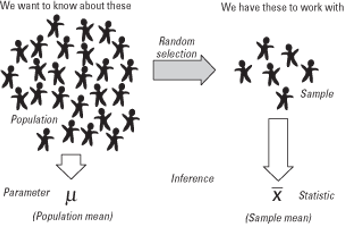 
     
### Our goal while doing empirical work in CS&AI


- **To use our knowledge of the sample to draw inferences about the target population **


  
## 3. Sampling Methods

### Simple random sampling

<p>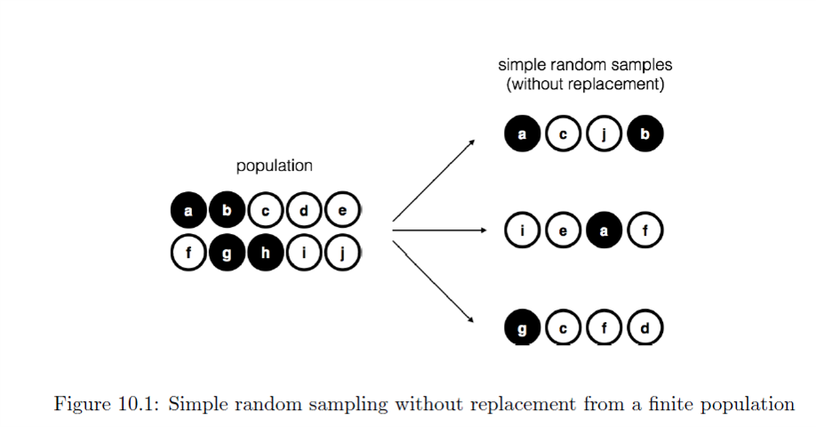</p>

### Side note on randomness

**Random vs pseudo random**

- R relies on a deterministic process to generate ‘random’ numbers

- **Random sampling or a random process** using the same procedure that can lead to different results each time with each person having equal chance of being selected

<p>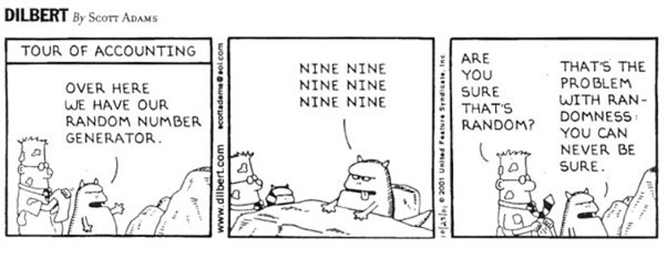</p>

- For more, check out: https://www.random.org/randomness/


### Biased sampling

<p>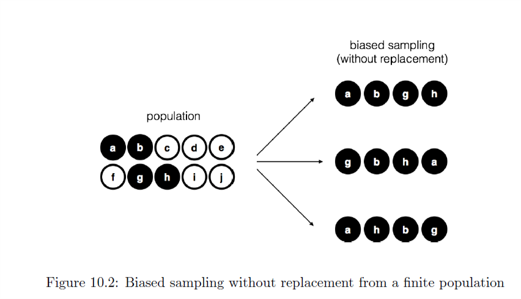</p>


### Biased sampling with replacement

<p>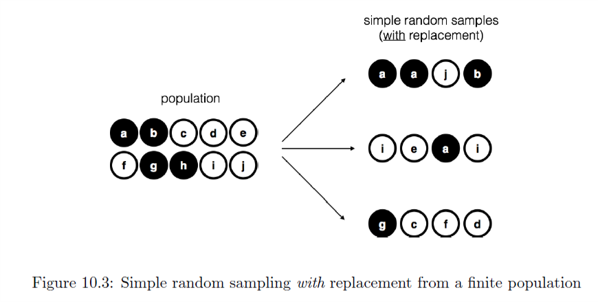</p>

## Sampling in R

- Create a variable called pop that includes the letters a-j
- Create a variable called samp1 by sampling the population using the sample() function
- Create a variable called samp2 by sampling the population using the sample() function with replacement
- Try to figure out how to add a bias to your sample that only draws the ‘black’ letters  a, b, g, and h and then make a samp3 variable with the biased sample. Remember that in sample(x, size, replace = FALSE, prob = NULL), prob stands for  a vector of probability weights for obtaining the elements of the vector being sampled.

**Remember: Figure 10.2**

### Create a variable called pop that includes the letters a-j

```{r ex1, exercise=TRUE}
#Create a variable called pop that includes the letters a-j


# Create a variable called samp1 by sampling the population using the sample() function
# to find out more you can type ?sample and run code to get help

#Create a variable called samp2 by sampling the population using the sample() function with replacement


#Try to figure out how to add a bias to your sample that only draws the ‘black’ letters  a, b, g, and h and then make a samp3 variable with the biased sample.
```
```{r ex1-hint}
#Use base function letters and select 1:10 (j is 10. letter)
pop<-base::letters[1:10]

samp1<-sample(pop,size=4,replace=FALSE)

samp2<-sample(pop,size=4,replace=TRUE)

bias<-c(1,1,0,0,0,0,1,1,0,0) #add a bias to letters a,b,g,h
samp3<-sample(pop,size=4,prob = bias,replace=FALSE)

```

```{r ex1-check}
#store
```


### Create a variable called samp1 by sampling the population using the `sample()` function

```{r ex2, exercise=TRUE}
#Create a variable called samp1 by sampling the population using the sample() function


```
```{r ex2-hint}
#Use function sample(), to find out more you can type ?sample and run code to get help
samp1<-sample(pop,size=4,replace=FALSE)
```
```{r ex2-check}
#store
```

### Create a variable called samp2 by sampling the population using the `sample()` function with replacement

```{r ex3, exercise=TRUE}
#Create a variable called samp2 by sampling the population using the sample() function with replacement

```
```{r ex3-hint}
#Use function sample(), to find out more you can type ?sample and run code to get help
samp2<-sample(pop,size=4,replace=TRUE)
```
```{r ex3-check}
#store
```

### Figure out how to add a bias to your sample that only draws the ‘black’ letters  a, b, g, and h and then make a samp3 variable with the biased sample. 
Remember that in sample(x, size, replace = FALSE, prob = NULL), prob stands for  a vector of probability weights for obtaining the elements of the vector being sampled.

```{r ex4, exercise=TRUE}
#Try to figure out how to add a bias to your sample that only draws the ‘black’ letters  a, b, g, and h and then make a samp3 variable with the biased sample.

```
```{r ex4-hint}
#Try to figure out how to add a bias to your sample that only draws the ‘black’ letters  a, b, g, and h and then make a samp3 variable with the biased sample.
bias<-c(1,1,0,0,0,0,1,1,0,0) #add a bias to letters a,b,g,h
samp3<-sample(pop,size=4,prob = bias,replace=FALSE)

```
```{r ex4-check}
#store
```

## 4. Sampling Distributions

### Types of sampling

| Type of sampling   | property   | Strength  |  Weakness  |
| ------------- |:-------------:|:-----:|:--------:|
| 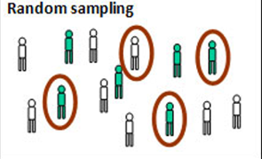   | Every member of a population has an equal chance of being selected E.g. Pulling names out of a hat  | For very large samples it provides the best chance of an unbiased representative sample     |  For large populations it is time- consuming to create a list of every individual.  |
| 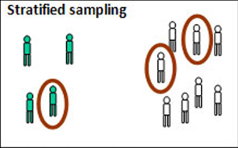| Dividing the target population into important subcategories Selecting members in proportion that they occur in the population E.g. 2.5% of British are of Indian origin, so 2.5% of your sample should be of Indian origin. and so on | A deliberate effort is made to make the sample representative of the target population|It can be time consuming as the subcategories have to be identified and proportions calculated |
| 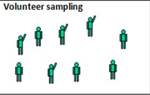        | Individuals who have chosen to be involved in a study. Also called self- selecting E.g. people who responded to an advert for participants| Relatively convenient and ethical if it leads to informed consent |  Unrepresentative as it leads to bias on the part of the participant. E.g. a daytime TV advert would not attract full-time workers.  |
| 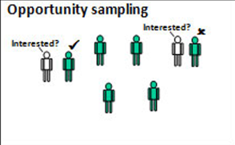 | Simply selecting those people that are available at the time. E.g. going up to people in cafés and asking them to be interviewed  | Quick, convenient and economical. A most common type of sampling in practice | Very unrepresentative samples and often biased by the researcher who will likely choose people who are ‘helpful’  |


### Convenience sampling and snowball sampling

### Convenience

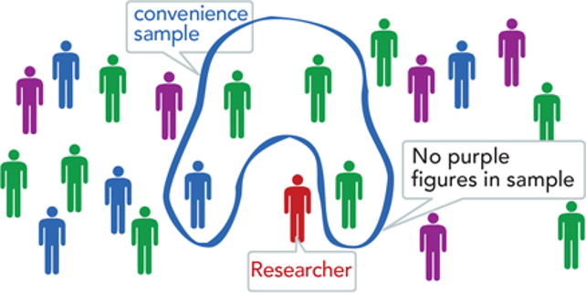

### Snowball

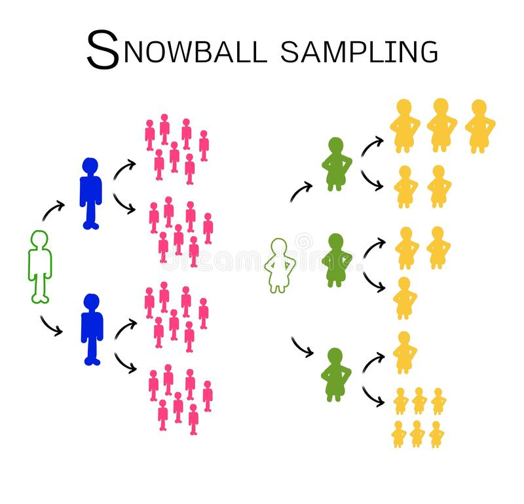

### Does your sampling method matter?

- It depends! 
- What is the target population?
- Could your sample be biased? In what way?
- Even if there is a bias, is the phenomena of interest likely to vary randomly in your sample?
- Often essential to:
  + Measure and report **diversity** in your sample
  + Be **transparent** about your sample and how they were recruited

### Activity: Discuss with a partner which sampling method might be most realistic in the cases below, why, what details you might need to report, and how the sample could be biased.

- The perceptions of different aged populations of a virtual agent helping with health issues
- How children with autism spectrum disorder learn social skills from a robot
- What cognitive capacities are associated with better problem solving performance
- People’s levels of stress after arriving to work after taking public transit


## 5. Population Parameters

### Sample statistics vs. Population parameters

- **Sample**
  + Mean and SD describe only the sample from which they were calculated.
- **Population**
  + Mean and SD are intended to describe the entire population (very rare in cog sci).
- **Sample to Population**
  + Mean and SD are obtained from a sample, but are used to **<u>estimate</u>** the mean and SD of the population (very common in cog sci).
  


| Parameter name            | Population parameter symbol   | Sample statistic  |
| ----------------- |:-------------:|:-----:|
| Number of cases   | $N$           | $n$     |
| Mean              | $\mu$         | $\overline{x}$ (Sample mean)|
| Proportion        | $\pi$         | $P$ (Sample proportion) | 
| Variance          | $\sigma^{2}$  | $s^{2}$ (Sample variance) |
| Standard deviation| $\sigma$      | $s$ (sample standard deviation) |
| Correlation       | $\rho$        | $r$ (Sample correlation) |
| Regression coefi. | $\beta$       | $b$ (Sample regression coefficient) |

## Exercises in R

### Sample statistics vs. Population parameters

- Let's generate some data:
  + IQ.1 <- round(rnorm(n=100, mean=100, sd=15))
  + IQ.2 <- round(rnorm(n=1000,mean=100,sd=15)) 
  + IQ.3 <- round(rnorm(n=10000,mean=100,sd=15))

**Now compare the mean and standard deviation of both of these. **

**What do you observe? And why?**


### 1. Generate three random variables with different sample sizes from a normal distribution

*Here's a simple exercise with an empty code chunk provided for entering the answer.*

```{r ex21, exercise=TRUE}
#Generate three random variables with different sample sizes from a normal distribution
IQ.1 <- round(rnorm(n=100, mean=100, sd=15))
IQ.2 <- round(rnorm(n=1000,mean=100,sd=15 ))
IQ.3 <- round(rnorm(n=10000,mean=100,sd=15))

### 2. Look at the means and standard deviations


### Make a plot of the three means, you can try creating plot by using function `plot()`

```
```{r ex21-hint}
#Generate three random variables with different sample sizes from a normal distribution
IQ.1 <- round(rnorm(n=100, mean=100, sd=15))
IQ.2 <- round(rnorm(n=1000,mean=100,sd=15 ))
IQ.3 <- round(rnorm(n=10000,mean=100,sd=15))

#Use pre built functions mean(),  sd()
mean(IQ.1)
sd(IQ.1)
mean(IQ.2)
sd(IQ.2)
mean(IQ.3)
sd(IQ.3)

plot(c(mean(IQ.1),mean(IQ.2),mean(IQ.3)),type='l')


### Make a plot of the three standard deviations 
# Remember that in sample(x, size, replace = FALSE, prob = NULL), prob stands for  a vector of probability weights for obtaining the elements of the vector being sampled.

plot(c(sd(IQ.1),sd(IQ.2),sd(IQ.3)),type='l')
```
```{r ex21-check}
#store
```


### 2. Look at the means and standard deviations

You can do this by using `mean()` and `sd()` functions included in R.
```{r ex22, exercise=TRUE}
#You could use pre built functions mean() and sd() to find out these values for all 3 datasets.


```
```{r ex22-hint}
#Use pre built functions mean(),  sd()
mean(IQ.1)
sd(IQ.1)
mean(IQ.2)
sd(IQ.2)
mean(IQ.3)
sd(IQ.3)

```
```{r ex22-check}
#store
```

### Make a plot of the three means 
You can try creating plot by using function `plot()`, to find out more about it run code: `?plot`

```{r ex23, exercise=TRUE}
# Make a plot for 3 value of means


```
```{r ex23-hint}
#Use function plot()
plot(c(mean(IQ.1),mean(IQ.2),mean(IQ.3)),type='l')

```
```{r ex23-check}
#store
```
### Make a plot of the three standard deviations 
Remember that in sample(x, size, replace = FALSE, prob = NULL), prob stands for  a vector of probability weights for obtaining the elements of the vector being sampled.

```{r ex24, exercise=TRUE}
#Make plot for 3 values of standard deviation


```
```{r ex24-hint}
#Use function plot()
plot(c(sd(IQ.1),sd(IQ.2),sd(IQ.3)),type='l')
```
```{r ex24-check}
#store
```

## 6. Law of large numbers

- **We get more ‘accurate’ numbers from larger samples.**

- **With the roll of a six sided die we see:**

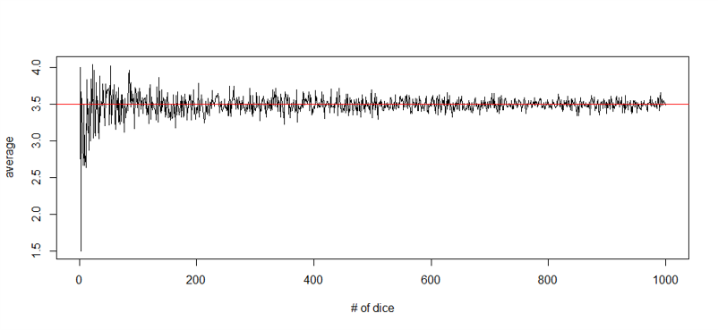


- With sample statistics, as our sample size increases ($N \to Inf$), the sample mean approaches the population mean. 
- So our sample statistics are often have a degree of inaccuracy, but this tells us with more data, we can move closer and closer to the true population parameters

### IQ score sampling distribution

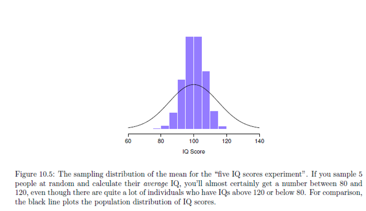

Figure 10.5: The sampling distribution of the mean for the "five IQ scores experiment". If you sample 5 people at random and calculate their average IQ, you'll almost certainly get a number between 80 and 120, even though there are quite a lot of individuals who have IQs above 120 or below 80. For comparison, the black line plots the population distribution of IQ scores.

## Exercises in R

### Sampling distribution of the mean

- Using the same sample information from before (M = 100, SD = 15)
  + Calculate the sampling distribution of the mean for 100, 1000, and 10000 samples with size 5
  + Plot a histogram for each of these
- After that:
  + Calculate the sampling distribution of the mean for 100, 1000, and 10000 samples with size 10000
  + Plot a histogram for each of these
  
- **HINT: You may want to use a for loop**


### Calculate the sampling distribution of the mean for 100, 1000, and 10000 samples with size 10000
Plot a histogram for each of these

```{r ex31, exercise=TRUE}
#Use a loop to create more samples
x<-NULL
for (i in 1:100){
  x[i]<-round(rnorm(n=10000,mean=100,sd=15))
}
hist(x, freq=FALSE,col='gray')
x<-NULL
for (i in 1:1000){
  x[i]<-round(rnorm(n=10000,mean=100,sd=15))
}
hist(x, freq=FALSE,col='gray')
x<-NULL
for (i in 1:10000){
  x[i]<-round(rnorm(n=10000,mean=100,sd=15))
}
hist(x, freq=FALSE,col='gray')

```
```{r ex31-hint}
#Generate three variables with different sample sizes from a normal distribution
x<-NULL
for (i in 1:100){
  x[i]<-round(rnorm(n=10000,mean=100,sd=15))
}
hist(x, freq=FALSE,col='gray')
x<-NULL
for (i in 1:1000){
  x[i]<-round(rnorm(n=10000,mean=100,sd=15))
}
hist(x, freq=FALSE,col='gray')
x<-NULL
for (i in 1:10000){
  x[i]<-round(rnorm(n=10000,mean=100,sd=15))
}
hist(x, freq=FALSE,col='gray')
```
```{r ex31-check}
#store
```


### Calculate the sampling distribution of the mean for 100, 1000, and 10000 samples with size 5
And Plot a histogram for each of these

You can do this by using `hist()` function included in R.
```{r ex32, exercise=TRUE}

### Calculate the sampling distribution of the mean for 100, 1000, and 10000 samples with size 5


```
```{r ex32-hint}
#You could use mean(round(rnorm(n=5,mean=100,sd=15) in a for loop. Do it for 100 samples here:
x<-NULL
for (i in 1:100){
  x[i]<-round(rnorm(n=5,mean=100,sd=15))
}
hist(x, freq=FALSE,col='gray')
#You could use mean(round(rnorm(n=5,mean=100,sd=15) in a for loop. Do it for 1000 samples here:
x<-NULL
for (i in 1:1000){
  x[i]<-round(rnorm(n=5,mean=100,sd=15))
}
hist(x, freq=FALSE,col='gray')


x<-NULL
for (i in 1:10000){
  x[i]<-round(rnorm(n=5,mean=100,sd=15))
}
hist(x, freq=FALSE,col='gray')

```
```{r ex32-check}
#store
```
```{r ex33, exercise=TRUE}
#You could use mean(round(rnorm(n=5,mean=100,sd=15) in a for loop. Do it for 1000 samples here:


```
```{r ex33-hint}
#You could use mean(round(rnorm(n=5,mean=100,sd=15) in a for loop. Do it for 1000 samples here:
x<-NULL
for (i in 1:1000){
  x[i]<-round(rnorm(n=5,mean=100,sd=15))
}
hist(x, freq=FALSE,col='gray')

```
```{r ex33-check}
#store
```
```{r ex34, exercise=TRUE}
#You could use mean(round(rnorm(n=5,mean=100,sd=15) in a for loop. Do it for 10000 samples here:


```
```{r ex34-hint}
#You could use mean(round(rnorm(n=5,mean=100,sd=15) in a for loop. Do it for 10000 samples here:

x<-NULL
for (i in 1:10000){
  x[i]<-round(rnorm(n=5,mean=100,sd=15))
}
hist(x, freq=FALSE,col='gray')

```
```{r ex34-check}
#store
```


### Sampling distribution of the mean

 In panel a, each data set contained only a single observation, so the mean of each sample is just one person's IQ score. As a consequence, the sampling distribution of the mean is of course identical to the population distribution of IQ scores. 
 However, when we raise the sample size to 2, the mean of any one sample tends to be closer to the population mean than a one person's IQ score, and so the histogram (i.e., the sampling distribution) is a bit narrower than the population distribution. By the time we raise the sample size to 10 (panel c), we can see that the distribution of sample means tend to be fairly tightly clustered around the true population mean.


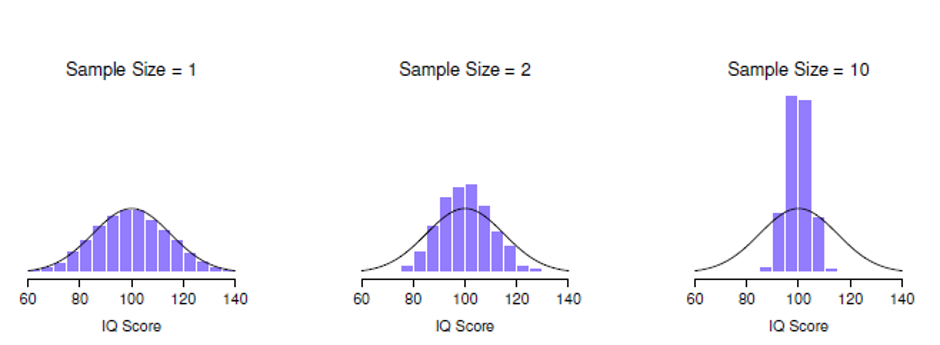

### Exercise: Standard error

- Using the same sample information from before (M = 100, SD = 15)
  + Calculate the standard error of the mean for 10000 samples with size 5
  + Plot a histogram for each of these

- Using the same sample information from before (M = 100, SD = 15)
  + Calculate the standard error of the mean for 10000 samples with size 10000
  + Plot a histogram for each of these

**Standard error:** $SE = \frac{\sigma}{\sqrt n}$ 


### Calculate the standard error of the mean for 10000 samples with size 5

And Plot a histogram for each of these
M = 100, SD = 15

You can do this by using `sd()` function included in R.
```{r ex41, exercise=TRUE}
#Formula for Standard error is SD/sqrt(number of samples)


```
```{r ex41-hint}
#You could use mean(round(rnorm(n=5,mean=100,sd=15) in a for loop. Do it for 100 samples here:
x<-NULL
for (i in 1:10000){
  x[i]<-sd(round(rnorm(n=5,mean=100,sd=15)))/sqrt(5)
}
hist(x, freq=FALSE,col='gray')

```
```{r ex41-check}
#store
```
### Calculate the standard error of the mean for 10000 samples with size 10000
Plot a histogram for each of these
M = 100, SD = 15

You can do this by using `sd()` function included in R.
```{r ex42, exercise=TRUE}
#Formula for Standard error is SD/sqrt(number of samples)


```
```{r ex42-hint}
#You could use mean(round(rnorm(n=5,mean=100,sd=15) in a for loop. Do it for 1000 samples here:
x<-NULL
for (i in 1:10000){
  x[i]<-sd(round(rnorm(n=10000,mean=100,sd=15)))/sqrt(10000)
}
hist(x, freq=FALSE,col='gray')

```
```{r ex42-check}
#store
```

## 7. Central limit theorem

- Given a sufficiently sized sample, the following claims are typically true:
  + The mean of the sampling distribution is the same as the mean of the population
  + The standard deviation of the sampling distribution (the standard error) gets smaller as the sample size increases 
  + The shape of the sampling distribution becomes normal as the sample size increases. 
  
- What can this tell us?
  + Why larger experiments are more reliable than smaller ones
  + And how much more (in terms of standard error)
  + Why the normal distribution is normal

### Estemating population parameters

- **Often we just give our best guess**

| Symbol            | What is it           | Do we know what it is?  |
|:----:|:-------------:|:---------:|
| $\tilde{x}$   | Sample mean   | Yes, calculated from the raw data     |
| $\mu$              | True population mean        | Almost never known for sure|
| $\hat{\mu}$       | Estimate of population mean         | Yes, identical of sample mean | 


| Symbol            | What is it           | Do we know what it is?  |
|:----:|:-------------:|:---------:|
| $s$   | Sample standard deviation   | Yes, calculated from the raw data     |
| $\sigma$    | Population standard deviation | Almost never known for sure|
| $\hat{\sigma}$       | Estimate of population standard deviation| Yes, identical of sample mean | 

| Symbol         | What is it    | Do we know what it is?  |
|:----:|:-------------:|:---------:|
| $s^{2}$   | Sample variance  | Yes, calculated from the raw data     |
| $\sigma^{2}$               | Population variance | Almost never known for sure|
| $\hat{\sigma}^{2}$       | Estimate of population variance | Yes, identical of sample mean | 


### CI and SE mixup


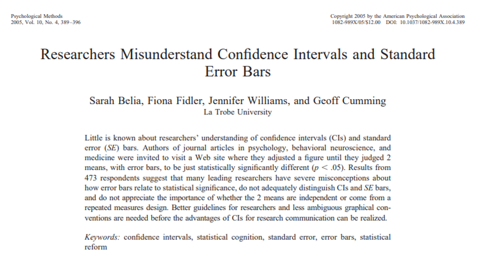


### Confidence intervals

- <u>**Need to quantify the amount of uncertainty that is associated with our estimates of population parameters.**</u> 
- Typically we want to say there is a 95% chance the true population mean lies within a certain window of values (e.g., between 105 and 114).
- There is a 95% chance that a normally-distributed quality lies within 2 standard deviations of the mean.

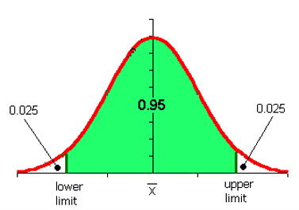

### Finding the boundaries in R

Run the code to find lower and upper limit:

```{r qnorm, exercise=TRUE}
#This is two tailed z test distribution .. use qnorm

```
```{r qnorm-hint}

qnorm( p = c(.025, .975) )


```
```{r qnorm-check}
#store
```
[1] -1.959964  1.959964
$$\overline{X}-(1.96\cdot SEM)\le\mu\le\overline{X}+(1.96 \cdot SEM)$$

$$CI_{95}=\overline{X}\pm(1.96\cdot\frac{\sigma}{\sqrt N})$$

- Actually need to rely on a t-distribution (because we don’t know the true population SD
- N <- 10000 # suppose our sample size is 10,000
- >`qt( p = .975, df = N-1)`
- Check this video: https://www.khanacademy.org/math/statistics-probability/confidence-intervals-one-sample/old-confidence-interval-videos/v/t-statistic-confidence-interval

### Do a T-distribution
Sample size N=10000

```{r ex52, exercise=TRUE}
#This is one? tailed z test distribution
N <- 10000 # suppose our sample size is 10,000
qt( p = .975, df = N-1)

```
```{r ex52-hint}
#You could..


```
```{r ex52-check}
#store
```

### Interpreting a confidence interval

+ If we replicated the experiment over and over again and computed a 95% confidence interval for each replication, then 95% of those intervals would contain the true mean.


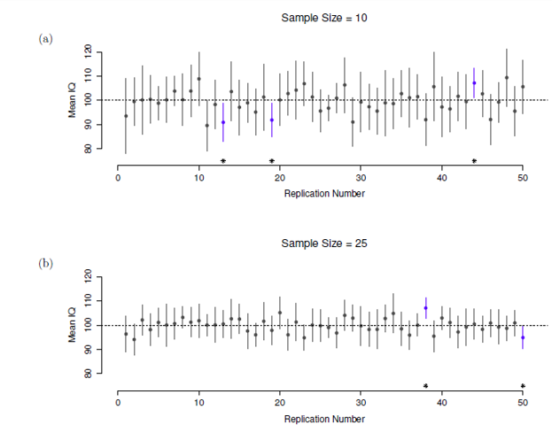

Figure 10.11: 95% confidence intervals. The top (panel a) shows 50 simulated replications of an exper-
iment in which we measure the IQs of 10 people. The dot marks the location of the sample mean, and the line shows the 95% confidence interval. In total 47 of the 50 confidence intervals do contain the true mean (i.e., 100), but the three intervals marked with asterisks do not. The lower graph (panel b) shows a similar simulation, but this time we simulate replications of an experiment that measures the IQs of 25 people.


## Exercise 1

### Calculating the CI in R

- Install and load the lsr package
- Install and load the R datasets package and load the ‘trees’ and ‘discoveries’ data sets
- Use Help in R to find out what these datasets contain
- For each variable in the trees data set (Girth, Height, Volume)
  - Estimate the population mean and sd
  - Use the `ciMean()` function to find out 95% CI of the population mean
  - Use the `ciMean()` function to find out 99% CI of the population mean
  - How do these CIs compare?
- For the discoveries data set:
  - Do you think this is  sample or a population? Why?
  - Assume it is a sample and  estimate the population mean and sd
  - Use the `ciMean()` function to find out 95% CI of the population mean
  - Assume it is your population and draw a sample of various sizes (e.g., 5, 10, 30, 60), without replacement and see how the sample mean and SD compare to the original estimates you got. 

**If you're running this locally, make sure the lsr package is installed**

### 1. Load packages and data

Load the library 'datasets' and the 'discoveries' and 'trees' datasets.

In this online coding environment the libraries are pre-installed However, do not forget to install and load any new libraries when running R studio on your computer! 
 
 
```{r ex80, exercise=TRUE}
#datasets are preloaded, cakk them 'discoveries' and 'trees'
head(trees)

#Find values for mean, SD, and both confidence intervals(95% and 99%) for tree grith


#Find mean, sd and both confidence intervals for tree height

#Find mean, sd and both confidence intervals for tree volume


```
```{r ex80-hint}
library('datasets')
data("discoveries")
data('trees')

#calculate required values
mean(trees$Girth)
sd(trees$Girth)
ciMean(x=trees$Girth,conf=.95)
ciMean(x=trees$Girth,conf=.99)

mean(trees$Height)
sd(trees$Height)
ciMean(x=trees$Height,conf=.95)
ciMean(x=trees$Height,conf=.99)

```
```{r ex80-check}
#store
```
### Trees Data

 In the code blocks below, you can write, run, and submit code for the tree part of the exercise.
 
### Tree Girth: mean, sd and CI(95% and 99%)

```{r ex81, exercise=TRUE}
#Find values for mean, SD, and both confidence intervals


```
```{r ex81-hint}
#calculate required values
mean(trees$Girth)
sd(trees$Girth)
ciMean(x=trees$Girth,conf=.95)
ciMean(x=trees$Girth,conf=.99)

```
```{r ex81-check}
#store
```

### Tree Height: mean, sd and CI(95% and 99%)**

```{r ex82, exercise=TRUE}
#Find values for mean, sd and both confidence intervals


```
```{r ex82-hint}
#calculate required values
mean(trees$Height)
sd(trees$Height)
ciMean(x=trees$Height,conf=.95)
ciMean(x=trees$Height,conf=.99)

```
```{r ex82-check}
#store
```

### Tree Volume: mean, SD, and CI(95% and 99%)

```{r ex83, exercise=TRUE}
#Find values for mean, sd and both confidence intervals


```
```{r ex83-hint}
#calculate required values
mean(trees$Volume)
sd(trees$Volume)
ciMean(x=trees$Volume,conf=.95)
ciMean(x=trees$Volume,conf=.99)

```
```{r ex83-check}
#store
```


### Discoveries

Do you think this is  sample or a population? Why? Preform some analysis on the dataset to give a better answer.

Assume it is a sample and  estimate the population mean and sd

```{r ex84, exercise=TRUE}
#Find values for mean, SD and Confidence interval(95% and 99%)


```
```{r ex84-hint}
#calculate required values
mean(discoveries[1:100])
sd(discoveries[1:100])
ciMean(x=discoveries[1:100],conf=.95)
ciMean(x=discoveries[1:100],conf=.99)


```
```{r ex84-check}
#store
```
### Draw samples

 Assume it is your population and draw a sample of various sizes (e.g., 5, 10, 30, 60), without replacement and see how the sample mean and SD compare to the original estimates you got.
 
```{r ex85, exercise=TRUE}
#Make sample of size 5 and calculate sample mean and SD
?sample

```
```{r ex85-hint}
#Make sample of size 5 and calculate sample mean and SD
disc_samp1<-sample(discoveries[1:100],size=5,replace=FALSE)
mean(disc_samp1)
sd(disc_samp1)


```
```{r ex85-check}
#store
```
### Make sample of size 10
```{r ex86, exercise=TRUE}
#Make sample of size 10 and calculate sample mean and SD
?sample

```
```{r ex86-hint}
#Make sample of size 10 and calculate sample mean and SD
disc_samp2<-sample(discoveries[1:100],size=10,replace=FALSE)
mean(disc_samp2)
sd(disc_samp2)
```
```{r ex86-check}
#store
```

### Make sample of size 30
```{r ex87, exercise=TRUE}
#Make sample of size 30 and calculate sample mean and SD
?sample

```
```{r ex87-hint}
#Make sample of size 30 and calculate sample mean and SD
disc_samp3<-sample(discoveries[1:100],size=30,replace=FALSE)
mean(disc_samp3)
sd(disc_samp3)
```
```{r ex87-check}
#store
```

### Make sample size of 60

```{r ex88, exercise=TRUE}
#Make sample of size 60 and calculate sample mean and SD


```
```{r ex88-hint}
#Make sample of size 60 and calculate sample mean and SD
disc_samp4<-sample(discoveries[1:100],size=60,replace=FALSE)
mean(disc_samp4)
sd(disc_samp4)
```
```{r ex88-check}
#store
```


## Exercise 2 

### Simulate a simple random sample

- Install and load the ‘tigerstats’ package
- Load the FakeSchool data include in the package and check out the data frame
- Check out the arguments for the `popsamp()` function
- Using the `popsamp()` function generate a simple random sample from the FakeSchool “population” of size 7
- Calculate the mean Grade Point Average (GPA) of the population (the whole FakeSchool)
- Calculate the mean of the Simple Random Sample
- Compare the two means


### Load the FakeSchool dataset from tigerstats

In this online coding environment the packages you need are pre-installed and loaded. Don't forget to install and load the packages you need.

```{r ex61, exercise=TRUE}
library(tigerstats)
data(FakeSchool)

### Set a seed to be able to replicate random samples
#With setting a seed you ensure random alghoritm will be the same every time you run it


### Generate a simple random sample of size 7 and store it in a variable called simplerandomsample


### Check the mean GPA of the population and store it in a variable called mean.pop

### Check the mean GPA of the simple random sample 


```
```{r ex61-hint}

if (!require('tigerstats')) install.packages('tigerstats')
require(tigerstats)
data(FakeSchool)

#With setting a seed you ensure random alghoritm will be the same every time you run it
set.seed(23325)

simplerandomsample<-popsamp(7,FakeSchool)

mean.pop<- mean(FakeSchool$GPA)

#Use randomsample from previiys data to create variable: mean.srs
mean.srs<- mean(simplerandomsample$GPA)

```
```{r ex61-check}
#store
```

**Compare the two means**

## Exercise 3

### Simulate a stratified sample

- Using the FakeSchool data there are Honors and non-Honors students:
- Create a sample of size 7 that proportionally represents the honors and non-honors students in the population (the whole FakeSchool data frame)
- Calculate the mean Grade Point Average (GPA) of the stratified sample.
- How does it compare to the simple random sample and true population mean?
- Why might stratified sampling be difficult in practice? 


### How many students in each category?

- How many honors students are there compared to non-honors students?

- You can use many different methods to give specific information from your dataset

- Here it might be a problem of multiple solutions

```{r ex69, exercise=TRUE}
#There are many commands that can help you inspect data


# Remember `popsamp()` function? If not run code: `??popsamp`
# To solve this exercise you need to combine two samples(honor-non honor) and combine them
##Create a sample of size 7 that proportionally represents the honors and non-honors students in the population.
#honors

#non honors


# Combine the two samples to create sample that proportionally represents the distribution of honor/non-honor population and calculate GPA mean


```
```{r ex69-hint}
#hint

summary(FakeSchool)

psych::describeBy(FakeSchool,FakeSchool$Honors)

set.seed(1837)

honors=subset(FakeSchool,Honors=="Yes")
honors.samp=popsamp(3,honors)


nonhonors=subset(FakeSchool,Honors=="No") 
nonhonors.samp=popsamp(4,nonhonors) 

stratifiedsample<-rbind(honors.samp,nonhonors.samp)
stratifiedsample.mean<-mean(stratifiedsample$GPA)
stratifiedsample.mean

```
```{r ex69-check}
#store
```


## Exercise 4

### Calculate many simple random samples

- Using the FakeSchool data :
- For 100, 1000, and 10,000 samples, create a sample of size 7 from population (the whole FakeSchool data frame)
- Visualize the sampling distribution of the mean Grade Point Average (GPA) for each of the total numbers of samples (100, 1000, 10,000)
- Calculate the mean of the sampling distribution of the means (100, 1000, 10,000)
- Calculate the 95%CI for the sampling distribution of the means (100, 1000, 10,000)


### Create sampling distribution of the mean and CIs for 1000 simple random samples

In this online coding environment it’s not needed to load libraries, because they are pre-loaded. However, do not forget to load libraries when running R studio on your computer! In this case, we would use library(lsr).

### For 100, 1000, and 10,000 samples, create a sample of size 7 from population and visualize with histogram

```{r ex71, exercise=TRUE}
#100 samples and plot a histogram
head(FakeSchool)

#1000 samples

#10000 samples

### Calculate mean and confidence interval of sampling distribution of the means from the 3 sample sets(100, 1000, 10000) that you've just created

```
```{r ex71-hint}
#100 samples
x.100<-NULL
for (i in 1:100){
  srs<-popsamp(7,FakeSchool)
  x.100[i]<-mean(srs$GPA)
}
hist(x.100, freq=FALSE,col='gray')
#1000 samples
x.1000<-NULL
for (i in 1:1000){
  srs<-popsamp(7,FakeSchool)
  x.1000[i]<-mean(srs$GPA)
}
hist(x.1000, freq=FALSE,col='gray')
#10000 samples
x.10000<-NULL
for (i in 1:10000){
  srs<-popsamp(7,FakeSchool)
  x.10000[i]<-mean(srs$GPA)
}
hist(x.10000, freq=FALSE,col='gray')

#100 samples dataset mean and confidence interval
mean(x.100)
ciMean(x.100)
```
```{r ex71-check}
#store
```


## Conclusion

### Summing up

- Sampling Methods
- Sample statistics vs population parameters
- Estimating population parameters from sample statistics 
- Confidence intervals

### Thanks!

See you next week!
**Questions?**
