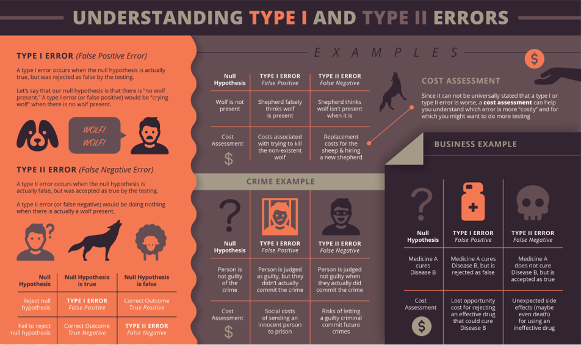

```{r setup, include=FALSE}
## libraries
library(learnr)
library(tidyr)
library(dplyr)
library(ggplot2)
library(scales)
library(RMariaDB)
library(DBI)
library(pool)


### FILL IN YOUR DATABASE DETAILS HERE ###

################################################################################

pool <- dbPool(
  drv = RMySQL::MySQL(), ## Check that this corresponds to the type of database you are using (MySQL/MariaDB, etc.)
  dbname = "YOUR DATABASE NAME",
  host = "DATABASE IP", 
  username = "USERNAME", ## Make sure the user has read & write rights for the selected database
  password = "PASSWORD"
)

dbtable = "THE TABLE YOU WANT TO STORE QUIZ/EXERCISE DATA IN FOR THIS MODULE"
################################################################################


select_query = paste("SELECT * FROM", dbtable)

## options
knitr::opts_chunk$set(echo = TRUE)
tutorial_options(exercise.eval = FALSE, exercise.checker=FALSE)

## recording data
new_recorder <- function(tutorial_id, tutorial_version, user_id, event, data) {
    cat(user_id, ", ", event, ",", data$label, ", ", data$answer, ", ", data$correct, "\n", sep = "", append = TRUE)
  
d_tibble <- tibble::tibble(
user_id  = user_id, 
event = event,
label = data$label,
correct = data$correct,
question = data$question,
answer = data$answer
  )

## send to mysql
dbWriteTable(pool, "module3", d_tibble, append=TRUE, row.names = FALSE)}

options(tutorial.event_recorder = new_recorder)

#exercuse setup
library(BSDA)
library(psych)
exam_data=read.delim("data/Exam Anxiety.dat")


```

## Introduction

```{r, echo=FALSE, out.width="100%", fig.align = "center"}
## HEADER ###
HTML("  <div class='jumbotron jumbotron-fluid'>
    <div class='container'>
    <h2 class='mb-3' style='color:rgba(31, 56, 100, 0.85);'><u>Correlation</u></h2>
    <h4 class='mb-3'>Statistics for CSAI II</h4>
    <h6 class='mb-3'>Travis J. Wiltshire, Ph.D.</h6>
    </div>
  </div>")
```


### Outline

What we will cover today:

1. Hypothesis Testing Revisited
2. Correlation

## Quiz

### Question 1

```{r Quiz1,  echo=FALSE}
  question("Which of the following models shows orthogonal polynomial regression with a quadratic term?",
    answer("`lm(affect ~ stress + I(stress^2))`"),
    answer("`lm(affect ~ stress * performance)`"),
    answer("`lm(affect ~ poly(stress, 2) + performance)`", correct = TRUE),
    answer("`lm(affect ~ poly(stress, 3) + performance)`"),
    allow_retry = FALSE
    )
```

### Results

#### 1. Which of the following models shows orthogonal polynomial regression with a quadratic term?

```{r, Quiz1O, echo = FALSE}
plotOutput("Q1")
```

```{r, Quiz1R, context="server", echo = FALSE, warning = FALSE, message=FALSE, out.width="100%", fig.align = "center"}

output$Q1 <- renderPlot({
  
  data <- dbGetQuery(pool, select_query)
  answers <- subset(data, data$label == "Quiz1",)
  answers[answers==""] <- NA
  answers <- na.omit(answers)

  answers_count <- as.data.frame(answers %>% 
  count(answer))
  total_n = nrow(answers)
  answers_count$percentage <- (answers_count$n/total_n)*100
  answers_count$correct <- ifelse(answers_count$answer == "`lm(affect ~ poly(stress, 2) + performance)`", "Correct", "Incorrect")

  ggplot(answers_count,
         aes(x = percentage,
             y = answer,
             fill=correct
             )
         ) +
    geom_col(width=0.6) +theme_minimal() + scale_fill_brewer(palette="Paired", direction=-1)  +
    xlab("Percentage (%)") + ylab("Answer") + labs(fill = "Correct")
})
```

### Question 2

```{r Quiz2,  echo=FALSE}
  question("Which of the following is the most accurate interpretation of intra-class correlation (ICC) in mixed modeling?",
    answer("How much variation in the model is due to random effects", correct = TRUE),
    answer("How correlated the random effects are with the fixed effects"),
    answer("How much variation in the model is due to the fixed effects"),
    answer("How much correlation there is between the random intercepts and random slopes"),
    allow_retry = FALSE
    )
```

### Results

#### 2. Which of the following is the most accurate interpretation of ICC in mixed modeling?

```{r, Quiz2O, echo = FALSE}
plotOutput("Q2")
```

```{r, Quiz2R, context="server", echo = FALSE, warning = FALSE, message=FALSE, out.width="100%", fig.align = "center"}

output$Q2 <- renderPlot({
  
  data <- dbGetQuery(pool, select_query)
  answers <- subset(data, data$label == "Quiz2",)
  answers[answers==""] <- NA
  answers <- na.omit(answers)

  answers_count <- as.data.frame(answers %>% 
  count(answer))
  total_n = nrow(answers)
  answers_count$percentage <- (answers_count$n/total_n)*100
  answers_count$correct <- ifelse(answers_count$answer == "How much variation in the model is due to random effects", "Correct", "Incorrect")

  ggplot(answers_count,
         aes(x = percentage,
             y = answer,
             fill=correct
             )
         ) +
    geom_col(width=0.6) +theme_minimal() + scale_fill_brewer(palette="Paired", direction=-1)  +
    xlab("Percentage (%)") + ylab("Answer") + labs(fill = "Correct")
})
```


### Question 3

```{r Quiz3,  echo=FALSE}
  question("Which of the following is true regarding growth curve modeling and mixed effects modeling?",
    answer("Growth curve models do not feature random slopes or random intercepts"),
    answer("Growth curve models use both latent and observed variables to look at trajectories of change over time"),
    answer("Mixed effects models cannot capture the growth of variables over time"),
    answer("Growth curve modeling is a form of mixed modeling that focuses on modeling the shape over time", correct = TRUE),
    allow_retry = FALSE
    )
```

### Results

#### 3. Which of the following is true regarding growth curve modeling and mixed effects modeling?

```{r, Quiz3O, echo = FALSE}
plotOutput("Q3")
```

```{r, Quiz3R, context="server", echo = FALSE, warning = FALSE, message=FALSE, out.width="100%", fig.align = "center"}

output$Q3 <- renderPlot({
  
  data <- dbGetQuery(pool, select_query)
  answers <- subset(data, data$label == "Quiz3",)
  answers[answers==""] <- NA
  answers <- na.omit(answers)

  answers_count <- as.data.frame(answers %>% 
  count(answer))
  total_n = nrow(answers)
  answers_count$percentage <- (answers_count$n/total_n)*100
  answers_count$correct <- ifelse(answers_count$answer == "Growth curve modeling is a form of mixed modeling that focuses on modeling the shape over time", "Correct", "Incorrect")

  ggplot(answers_count,
         aes(x = percentage,
             y = answer,
             fill=correct
             )
         ) +
    geom_col(width=0.6) +theme_minimal() + scale_fill_brewer(palette="Paired", direction=-1)  +
    xlab("Percentage (%)") + ylab("Answer") + labs(fill = "Correct")
})
```


## Hypothesis testing

### What is a hypothesis? 

- A formal statement predicting the relationship between two or more variables.
  + The number of hours spent studying will improve student’s grades in a course.
  + Playing video games more often will lead to stronger social relationships in teenagers. 
  + Higher instances of communication breakdowns in teams will lead to poorer teamwork performance. 

### Hypothesis Testing

- The general goal of a hypothesis test is to rule out chance (sampling error) as a plausible explanation for the results from a research study.  
- Hypothesis testing is a technique often used to help determine whether a specific treatment has an effect on the individuals in a population. 


### Null and Alternative Hypotheses

- Convert the research question to null and alternative hypotheses 
- The **null hypothesis (H0)** is a claim of “no difference in the population” 
  + Or an effect is zero
- **The alternative hypothesis (Ha)** claims “H0 is false”
- Collect data and seek evidence against H0 as a way of bolstering Ha (deduction)

### Critical regions


### Critical regions


## Z-test in R

1. Randomly generate a vector in R from a normal distribution with mean of 55.4, n=30,sd=5.
2. Install and load the BSDA package
3. Check out the arguments for the `z.test()` function
4. Come up with a null hypothesis and alternative hypothesis regarding your randomly generated vector using the following population parameters: H0 : μ0 = 50, σ = 20
5. Use the `z.test()` function to test your hypothesis
6. Read the output and make a decision about the null hypothesis

### Load 

In this online coding environment it’s not needed to load the data, because they are pre-loaded. However, do not forget to load the data and libraries when running R studio on your computer!

```{r ex11, exercise=TRUE}
#Require BSDA

# Generate a vector from a random normal distribution with a certain mean and standard deviation


# Generate a z statistic and results

```
```{r ex11-hint}

#code to generate a vector from a random normal distribution with a certain
#mean and standard deviation
x<-rnorm(n=30,mean=55.4,sd=5)

# Generate a z statistic and results

z.test(x=x,sigma.x=20,mu=50,conf.level=0.95,alternative='greater')

```
```{r ex11-check}
#store
```


### Using the t distribution when population SD is unknown

- **S is our sample SD**

$$t-statistic=\frac{\overline{x}-\mu_{0}}{\frac{S}{\sqrt{n}}}$$


## T-test in R

1. Again, create a vector in R from a normal distribution with mean of 55.4, n=30,sd=5.
2. Check out the arguments for the `t.test()` function
3. Come up with a null hypothesis and alternative hypothesis regarding your randomly generated vector using the following population parameter: H0 : μ0 = 50
4. Use the `t.test()` function to test your hypothesis
5. Read the output and make a decision about the null hypothesis
6. How does this compare to your z.test?
7. What about the CIs?

###  Code to generate a t-statistic and results
```{r ex14, exercise=TRUE}
#code to generate a t statistic and results

```
```{r ex14-hint}
# code to generate a t statistic and results
x<-rnorm(n=30,mean=55.4,sd=5)

t.test(x=x,mu=50,conf.level=0.95,alternative='greater')
```
```{r ex14-check}
#store
```


## Errors in Hypothesis Tests

- Just because the sample mean (following treatment) is different from the original population mean does not necessarily indicate that the treatment has caused a change or that there is an effect.  
- You should recall that there usually is some discrepancy between a sample mean and the population mean simply as a result of sampling error. 



### Measuring Effect Size

- Because a significant effect does not necessarily mean a large effect, it is recommended that the hypothesis test be accompanied by a measure of the **effect size.**  
- For mean comparisons we typically use Cohen’s d as a standardized measure of effect size.  
- Much like a z-score, **Cohen’s d** measures the size of the mean difference in terms of the standard deviation.


### Effect Size


### Effect size exercises

1. Install/load the ‘psych’ package
2. Read about the `cohen.d()` function
3. Load the sat.act data from the psych package into your global env.
4. Calculate the effect size that gender has on each of the variables in the sat.act dataset
5. What do the effect sizes tell you? 

### Code for effect size example

In this online coding environment it’s not needed to load the data, because they are pre-loaded. However, do not forget to load the data and libraries when running R studio on your computer!

```{r ex15, exercise=TRUE}
#code to generate effect size sample
head(sat.act)

```
```{r ex15-hint}
# code to generate a effect size sample
library(psych)
cohen.d(sat.act,"gender")
cd <- cohen.d.by(sat.act,"gender","education") #Compound effect sizes
summary(cd)  #summarize the output
```
```{r ex15-check}
#store
```


## Hypothesis Testing and a Model Based Approach

- Data = Model + Error
- Comparison (relationship) vs Prediction (predicted outcomes vs predicting relationship vs using the model for prediction)

### Hypothesis Testing in a Model-Based Framework


### Test ideas


## Correlation 

### Outline

1. **Measuring relationships**
  + Scatterplots
  + Covariance
  + Pearson’s correlation coefficient
2. **Nonparametric measures**
  + Spearman’s rho
  + Kendall’s tau
3. **Interpreting correlations**
  + Causality
4. **Partial correlations**

### What is a correlation?

- It is a way of measuring the extent to which two variables are related.
- It measures the pattern of responses across variables.


### Different types of relationships


### www.guessthecorrelation.com

- www.guessthecorrelation.com


### Measuring Relationships

- We need to see whether as one variable increases, the other increases, decreases or stays the same.
- This can be done by calculating the **<u>covariance.</u>**
  + We look at <u>how much each score deviates from the mean.</u>
  + If both variables deviate from the mean by the same amount, they are likely to be related.


### Revisiting the Variance

- The variance tells us by how much scores deviate from the mean for a single variable.
- It is closely linked to the sum of squares.
- Covariance is similar – it tells is by how much scores on two variables differ from their respective means.

$$variance = \frac{\sum_{i=1}^{n}(x_i - \mu)^2} {N-1}$$
- **Sum of squared errors (deviations from the mean)**
- **Square to avoid values canceling each other out when summing.**

### Covariance

- Calculate the error between the mean and each subject’s score for the first variable (x).
- Calculate the error between the mean and their score for the second variable (y).
- Multiply these error values.
- Add these values and you get the cross product deviations.
- The covariance is the average cross-product deviations:

$$cov_{x,y}=\frac{\sum_{i=1}^{N}(x_{i}-\bar{x})(y_{i}-\bar{y})}{N-1}$$

### Calculating example


$cov_{x,y}=\frac{\sum(x_{i}-\bar{x})(y_{i}-\bar{y})}{N-1}\\=\frac{(-0.4)(-3)+(-1.4)(-2)+(-1.4)(-1)+(0.6)(2)+(2.6)(4)}{4}\\=\frac{1.2+2.8+1.4+1.2+10.4}{4}\\=\frac{17}{4}\\=4.25$

## Covariance Exercises

- Create two variables in R:
  + **Ads** with values 5,4,4,6,8
  + **Packets ** with values 8, 9, 10, 13, 15
- Use the `cov()` function to calculate the covariance of ads and packets


### 1. Creating two variables

```{r ex2, exercise=TRUE}
## creatge variables

# Calculate the covariance of two variables


```
```{r ex2-hint}

ads<-c(5,4,4,6,8)
packets<-c(8,9,10,13,15)

cov(ads,packets)
```
```{r ex2-check}
#store
```


## Problems with Covariance

- It depends upon the **<u>units of measurement</u>**.
  + E.g. the covariance of two variables measured in miles might be 4.25, but if the same scores are converted to kilometres, the covariance is 11.
- One solution: **standardize it!**
  + Divide by the standard deviations of both variables.
- The standardized version of covariance is known as the **<u>correlation coefficient</u>.**
  + It is relatively unaffected by units of measurement.
- **BONUS: We can manually standardize variables to put them on the same scale by subtracting the mean from each value and dividing by the standard deviation (turning them into z-scores). **

$$ r =\frac{ cov_{xy} }{s_{x}s_{y}}$$

$r = \frac{ cov_{xy} }{s_{x}s_{y}}\\=\frac{4.25}{1.67 \times 2.29}\\= .87$  


## Standardizing and Correlation Exercises

- Create new variables by standardizing both variables below using the `scale()` function:
  + Ads
  + Packets
- Use the `cov()` function to calculate the covariance of the **standardized versions** of ads and packets
- Use the `cor()` function to calculate the correlation of ads and packets

### Testing out standardization of variables
```{r ex23, exercise=TRUE}
#Require 
ads<-c(5,4,4,6,8)
packets<-c(8,9,10,13,15)
# Create new standardized variables


### Calculate the correlation coefficients


```
```{r ex23-hint}

std_ads<-scale(ads)
std_packets<-scale(packets)
cov(std_ads,std_packets)

#correlation coefficients


cor(ads,packets, method="pearson")
```
```{r ex23-check}
#store
```


## Things to Know about the Correlation

- It varies between -1 and +1
  + 0 = no relationship
- It is an effect size
  + ±.1 = small effect
  + ±.3 = medium effect
  + ±.5 = large effect
- Coefficient of determination, $r^{2}$
  + By squaring the value of r you get the proportion of variance in one variable shared by the other.


### General Procedure for Correlations Using R 

- To compute basic correlation coefficients there are three main functions that can be used: 
  + `cor()` 
  + `cor.test()`
  + `rcorr()`


### Hypothesis testing with correlations

- We can use `cor.test()` to test the null hypothesis that the correlation in the population is 0. 
- And we can also specify our alternative for whether there should be a negative relationship **(alternative =‘less’)** or positive association **(alternative=‘greater’)**
- Also provides p-values, and CIs

## Correlation Testing Exercises

- Use the `cor.test()` function to calculate the correlation of ads and packets
- Use the `cor.test()` function to calculate the correlation of ads and packets predict a negative association
- Use the `cor.test()` function to calculate the correlation of ads and packets predict a positive association

What do these results suggest to you? Is the correlation between these variables significant? 


### Testing the correlation, obtaining a p-value and CIs and making a prediction about positive or negative relationships
```{r ex25, exercise=TRUE}
#Require 
ads<-c(5,4,4,6,8)
packets<-c(8,9,10,13,15)
```
```{r ex25-hint}
cor.test(ads,packets, method="pearson")
cor.test(ads,packets, method="pearson",alternative = "less")
cor.test(ads,packets, method="pearson",alternative = "greater")
```
```{r ex25-check}
#store
```


### Correlation and Causality

- The third-variable problem:
  + In any correlation, causality between two variables cannot be assumed because there may be other measured or unmeasured variables affecting the results.
- Direction of causality:
  + Correlation coefficients say nothing about which variable causes the other to change.

Check [this](https://tylervigen.com/discover) out for some interesting spurious correlations: https://tylervigen.com/discover


## More Correlation Testing Exercises

- Load the Exam Anxiety.dat file into R using `read.delim()` function
  - 103 participants, variables indicated Time spent revising (hours), Exam performance (%), Exam Anxiety (the EAQ, score out of 100), Gender
  - Make a prediction about the relationship between exam performance and anxiety and test it using the `cor.test()` function 
    - What did you observe? Was there a significant correlation? What is the size (small, medium, large)?
    -What is the r2 value? What does this mean?
- Generate an exploratory correlation matrix using the `correlate()` function from the `lsr` package. How do you interpret this?


### 1. Load the Exam Anxiety dataset and do a correlation test

The exam anxiety dataset is pre-loaded in a variable called exam_data.

In this online coding environment data and libraries are pre-loaded. However, do not forget to load the data and libraries when running R studio on your computer

```{r ex31, exercise=TRUE}
#exam_data=read.delim("data/Exam Anxiety.dat")
head(exam_data)

# Relation between Revising and Anxiety

# Generate a correlation matrix


```
```{r ex31-hint}
cor.test(exam_data$Exam, exam_data$Anxiety, method = "pearson", alternative='less')
### Relation between Revising and Anxiety
cor.test(exam_data$Revise, exam_data$Anxiety, method = "pearson", alternative='less')
#Generate a correlation matrix
correlate(exam_data)

```
```{r ex31-check}
#store
```


### Reporting results of a correlation

- Exam performance was significantly correlated with exam anxiety, r = .44, and time spent revising, r = .40; the time spent revising was also correlated with exam anxiety, r = .71 (all ps < .001).
- **Remember it is best to report exact p-values, but these are all very very small.** 


## Conculsion

### Summing up

- Correlations
  + Positive, negative and range from -1 to 1
  + Small, medium, large effects
  + Not causal


### Thanks!

See you next week!
**Questions?**

### Summing Up


