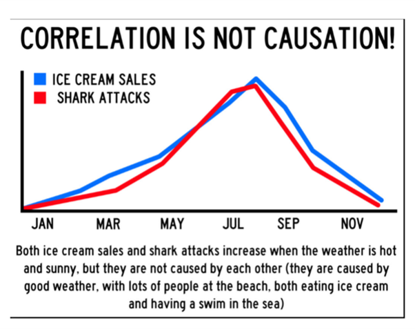

```{r setup, include=FALSE}
## libraries
library(learnr)
library(tidyr)
library(dplyr)
library(ggplot2)
library(scales)
library(RMariaDB)
library(DBI)
library(pool)


### FILL IN YOUR DATABASE DETAILS HERE ###

################################################################################

pool <- dbPool(
  drv = RMySQL::MySQL(), ## Check that this corresponds to the type of database you are using (MySQL/MariaDB, etc.)
  dbname = "YOUR DATABASE NAME",
  host = "DATABASE IP", 
  username = "USERNAME", ## Make sure the user has read & write rights for the selected database
  password = "PASSWORD"
)

dbtable = "THE TABLE YOU WANT TO STORE QUIZ/EXERCISE DATA IN FOR THIS MODULE"
################################################################################


select_query = paste("SELECT * FROM", dbtable)

## options
knitr::opts_chunk$set(echo = TRUE)
tutorial_options(exercise.eval = FALSE, exercise.checker=FALSE)

## recording data
new_recorder <- function(tutorial_id, tutorial_version, user_id, event, data) {
    cat(user_id, ", ", event, ",", data$label, ", ", data$answer, ", ", data$correct, "\n", sep = "", append = TRUE)
  
d_tibble <- tibble::tibble(
user_id  = user_id, 
event = event,
label = data$label,
correct = data$correct,
question = data$question,
answer = data$answer
  )

## send to mysql
dbWriteTable(pool, "module4", d_tibble, append=TRUE, row.names = FALSE)}

options(tutorial.event_recorder = new_recorder)


## exercise setup
library(ppcor)
#library(ggm)
library(correlation)
library(see)
liar_data <- read.delim("data/The Biggest Liar.dat")
exam_data2<-read.delim(file="data/Exam Anxiety.dat",header=TRUE)

```

## Introduction


```{r, echo=FALSE, out.width="100%", fig.align = "center"}
## HEADER ###
HTML("  <div class='jumbotron jumbotron-fluid'>
    <div class='container'>
    <h2 class='mb-3' style='color:rgba(31, 56, 100, 0.85);'><u>Correlation II</u></h2>
    <h4 class='mb-3'>Statistics for CSAI II</h4>
    <h6 class='mb-3'>Travis J. Wiltshire, Ph.D.</h6>
    </div>
  </div>")
```


### Outline

**there is missing exercise 1?**

What we will cover today:

1. Correlation (revisited)
2. Nonparametric measures
    - Spearman’s rho
    - Kendall’s tau
3. Interpreting correlations
    + Causality
4. Partial correlations
5. Syllabus/Open Stats Lab
6. PE updates

### LearnR

1. Optional
2. Have a Swirl equivalent

## Quiz

### Question 1
```{r Quiz1, echo=FALSE}
  question("How do you estimate the amount of overlap in variance between two variables using the correlation (r)?",
    answer("Divide it by 2"),
    answer("Square it", correct = TRUE),
    answer("Take the square root"),
    answer("Divide by standard error"),
    incorrect = "Hint: Try again, you can pick another answer!",
    allow_retry = TRUE
    )
```

### Results

#### 1. How do you estimate the amount of overlap in variance between two variables using the correlation (r)?

```{r, Quiz1O, echo = FALSE}
plotOutput("Q1")
```

```{r, Quiz1R, context="server", echo = FALSE, warning = FALSE, message=FALSE, out.width="100%", fig.align = "center"}

output$Q1 <- renderPlot({
  
  data <- dbGetQuery(pool, select_query)
  answers <- subset(data, data$label == "Quiz1",)
  answers[answers==""] <- NA
  answers <- na.omit(answers)

  answers_count <- as.data.frame(answers %>% 
  count(answer))
  total_n = nrow(answers)
  answers_count$percentage <- (answers_count$n/total_n)*100
  answers_count$correct <- ifelse(answers_count$answer == "Square it", "Correct", "Incorrect")

  ggplot(answers_count,
         aes(x = percentage,
             y = answer,
             fill=correct
             )
         ) +
    geom_col(width=0.6) +theme_minimal() + scale_fill_brewer(palette="Paired", direction=-1)  +
    xlab("Percentage (%)") + ylab("Answer") + labs(fill = "Correct")
})
```

### Question 2
```{r Quiz2, echo=FALSE}
  question("An estimate of the the correlation between Scoville Heat Units in various chili peppers and
perceived pain is .7. What size effect is this?",
    answer("Small"),
    answer("Medium"),
    answer("Large", correct = TRUE),
    answer("No idea"),
    incorrect = "Hint: Try again, you can pick another answer!",
    allow_retry = TRUE
    )
```

### Results

#### 2. An estimate of the the correlation between Scoville Heat Units in various chili peppers and perceived pain is .7. What size effect is this?

```{r, Quiz2O, echo = FALSE}
plotOutput("Q2")
```

```{r, Quiz2R, context="server", echo = FALSE, warning = FALSE, message=FALSE, out.width="100%", fig.align = "center"}

output$Q2 <- renderPlot({
  
  data <- dbGetQuery(pool, select_query)
  answers <- subset(data, data$label == "Quiz2",)
  answers[answers==""] <- NA
  answers <- na.omit(answers)

  answers_count <- as.data.frame(answers %>% 
  count(answer))
  total_n = nrow(answers)
  answers_count$percentage <- (answers_count$n/total_n)*100
  answers_count$correct <- ifelse(answers_count$answer == "Large", "Correct", "Incorrect")

  ggplot(answers_count,
         aes(x = percentage,
             y = answer,
             fill=correct
             )
         ) +
    geom_col(width=0.6) +theme_minimal() + scale_fill_brewer(palette="Paired", direction=-1)  +
    xlab("Percentage (%)") + ylab("Answer") + labs(fill = "Correct")
})
```

### Question 3
```{r Quiz3, echo=FALSE}
 question("The null hypothesis for a correlation test is which of the following?",
    answer("The correlation is positive"),
    answer("The correlation is negative"),
    answer("The correlation is different than 0"),
    answer("The correlation is equal to 0", correct = TRUE),
    incorrect = "Hint: Try again, you can pick another answer!",
    allow_retry = TRUE
    )
```

### Results

#### 3. The null hypothesis for a correlation test is which of the following?

```{r, Quiz3O, echo = FALSE}
plotOutput("Q3")
```

```{r, Quiz3R, context="server", echo = FALSE, warning = FALSE, message=FALSE, out.width="100%", fig.align = "center"}

output$Q3 <- renderPlot({
  
  data <- dbGetQuery(pool, select_query)
  answers <- subset(data, data$label == "Quiz3",)
  answers[answers==""] <- NA
  answers <- na.omit(answers)

  answers_count <- as.data.frame(answers %>% 
  count(answer))
  total_n = nrow(answers)
  answers_count$percentage <- (answers_count$n/total_n)*100
  answers_count$correct <- ifelse(answers_count$answer == "The correlation is equal to 0", "Correct", "Incorrect")

  ggplot(answers_count,
         aes(x = percentage,
             y = answer,
             fill=correct
             )
         ) +
    geom_col(width=0.6) +theme_minimal() + scale_fill_brewer(palette="Paired", direction=-1)  +
    xlab("Percentage (%)") + ylab("Answer") + labs(fill = "Correct")
})
```

### Question 4
```{r Quiz4, echo=FALSE}
question("How glad are you to have the option to attend lectures on campus?",
    answer("1"),
    answer("2"),
    answer("3"),
    answer("4"),
    answer("5"),
    answer("6"),
    answer("7"),
    answer("8"),
    answer("9"),
    answer("10", correct=TRUE),
    incorrect = "Answer recorded",
    allow_retry = FALSE
    )
```

### Results

#### 4. How glad are you to have the option to attend lectures on campus?

```{r, Quiz4O, echo = FALSE}
plotOutput("Q4")
```

```{r, Quiz4R, context="server", echo = FALSE, warning = FALSE, message=FALSE, out.width="100%", fig.align = "center"}

output$Q4 <- renderPlot({
  
  data <- dbGetQuery(pool, select_query)
  answers <- subset(data, data$label == "Quiz4",)
  answers[answers==""] <- NA
  answers <- na.omit(answers)

  answers_count <- as.data.frame(answers %>% 
  count(answer))
  total_n = nrow(answers)
  answers_count$percentage <- (answers_count$n/total_n)*100
  answers_count$correct <- ifelse(answers_count$answer == "Narrower", "Correct", "Incorrect")

  ggplot(answers_count,
         aes(x = percentage,
             y = answer,
             fill=correct
             )
         ) +
    geom_col(width=0.6) +theme_minimal() + scale_fill_brewer(palette="Paired", direction=-1)  +
    xlab("Percentage (%)") + ylab("Answer") + labs(fill = "Correct")
})
```

## 1. Correlation (revisited)

### Covariance

- Calculate the error between the mean and each subject’s score for the first variable (x).
- Calculate the error between the mean and their score for the second variable (y).
- Multiply these error values.
- Add these values and you get the cross product deviations.
- The covariance is the average cross-product deviations:


$$cov(x,y)=\frac{\sum_{i=1}^{N}(x_{i}-\bar{x})(y_{i}-\bar{y})}{N-1}$$


### Pearson's Correlation Coefficient


$$ r =\frac{ cov_{xy} }{s_{x}s_{y}}$$


$$r =\frac{ cov_{xy} }{s_{x}s_{y}}=\\ =\frac{ 4.25 }{1.67\times2.92 } = \\= .87$$

### Things to Know about the Correlation

- It varies between -1 and +1
  + 0 = no relationship
- It is an effect size
  + ±.1 = small effect
  + ±.3 = medium effect
  + ±.5 = large effect
- Coefficient of determination, $r^2$
  + By squaring the value of r you get the proportion of variance in one variable shared by the other. Variance accounted for by…


## 2. Non-parametric measures


### Non-parametric Correlations


**(some) assumptions of Pearson’s Correlation:**

- Interval or ratio scale data
- Normally distributed

**We can then use:**

- [Spearman’s rho](https://www.youtube.com/watch?v=RIfISCTEE2M&feature=youtu.be)
  - Pearson’s correlation on the ranked data
- [Kendall’s tau](https://www.youtube.com/watch?v=oXVxaSoY94k)
  - Better than Spearman’s for small samples


### Exercise: More Correlation Testing in R

- Load the The Biggest Liar.dat file into R.
  - 68 participants, variables indicate where they were placed in the competition (first, second, third, etc.), Creativity questionnaire (maximum score 60)
  - Make a prediction about the relationship between position in the competition and creativity and test it using the `cor.test()` function use method spearman and kendall
    - What did you observe? Was there a significant correlation? What is the size (small, medium, large)? Do both analyses give you similar conclusions?
    - How would you report your findings? Try to summarize your results in a write up.  

### 1. Loading The Biggest Liar data

Load the dataset and store it in a variable called liar_data. In this online envionrment it also comes preloaded 


```{r ex1, exercise=TRUE}
# liar_data <- read.delim("data/The Biggest Liar.dat")

# Make a prediction about the relationship between position in the competition and creativity and test it using the `cor.test()` function. Use the spearman and kendall methods.

```
```{r ex1-hint}
#Add exact argument to avoid warning
cor.test(liar_data$Position, liar_data$Creativity,method="spearman", alternative = 'less', exact=FALSE)
cor.test(liar_data$Creativity,liar_data$Position, method="kendall", alternative = 'less')
```
```{r ex1-check}
#store
```


### Correlation and Causality

- The third-variable problem:
  - In any correlation, causality between two variables cannot be assumed because there may be other measured or unmeasured variables affecting the results.
- Direction of causality:
  - Correlation coefficients say nothing about which variable causes the other to change.

Check [this out](https://tylervigen.com/discover) for some interesting spurious correlations




## 3. Partial and Semi-partial Correlations

### Correlations:

- Partial correlation:
  - Measures the relationship between two variables, controlling for the effect that a third variable has **on them both.**
- Semi-partial correlation:
  - Measures the relationship between two variables controlling for the effect that a third variable has **on only one of the others.**


### Partial and Semi-partial Correlations

Use for when you think that the confounding variable does not influence both variables.   

 


Need more details? Watch [this video](https://www.youtube.com/watch?v=OpAf4N582bA).

### Doing Partial Correlation using R

- Need ‘ppcor’ package
- The general form of `pcor.test()` is:
  - `pcor.test(x,y,z)`
- X and Y are the main variables of interest
- Z is the one you want to control for

### Doing Semi-Partial Correlation using R

- The general form of `spcor.test()` is:
  - `spcor.test(x,y,z)`
- X and Y are the main variables of interest
- Z is the one you want to control for, and it’s relationship with Y (the second variable entered) 


### Exercise 3: Partial and Semi-Partial Correlation Testing in R

- Load the Exam Anxiety.dat file into R.
- Install and load the `ppcor` package
- Optional: Create a new data frame that only contains the variables "Exam","Anxiety","Revise“
  - Run partial correlation test to see the relationship between exam score and revision time, while controlling for anxiety (use `pcor.test()`)
  - Run a semi-partial correlation test to see the relationship between exam score and revision time, while controlling for the effect of anxiety on exam score only (use `spcor.test()`)

### 1. Run individual tests

Store the data in a variable called exam_data2. In this online enivonrnment data also comes pre-loaded under varaiable exam_data2

```{r ex2, exercise=TRUE}
#library(ppcor)
exam_data2 <-read.delim(file="data/Exam Anxiety.dat",header=TRUE)
# Optional: create new data frames

# Run partial correlation test to see the relationship between exam score and revision time, while controlling for anxiety (use `pcor.test()`)

#  Run a semi-partial correlation test to see the relationship between exam score and revision time, while controlling for the effect of anxiety on exam score only (use `spcor.test()`)

# Test them all at once

# Alternative methods

```
```{r ex2-hint}
pcor.test(exam_data2$Revise,exam_data2$Exam,exam_data2$Anxiety)
spcor.test(exam_data2$Revise,exam_data2$Exam,exam_data2$Anxiety)

pcor(exam_data2)
spcor(exam_data2)

pc<-pcor(c("Exam","Anxiety","Revise"),var(exam_data2))
#The 1 indicates we are only controlling for 1 variable, and the 103 is the sample size
pcor.test(pc,1,103) 
```
```{r ex2-check}
#store
```


### Easystats: correlation package


### Load packages 

In this online envionrnment packages already come pre-loaded.

```{r ex3, exercise=TRUE}

# Use correlation

# Plot results of correlation

# Partial correlations


```
```{r ex3-hint}
#library pcor
results <- correlation(exam_data2)


results %>%
  summary(redundant = TRUE) %>%
  plot()

exam_data %>%
 correlation(partial=TRUE) %>%
summary()

```
```{r ex3-check}
#store
```


## Conculsion

## Summing Up

- Correlations
  - Positive, negative and range from -1 to 1
  - Small, medium, large effects
  - Not causal
- Non parametric
  - If data are non-interval/ratio or non normal
- Partial/semi-partial correlations
- Syllabus/Open Stats Lab
- PE updates

### Thanks!

See you next week!
**Questions?**


