```{r setup, include=FALSE}
## libraries
library(learnr)
library(tidyr)
library(dplyr)
library(ggplot2)
library(scales)
library(RMariaDB)
library(DBI)
library(pool)


### FILL IN YOUR DATABASE DETAILS HERE ###

################################################################################

pool <- dbPool(
  drv = RMySQL::MySQL(), ## Check that this corresponds to the type of database you are using (MySQL/MariaDB, etc.)
  dbname = "YOUR DATABASE NAME",
  host = "DATABASE IP", 
  username = "USERNAME", ## Make sure the user has read & write rights for the selected database
  password = "PASSWORD"
)

dbtable = "THE TABLE YOU WANT TO STORE QUIZ/EXERCISE DATA IN FOR THIS MODULE"
################################################################################


select_query = paste("SELECT * FROM", dbtable)

## options
knitr::opts_chunk$set(echo = TRUE)
tutorial_options(exercise.eval = FALSE, exercise.checker=FALSE)

## recording data
new_recorder <- function(tutorial_id, tutorial_version, user_id, event, data) {
    cat(user_id, ", ", event, ",", data$label, ", ", data$answer, ", ", data$correct, "\n", sep = "", append = TRUE)
  
d_tibble <- tibble::tibble(
user_id  = user_id, 
event = event,
label = data$label,
correct = data$correct,
question = data$question,
answer = data$answer
  )

## send to mysql
dbWriteTable(pool, "module5", d_tibble, append=TRUE, row.names = FALSE)}

options(tutorial.event_recorder = new_recorder)

## EXCERCISE SETUP
albumsales1<-read.delim("data/Album Sales 1.dat",header=TRUE)
exam_data<-read.delim(file="data/Exam Anxiety.dat",header=TRUE)
library(ggplot2)
library(QuantPsyc)

```

## Introduction

```{r, echo=FALSE, out.width="100%", fig.align = "center"}
## HEADER ###
HTML("  <div class='jumbotron jumbotron-fluid'>
    <div class='container'>
    <h2 class='mb-3' style='color:rgba(31, 56, 100, 0.85);'><u>Linear Regression</u></h2>
    <h4 class='mb-3'>Statistics for CSAI II</h4>
    <h6 class='mb-3'>Travis J. Wiltshire, Ph.D.</h6>
    </div>
  </div>")
```


### Course Admin
- PEs
- Sign up for attendance for lectures
- Practical/ Q&A sessions


### Outline

1. Understand linear regression with one predictor
2. Understand how we assess the fit of a regression model
    - Total sum of squares
    - Model sum of squares
    - Residual sum of squares
    - $F$
    - $R^2$
3. Know how to do regression using **R**
4. Interpret a regression model

## Quiz


### Question 1

```{r Quiz1, echo = FALSE}
  question("Which of the following types of correlation would you use if you want to examine the relationship between x and y, while controlling for the relationship of z on both x and y?",
    answer("Pearson correlation"),
    answer("Partial correlation", correct = TRUE),
    answer("Spearman correlaton"),
    answer("Semi-partial correlation"),
    incorrect = "Hint: Try again, you can pick another answer!",
    allow_retry = TRUE
    )
```

### Results

#### 1. Which of the following types of correlation would you use if you want to examine the relationship between x and y, while controlling for the relationship of z on both x and y?

```{r, Quiz1O, echo = FALSE}
plotOutput("Q1")
```

```{r, Quiz1R, context="server", echo = FALSE, warning = FALSE, message=FALSE, out.width="100%", fig.align = "center"}

output$Q1 <- renderPlot({
  data <- dbGetQuery(pool, select_query)
  answers <- subset(data, data$label == "Quiz1",)
  answers[answers==""] <- NA
  answers <- na.omit(answers)

  answers_count <- as.data.frame(answers %>% 
  count(answer))
  total_n = nrow(answers)
  answers_count$percentage <- (answers_count$n/total_n)*100
  answers_count$correct <- ifelse(answers_count$answer == "Partial correlation", "Correct", "Incorrect")

  ggplot(answers_count,
         aes(x = percentage,
             y = answer,
             fill=correct
             )
         ) +
    geom_col(width=0.6) +theme_minimal() + scale_fill_brewer(palette="Paired", direction=-1)  +
    xlab("Percentage (%)") + ylab("Answer") + labs(fill = "Correct")
})
```

### Question 2
```{r Quiz2, echo = FALSE}
  question("What correlation would be most appropriate for examining the relationship between ranking in a gaming competition and age, when the sample size is small?",
    answer("Pearson correlation"),
    answer("Partial correlation"),
    answer("Spearman correlaton", correct = TRUE),
    answer("Semi-partial correlation"),
    incorrect = "Hint: Try again, you can pick another answer!",
    allow_retry = TRUE
    )
```

### Results

#### 2. What correlation would be most appropriate for examining the relationship between ranking in a gaming competition and age, when the sample size is small?

```{r, Quiz2O, echo = FALSE}
plotOutput("Q2")
```

```{r, Quiz2R, context="server", echo = FALSE, warning = FALSE, message=FALSE, out.width="100%", fig.align = "center"}

output$Q2 <- renderPlot({
  data <- dbGetQuery(pool, select_query)
  answers <- subset(data, data$label == "Quiz2",)
  answers[answers==""] <- NA
  answers <- na.omit(answers)

  answers_count <- as.data.frame(answers %>% 
  count(answer))
  total_n = nrow(answers)
  answers_count$percentage <- (answers_count$n/total_n)*100
  answers_count$correct <- ifelse(answers_count$answer == "Spearman correlaton", "Correct", "Incorrect")

  ggplot(answers_count,
         aes(x = percentage,
             y = answer,
             fill=correct
             )
         ) +
    geom_col(width=0.6) +theme_minimal() + scale_fill_brewer(palette="Paired", direction=-1)  +
    xlab("Percentage (%)") + ylab("Answer") + labs(fill = "Correct")
})
```


### Question 3
```{r Quiz3, echo = FALSE}
 question("Which letter is always used to specify the outcome variable in linear regression models?",
    answer("b"),
    answer("β"),
    answer("x"),
    answer("y", correct = TRUE),
    incorrect = "Hint: Try again, you can pick another answer!",
    allow_retry = TRUE
    )
```

### Results

#### 3. Which letter is always used to specify the outcome variable in linear regression models?

```{r, Quiz3O, echo = FALSE}
plotOutput("Q3")
```

```{r, Quiz3R, context="server", echo = FALSE, warning = FALSE, message=FALSE, out.width="100%", fig.align = "center"}

output$Q3 <- renderPlot({
  
  data <- dbGetQuery(pool, select_query)
  answers <- subset(data, data$label == "Quiz3",)
  answers[answers==""] <- NA
  answers <- na.omit(answers)

  answers_count <- as.data.frame(answers %>% 
  count(answer))
  total_n = nrow(answers)
  answers_count$percentage <- (answers_count$n/total_n)*100
  answers_count$correct <- ifelse(answers_count$answer == "y", "Correct", "Incorrect")

  ggplot(answers_count,
         aes(x = percentage,
             y = answer,
             fill=correct
             )
         ) +
    geom_col(width=0.6) +theme_minimal() + scale_fill_brewer(palette="Paired", direction=-1)  +
    xlab("Percentage (%)") + ylab("Answer") + labs(fill = "Correct")
})
```

## Linear regression

### Table of info

- https://lindeloev.github.io/tests-as-linear/

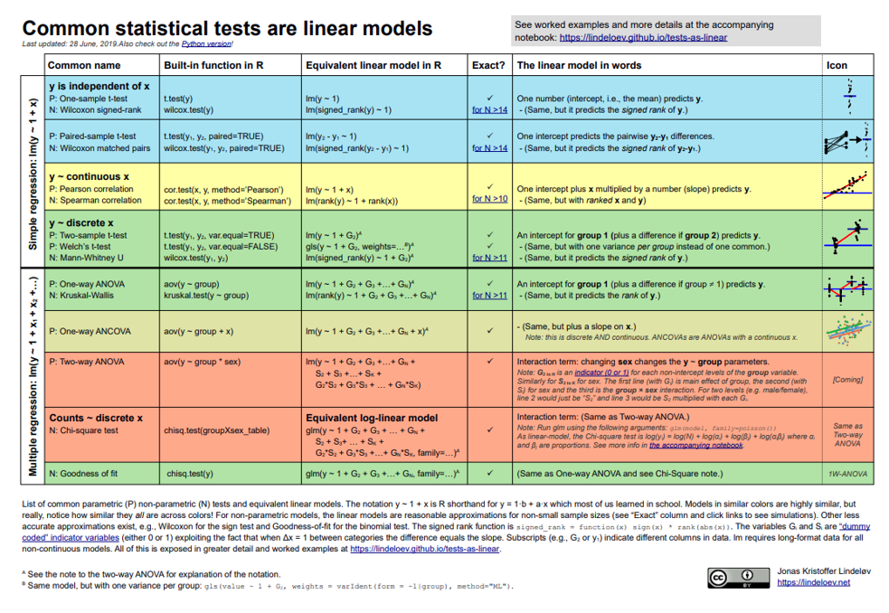

List of common parametric (P) non-parametric (N) tests and equivalent linear models. The notationy-1+xisRshorthand fory=1-b+ax which most of us leamed in school. Models in similar colors are highly similar, but
really, notice how similar they all are across colors! For non-parametric models, the linear models are reasonable approximations for non-small sample sizes (see "Exact" column and click links to see simulations). Other less
accurate approximations exist, e.g., Wilcoxon for the sign test and Goodness-of-fit for the binomial test. The signed rank function is $signed_rank-function(x) = sign (x)*rank (abs (x) )$. The variables G, and S, are "dummy
coded" indicator variables (either 0 or 1) exploiting the fact that when $\Delta x=1$ between categories the difference equals the slope. Subscripts (e.g, $G_2$ or $Y_1$.) indicate different columns in data. LM requires long-format data for all non-continuous models. All of this is exposed in greater detail and worked examples at [https://lindeloev.github.io/tests-as-linear](https://lindeloev.github.io/tests-as-linear)

### Different types of correlation relationships

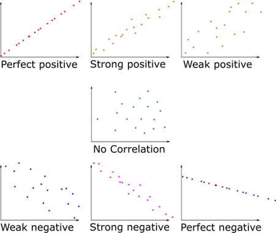

### What is Regression?

- A way of predicting the value of one variable from another.
  - It is a hypothetical model of the relationship between two variables.
    - Typically, both are interval scale variables
  - The model used is a **linear one.**
  - Therefore, we describe the relationship using **the equation of a straight line.**

$y=\color{Red}mx+\color{blue}b$

$y=\color{Red}3x+\color{blue}5$
  
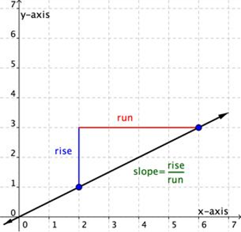

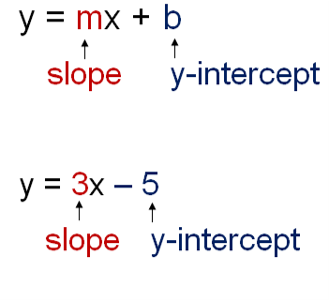


### Describing a Straight Line

$$Y_i = b_0 +b_iX_i+\epsilon_i$$

- $b_i$
  - Regression coefficient for the predictor
  - Gradient (slope) of the regression line
  - Direction/strength of relationship
- $b_0$
  - Intercept (value of Y when X = 0)
  - Point at which the regression line crosses the Y-axis (ordinate)

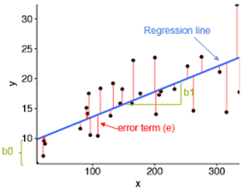

### Four different types of slopes

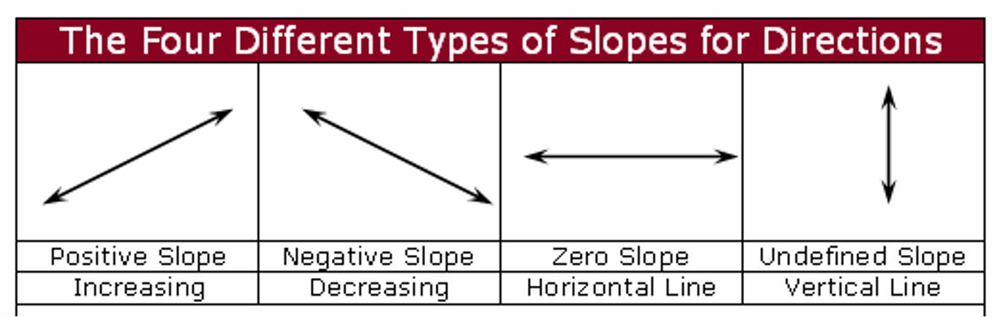


### Ordinary Least Squares

- Our coefficient **estimates** $b_0$ and $b_i$ are determined based on minimizing the difference between the observed data and the value predicted by the linear approximation
  - **Minimizing the sum of square residuals**
- **Other methods exist (e.g., loglikelihood, maximum likelihood)**


This graph shows a scatterplot of some data with a line representing the general trend. The vertical lines (dotted) represent the differences (or residuals) between the line and the actual data:

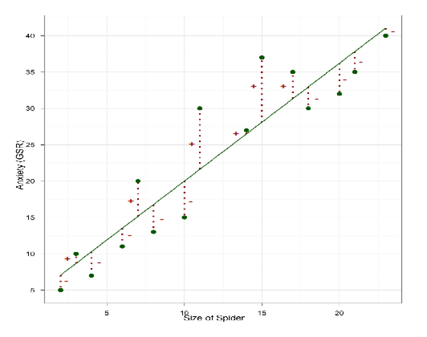


### How Good Is the Model?

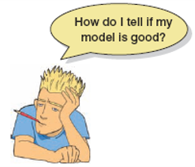

- The regression line is only a model based on the data.
- **This model might not reflect reality.**
  - We need to test how well the model fits the observed data.
  
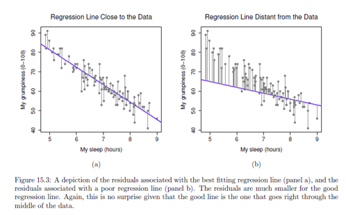
     


### Sum of Squares

Diagram showing from where the regression sums of squares derive:

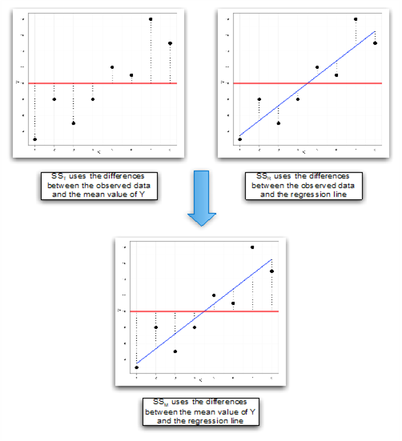

### Standardized vs unstandardized regression coefficients

- Unstandardized
  - $\beta$ coef is amount by which our dependent variable changes if we change the independent variable by one unit while keeping other independent variables constant.

- Standardize Beta
  - Measured in units of standard deviation. A beta value of 1.25 indicates that a change of one standard deviation in the independent variable results in a 1.25 standard deviations increase in the dependent variable.
  - Similar to partial r

**Beta:** $$\beta_{x_1}=\frac{r_{yx_1}-r_{yx_2}r_{x_1x_2}}{1-r^2_{x_1x_2}}$$

**Partial r:** $$r_{yx_1x_2}=\frac{r_{yx_1}-r_{yx_2}r_{x_1x_2}}{\sqrt{(1-r^2_{x_1x_2})(1-r^2_{yx_2})}}$$


### Sum of Squares Types

- $SS_{Total}$
  - **Total** variability (variability between scores and the mean).
  - $SS_{Total}=\sum(y_i-\overline{y})^2$
  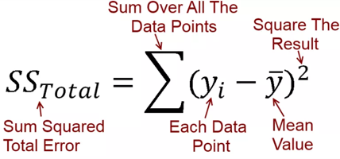
- $SS_{Residual}$
  - **Residual**/error variability (variability between the regression model and the actual data).
  - $SS_{res}=\sum(Y_i-\hat{Y_i})^2$
  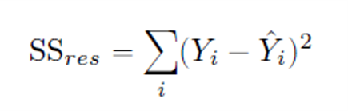
- $SS_{Model}$ 
  - **Model** variability (difference in variability between the model and the mean).
  - $SS_{mod}=SS_{tot}-SS_{res}$
  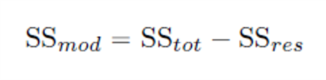

### Testing the Model: ANOVA


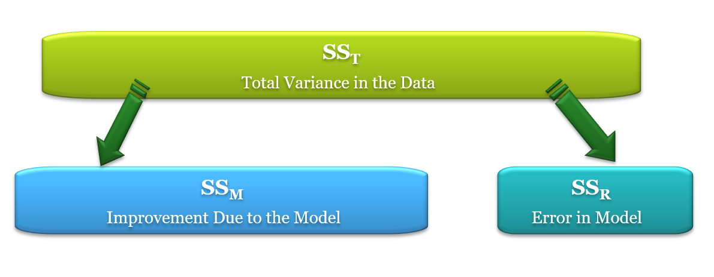

If the model results in better prediction than using the mean, then we expect $SS_M$ to be much greater than $SS_R$

### Testing the Model: ANOVA

- Mean squared error
  - Sums of squares are total values.
  - They can be expressed as averages.
  - These are called mean squares, **MS**.

$$F=\frac{MS_M}{MS_R}$$  
$$MS_{mod}=\frac{SS_{mod}}{df_{mod}}$$
$$MS_{res}=\frac{SS_{res}}{df_{res}}$$
$$df_{mod}=K$$
$$df_{res}=N-K-1$$

K = Number of predictor variables in model

### Testing the Model: R squared

- $R^2$
  - The proportion of variance accounted for by the regression model.
  - Pearson Correlation Coefficient Squared

$$R^2=\frac{SS_M}{SS_T}$$
$$R^2=1-\frac{SS_{res}}{SS_{tot}}$$

### Regression: An Example

- A record company boss was interested in predicting record sales from advertising.
- Data
  - 200 different album releases
- Outcome variable:
  - Sales (CDs and downloads) in the week after release
- Predictor variable:
  - The amount (in units of £1000) spent promoting the record before release.


### An Example hypothesis

- Testing the whole model
  - Null hypothesis: There is no 	relationship between the 	predictors and the outcome.
- Testing individual coefficients
  - Null hypothesis: The true 	population regression	coefficient is 0.

$$H_0: Y_i = b_0 + \epsilon_i$$
$$H_0: b=0$$
$$H_1: b\neq0$$
$$\hat{t}=\frac{\hat{b}}{SE(\hat{b})}$$

## Exercises

### Regression in R

- We run a regression analysis using the lm() function – lm stands for ‘linear model’. This function takes the general form:
  - newModel<-lm(outcome ~ predictor(s), data = dataFrame, na.action = an action)) 

  - albumSales.1 <- lm(album1$sales ~ album1$adverts)

- Or we can tell R what dataframe to use (using data = nameOfDataFrame), and then specify the variables without the dataFrameName$ before them:

  - albumSales.1 <- lm(sales ~ adverts, data = album1)

### Load the data

In this online coding environment it’s not needed to load the data, because they are pre-loaded. However, do not forget to load the data and libraries when running R studio on your computer!

```{r ex11, exercise=TRUE}
#Load the data 

# Run a linear regression model on albumsales1

# Make a nice plot

```
```{r ex11-hint}
albumsales1<-read.delim("data/Album Sales 1.dat",header=TRUE)

albumsalesmod1<-lm(sales~adverts,data=albumsales1)

#standarize 
QuantPsyc::lm.beta(albumsalesmod1)
albumsalesmod2<-lm(scale(sales)~scale(adverts),data=albumsales1)
summary(albumsalesmod2)

# nice plot
scatter <- ggplot(albumsales1, aes(adverts, sales))
scatter + geom_point() + geom_smooth(method = "lm", colour = "salmon",alpha = 0.1, fill = "Red") + labs(title="Regression Example",x = "Amount Spent on Advertisement in units of ?1000",y = "Sales of CDs and Downloads")
```
```{r ex11-check}
#store
```

### Output of a Simple Regression 

- We have created an object called albumSales.1 that contains the results of our analysis. We can show the object by executing:
  - summary(albumSales.1)


Coefficients:
                   Estimate        Std. Error     t value      Pr(>|t|)    
(Intercept)       1.341e+02   7.537e+00           17.799       <2e-16 ***
adverts           9.612e-02    9.632e-03          9.979         <2e-16 ***

Signif. codes:  0 ‘***’ 0.001 ‘**’ 0.01 ‘*’ 0.05 ‘.’ 0.1 ‘ ’ 1 

- Residual standard error: 65.99 on 198 degrees of freedom
- Multiple R-squared: 0.3346, Adjusted R-squared: 0.3313 
- F-statistic: 99.59 on 1 and 198 DF,  p-value: < 2.2e-16

```{r}
#albumsales1<-read.delim("Album Sales 1.dat",header=TRUE)
#summary(albumSales.1)
```

### 2. Run a linear regression model

```{r ex1, exercise=TRUE}
#run linear regression model

# Standardize the coefficients

#nice plot using gg2

```
```{r ex1-hint}

albumsalesmod1<-lm(sales~adverts,data=albumsales1)
summary(albumsalesmod1)

#standarize coef QuantPsyc::lm.beta(albumsalesmod1)
albumsalesmod2<-lm(scale(sales)~scale(adverts),data=albumsales1)
summary(albumsalesmod2)

#nice plot using gg2
scatter <- ggplot(albumsales1, aes(adverts, sales))
scatter + geom_point() + geom_smooth(method = "lm", colour = "salmon",alpha = 0.1, fill = "Red") + labs(title="Regression Example",x = "Amount Spent on Advertisement in units of ?1000",y = "Sales of CDs and Downloads")
```
```{r ex1-check}
#store
```

### Standardizing in R

- Standardizing using a function:
  - `QuantPsyc::lm.beta(albumsalesmod1)`

- Standardize in our model:
  - albumsalesmod2<-lm(scale(sales)~scale(adverts),data=albumsales1)
  - summary(albumsalesmod2)
  

### Making predictions with our Model

$$Record\ Sales_i = b_0+b_1Advertising\ Budget_i\\
=134.14+(0.09612\times Advertising\ Budget_i)$$

$$Record\ Sales_i = 134.14+(0.09612\times Advertising\ Budget_i)\\
=134.14+(0.09612\times 100)\\
=143.75$$


### Example Regression Write Up

The amounts of money spent on advertising not only explained a significant 33% of the variance in record sales ($R^2$ = .33, F(1, 198) = 99.59, p < .001), but it also significantly predicted album sales, b = .096, t(198) = 9.98, p < .001. 


### Exercise 2: Run your own regression on exam anxiety data

- Load the Exam Anxiety.dat file into R.
- Make a prediction about the relationship between exam anxiety and exam performance
- Run a linear regression using the lm() function
- Interpret the output
- Get the standardized beta coefficients
- Bonus create a scatter plot with the regression line
- Write a summary report of the results

### 1. Load the data

 In this online coding environment it’s not needed to load the data, because they are pre-loaded. However, do not forget to load the data and libraries when running R studio on your computer! It's saved under variable exam_data

### 1. Creating two variables

```{r ex2, exercise=TRUE}
 
# exam_data<-read.delim(file="Exam Anxiety.dat",header=TRUE)

# Run a linear regression model

# Make a nice plot

```
```{r ex2-hint}

# Run a linear regression mode
exam_data$Exam <- as.numeric(exam_data$Exam)
exam_datamod<-lm(Exam ~ Anxiety,data=exam_data)
summary(exam_datamod)

# Make a nice plot
scatter <- ggplot(exam_data, aes(Anxiety, Exam))
scatter + geom_point() + geom_smooth(method = "lm", colour = "salmon",alpha = 0.1, fill = "Red") + labs(title="Regression Exercise",x = "Anxiety about the Exam",y = "Exam Performance %")

QuantPsyc::lm.beta(exam_datamod)

plot(exam_data$Anxiety,exam_data$Exam)
abline(exam_datamod)

```
```{r ex2-check}
#store
```


## Conclusion

### Suming Up

- Understand linear regression with one predictor
- Understand how we assess the fit of a regression model
  - Total sum of squares
  - Model sum of squares
  - Residual sum of squares
  - $F$
  - $R^2$
- Know how to do regression using **R**
- Interpret a regression model

### Thanks!

See you next week!
**Questions?**
