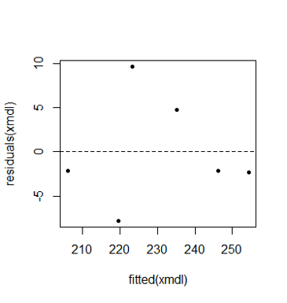
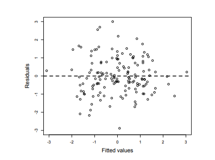
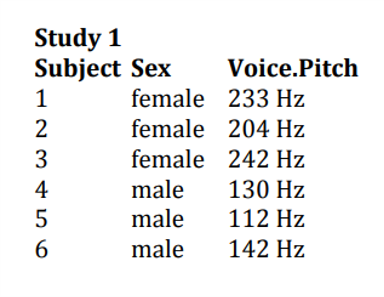

```{r setup, include=FALSE}
## libraries
library(learnr)
library(tidyr)
library(dplyr)
library(ggplot2)
library(scales)
library(RMariaDB)
library(DBI)
library(pool)


### FILL IN YOUR DATABASE DETAILS HERE ###

################################################################################

pool <- dbPool(
  drv = RMySQL::MySQL(), ## Check that this corresponds to the type of database you are using (MySQL/MariaDB, etc.)
  dbname = "YOUR DATABASE NAME",
  host = "DATABASE IP", 
  username = "USERNAME", ## Make sure the user has read & write rights for the selected database
  password = "PASSWORD"
)

dbtable = "THE TABLE YOU WANT TO STORE QUIZ/EXERCISE DATA IN FOR THIS MODULE"
################################################################################


select_query = paste("SELECT * FROM", dbtable)


## options
knitr::opts_chunk$set(echo = TRUE)
tutorial_options(exercise.eval = FALSE, exercise.checker=FALSE)

## recording data
new_recorder <- function(tutorial_id, tutorial_version, user_id, event, data) {
    cat(user_id, ", ", event, ",", data$label, ", ", data$answer, ", ", data$correct, "\n", sep = "", append = TRUE)
  
d_tibble <- tibble::tibble(
user_id  = user_id, 
event = event,
label = data$label,
correct = data$correct,
question = data$question,
answer = data$answer
  )

## send to mysql
dbWriteTable(pool, "module6", d_tibble, append=TRUE, row.names = FALSE)}

options(tutorial.event_recorder = new_recorder)

## EXCERCISE SETUP
exam_data<-read.delim(file="data/Exam Anxiety.dat",header=TRUE)
driving <- read.csv("data/driving.csv")
library(gvlma)
library(performance)
## exercise setup

```

## Introduction

```{r, echo=FALSE, out.width="100%", fig.align = "center"}
## HEADER ###
HTML("  <div class='jumbotron jumbotron-fluid'>
    <div class='container'>
    <h2 class='mb-3' style='color:rgba(31, 56, 100, 0.85);'><u>Linear Regression II</u></h2>
    <h4 class='mb-3'>Statistics for CSAI II</h4>
    <h6 class='mb-3'>Travis J. Wiltshire, Ph.D.</h6>
    </div>
  </div>")
```

### Outline

1. Understand linear regression with one predictor
    - Categorical
2. Meaningful intercepts
3. Assumptions of Regression
4. `Gvlma()`
5. `check_model()` from performance package


## Quiz

### Question 1

```{r Quiz1}
  question("If you observed a-0.03 correlation between hours of daylight and mood, which are you most likely to include?",
    answer("There is a negative relationship between hours of daylight and mood."),
    answer("There is a positive relationship between hours of daylight and mood."),
    answer("There is no relationship between hours of daylight and mood."),
    answer("Not enough information is provided", correct = TRUE),
    incorrect = "Hint: Try again, you can pick another answer!",
    allow_retry = TRUE
    )
```

### Results

#### 3. If you observeda-0.03 correlation between hours of daylight and mood, which are you most likely to include?

```{r, Quiz1R, context="server", echo = FALSE, warning = FALSE, message=FALSE, out.width="100%", fig.align = "center"}

output$Q1 <- renderPlot({
  
  data <- dbGetQuery(pool, select_query)
  answers <- subset(data, data$label == "Quiz1",)
  answers[answers==""] <- NA
  answers <- na.omit(answers)

  answers_count <- as.data.frame(answers %>% 
  count(answer))
  total_n = nrow(answers)
  answers_count$percentage <- (answers_count$n/total_n)*100
  answers_count$correct <- ifelse(answers_count$answer == "Not enough information is provided", "Correct", "Incorrect")

  ggplot(answers_count,
         aes(x = percentage,
             y = answer,
             fill=correct
             )
         ) +
    geom_col(width=0.6) +theme_minimal() + scale_fill_brewer(palette="Paired", direction=-1)  +
    xlab("Percentage (%)") + ylab("Answer") + labs(fill = "Correct")
})
```

### Question 2

```{r Quiz2}
  question("In a regression equation, b0 describes which of the following?",
    answer("The x intercept"),
    answer("The regression coefficient of the predictor"),
    answer("The correlation coefficients"),
    answer("The y intercept", correct = TRUE),
    incorrect = "Hint: Try again, you can pick another answer!",
    allow_retry = TRUE
    )
```

### Results

#### 2. In a regression equation, b0 describes which of the following?

```{r, Quiz2O, echo = FALSE}
plotOutput("Q2")
```

```{r, Quiz2R, context="server", echo = FALSE, warning = FALSE, message=FALSE, out.width="100%", fig.align = "center"}

output$Q2 <- renderPlot({
  data <- dbGetQuery(pool, select_query)
  answers <- subset(data, data$label == "Quiz2",)
  answers[answers==""] <- NA
  answers <- na.omit(answers)

  answers_count <- as.data.frame(answers %>% 
  count(answer))
  total_n = nrow(answers)
  answers_count$percentage <- (answers_count$n/total_n)*100
  answers_count$correct <- ifelse(answers_count$answer == "The y intercept", "Correct", "Incorrect")

  ggplot(answers_count,
         aes(x = percentage,
             y = answer,
             fill=correct
             )
         ) +
    geom_col(width=0.6) +theme_minimal() + scale_fill_brewer(palette="Paired", direction=-1)  +
    xlab("Percentage (%)") + ylab("Answer") + labs(fill = "Correct")
})
```


### Question 3

```{r Quiz3}
 question("All regression models use a straight line to describe the data.",
    answer("Yes", correct = TRUE),
    answer("No", correct = TRUE),
    incorrect = "Hint: Try again, you can pick another answer!",
    allow_retry = TRUE
    )
```

### Results

#### 3. All regression models use a straight line to describe the data.

```{r, Quiz3O, echo = FALSE}
plotOutput("Q3")
```

```{r, Quiz3R, context="server", echo = FALSE, warning = FALSE, message=FALSE, out.width="100%", fig.align = "center"}

output$Q3 <- renderPlot({
  
  data <- dbGetQuery(pool, select_query)
  answers <- subset(data, data$label == "Quiz3",)
  answers[answers==""] <- NA
  answers <- na.omit(answers)

  answers_count <- as.data.frame(answers %>% 
  count(answer))
  total_n = nrow(answers)
  answers_count$percentage <- (answers_count$n/total_n)*100
  answers_count$correct <- ifelse(answers_count$answer != " ", "Correct", "Incorrect")

  ggplot(answers_count,
         aes(x = percentage,
             y = answer,
             fill=correct
             )
         ) +
    geom_col(width=0.6) +theme_minimal() + scale_fill_brewer(palette="Paired", direction=-1)  +
    xlab("Percentage (%)") + ylab("Answer") + labs(fill = "Correct")
})
```


### Question 4

```{r Quiz4}
question("The slope of a regression line can be:",
    answer("Positive", correct = TRUE),
    answer("Negative", correct = TRUE),
    answer("Zero", correct = TRUE),
    answer("Undefined", correct = TRUE),
    incorrect = "Hint: Try again, you can pick another answer!",
    allow_retry = TRUE
    )
```

### Results

#### 4. The slope of a regression line can be:

```{r, Quiz4O, echo = FALSE}
plotOutput("Q4")
```

```{r, Quiz4R, context="server", echo = FALSE, warning = FALSE, message=FALSE, out.width="100%", fig.align = "center"}

output$Q4 <- renderPlot({
  data <- dbGetQuery(pool, select_query)
  answers <- subset(data, data$label == "Quiz4",)
  answers[answers==""] <- NA
  answers <- na.omit(answers)

  answers_count <- as.data.frame(answers %>% 
  count(answer))
  total_n = nrow(answers)
  answers_count$percentage <- (answers_count$n/total_n)*100
  answers_count$correct <- ifelse(answers_count$answer != " ", "Correct", "Incorrect")

  ggplot(answers_count,
         aes(x = percentage,
             y = answer,
             fill=correct
             )
         ) +
    geom_col(width=0.6) +theme_minimal() + scale_fill_brewer(palette="Paired", direction=-1)  +
    xlab("Percentage (%)") + ylab("Answer") + labs(fill = "Correct")
})
```

### Question 5

```{r Quiz5}
  question("The R-squared value tells you",
    answer("If there is a relationship between your predictor and your outcome"),
    answer("How much error is in your model"),
    answer("How much of the variance your overall model accounts for", correct = TRUE),
    answer("If your regression summary is valid "),
    incorrect = "Hint: Try again, you can pick another answer!",
    allow_retry = TRUE
    )
```

### Results

#### 5. The R-squared value tells you

```{r, Quiz5O, echo = FALSE}
plotOutput("Q5")
```

```{r, Quiz5R, context="server", echo = FALSE, warning = FALSE, message=FALSE, out.width="100%", fig.align = "center"}

output$Q5 <- renderPlot({
  data <- dbGetQuery(pool, select_query)
  answers <- subset(data, data$label == "Quiz5",)
  answers[answers==""] <- NA
  answers <- na.omit(answers)

  answers_count <- as.data.frame(answers %>% 
  count(answer))
  total_n = nrow(answers)
  answers_count$percentage <- (answers_count$n/total_n)*100
  answers_count$correct <- ifelse(answers_count$answer == "How much of the variance your overall model accounts for", "Correct", "Incorrect")

  ggplot(answers_count,
         aes(x = percentage,
             y = answer,
             fill=correct
             )
         ) +
    geom_col(width=0.6) +theme_minimal() + scale_fill_brewer(palette="Paired", direction=-1)  +
    xlab("Percentage (%)") + ylab("Answer") + labs(fill = "Correct")
})
```
  
## Understanding regression


### Describing a Straight Line

$$Y_i = b_0 +b_iX_i+\epsilon_i$$

- $b_i$
  - Regression coefficient for the predictor
  - Gradient (slope) of the regression line
  - Direction/strength of relationship
- $b_0$
  - Intercept (value of Y when X = 0)
  - Point at which the regression line crosses the Y-axis (ordinate)
### Different types of correlation relationships


     
### Output of a Simple Regression 

- We have created an object called albumSales.1 that contains the results of our analysis. We can show the object by executing:
  - summary(albumSales.1)

>Coefficients:
                   Estimate        Std. Error     t value      Pr(>|t|)    
(Intercept) 1.341e+02   7.537e+00   17.799       <2e-16 ***
adverts       9.612e-02    9.632e-03    9.979         <2e-16 ***

    - Signif. codes:  0 ‘***’ 0.001 ‘**’ 0.01 ‘*’ 0.05 ‘.’ 0.1 ‘ ’ 1 

- Residual standard error: 65.99 on 198 degrees of freedom
- Multiple R-squared: 0.3346, Adjusted R-squared: 0.3313 
- F-statistic: 99.59 on 1 and 198 DF,  p-value: < 2.2e-16

### Making predictions with our Model

$$Record\ Sales_i = b_0+b_1Advertising\ Budget_i\\
=134.14+(0.09612\times Advertising\ Budget_i)$$

$$Record\ Sales_i = 134.14+(0.09612\times Advertising\ Budget_i)\\
=134.14+(0.09612\times 100)\\
=143.75$$


### Regression in Matrix Algebra Form

     
$$\underbrace{\begin{bmatrix}
y_1  \\
y_2  \\
y_3  \\
\end{bmatrix}}_y =\underbrace{ \begin{bmatrix} 1 & x_1  \\ 2 & x_2  \\3 & x_3  \\ \end{bmatrix}}_X\underbrace{\begin{bmatrix} \beta_0  \\ \beta_1  \\ \end{bmatrix}}_\beta+\underbrace{\begin{bmatrix}
e_1  \\
e_2  \\
e_3  \\
\end{bmatrix}}_e=X\beta+e$$

Note that the matrix-vector multiplication $X\beta$ results in:
$$X\beta=\begin{bmatrix}
\beta_0+\beta_1 x_1  \\
\beta_0+\beta_1 x_2  \\
\beta_0+\beta_1 x_3  \\
\end{bmatrix} $$


- More details [here](https://godatadriven.com/blog/the-linear-algebra-behind-linear-regression/)
- And [here](https://online.stat.psu.edu/stat462/node/132/)


### Regression with a Categorical Predictor

pitch = c(233,204,242,130,112,142)  
sex = c(rep("female",3),rep("male",3))  
my.df = data.frame(sex,pitch)  

#model pitch by sex
xmdl = lm(pitch ~ sex, my.df)  
summary(xmdl)  

```{r }
pitch = c(233,204,242,130,112,142)
sex = c(rep("female",3),rep("male",3))
my.df = data.frame(sex,pitch)

#model pitch by sex
xmdl = lm(pitch ~ sex, my.df)
summary(xmdl)
```


### What’s going on with our predictor?

contrasts(my.df$sex)
male
female    0
male      1

mean(my.df[my.df$sex=="female",]$pitch)
**226.3333**

mean(my.df[my.df$sex==“male",]$pitch)
128

Call:
lm(formula = pitch ~ sex, data = my.df)

Residuals:
      1       2       3       4       5       6 
  6.667 -22.333  15.667   2.000 -16.000  14.000 

Coefficients:
            Estimate Std. Error t value Pr(>|t|)    
(Intercept)   **226.33**      10.18  22.224 2.43e-05 ***
sexmale       -98.33      14.40  -6.827  0.00241 ** 
---
Signif. codes:  0 ‘***’ 0.001 ‘**’ 0.01 ‘*’ 0.05 ‘.’ 0.1 ‘ ’ 1

Residual standard error: 17.64 on 4 degrees of freedom
Multiple R-squared:  0.921, Adjusted R-squared:  0.9012 
F-statistic: 46.61 on 1 and 4 DF,  p-value: 0.002407

### Exercise 1: Run a regression on exam anxiety data

- Load the Exam Anxiety.dat file into R.
- Make a prediction about the relationship between exam anxiety and gender
- Run a linear regression using the `lm()` function
- Interpret the output

```{r ex1, exercise=TRUE}

head(exam_data)
#make prediction and make linar regression model


```
```{r ex1-hint}
mod1<-lm(Anxiety~Gender,data=examData)
summary(mod1)

```
```{r ex1-check}
#store
```

### 1. Loading Exam Anxiety data

In this online coding environment it’s not needed to load the data, because they are pre-loaded. However, do not forget to load the data and libraries when running R studio on your computer! It's saved under variable exam_data

```{r ex11, exercise=TRUE}
# Create dataframe
head(exam_data)

# Model pitch by sex

# Check how R is treating the dummy coding of a character variable

# Continous data

```
```{r ex11-hint}
pitch = c(233,204,242,130,112,142)
sex = as.factor(c(rep("female",3),rep("male",3)))
my.df = data.frame(sex,pitch)

# Model pitch by sex
xmdl = lm(pitch ~ sex, my.df)
summary(xmdl)

# dummy code
contrasts(my.df$sex)
mean(my.df[my.df$sex=="female",]$pitch)

```
```{r ex11-check}
#store
```


### Meaningless intercepts with continuous variables

`age = c(14,23,35,48,52,67)`  
`pitch = c(252,244,240,233,212,204)`  
`my.df = data.frame(age,pitch)`  
`xmdl = lm(pitch ~ age, my.df)`  
`summary(xmdl)`  

```{r }
age = c(14,23,35,48,52,67)
pitch = c(252,244,240,233,212,204)
my.df = data.frame(age,pitch)
xmdl = lm(pitch ~ age, my.df)
summary(xmdl)

```

### Meaningless intercepts


     


### Using centering to make a more meaningful intercept

`my.df$age.c = my.df$age - mean(my.df$age)`  CENTERING

`xmdl = lm(pitch ~ age.c, my.df)`
`summary(xmdl)`


```{r }
age = c(14,23,35,48,52,67)
pitch = c(252,244,240,233,212,204)
my.df = data.frame(age,pitch)
my.df$age.c = my.df$age - mean(my.df$age) #CENTERING
xmdl = lm(pitch ~ age.c, my.df)
summary(xmdl)


```


### Continous data Exercise

```{r ex2, exercise=TRUE}
# create new dataframe


# Check with centering

# Check linearity and homscedasticity


```
```{r ex2-hint}
age = c(14,23,35,48,52,67)
pitch = c(252,244,240,233,212,204)
my.df = data.frame(age,pitch)
xmdl = lm(pitch ~ age, my.df)
summary(xmdl)

my.df$age.c = my.df$age - mean(my.df$age)
xmdl = lm(pitch ~ age.c, my.df)
summary(xmdl)

plot(fitted(xmdl),residuals(xmdl), pch=20)
abline(a=0,b=0, lty=2)

#Check normality of residuals
hist(residuals(xmdl))
qqnorm(residuals(xmdl))

#Check for influential data points
dfbeta(xmdl)

# Global Check of the assumptions
require(gvlma)
gvlma(xmdl)


```
```{r ex2-check}
#store
```

Now our intercept tells us the mean voice pitch. 

## Assumptions of Regression

### Linearity

- Assuming a linear combination of variables to describe our outcome
  - If not, residuals plot will show curves or some other patterns
  
`plot(fitted(xmdl),residuals(xmdl), pch=20)`
`abline(a=0,b=0, lty=2)`




     
### Homoscedasticity

- The variance of the data should be approximately equal across the range of predicted values
- Check the residual plots

**Good / Homoscedastic**



**Less Good**


     
### Normality of Residuals     

Examine the histogram or q-q plot of the residuals.

`hist(residuals(xmdl))`
`qqnorm(residuals(xmdl))`


### Be cautious of influential points (outliers)

- `dfbeta(xmdl)`

```{r }

dfbeta(xmdl)

```
- Leave one out diagnostics for each point 
  - Adjustments to the coef if that estimate is left out
- Make sure the values won’t change the sign of the coef
- Half of the absolute value of coef could be concerning 


- What to do if you have these points?
  - Run analyses both ways (with and without) and report
  - Consider why it might be valid to exclude them


     
### Independence *IMPORTANT!*

- Each observation must be independent 
  - Increased chance of spurious results 
  - Meaningless p-values
- Part of the experimental design
- Use mixed models to resolve non-independencies

 | 

### Exercise 2: Check the assumptions of exam anxiety data

- Load the Exam Anxiety.dat file into R.
- Make a prediction about the relationship between exam anxiety and exam performance
- Run a linear regression using the lm() function
- Check the linearity assumption
- Check the homoscedasticity assumption
- Check the normality of the residuals
- Check for influential data points


### 1. Load exam data

In this online coding environment it’s not needed to load the data, because they are pre-loaded. However, do not forget to load the data and libraries when running R studio on your computer!

```{r ex3, exercise=TRUE}
#Load the data 
head(data)

# Create a linear regression model

# Check linearity and homscedasticity
plot(fitted(mod1),residuals(mod1), pch=20)
abline(a=0,b=0, lty=2)

# Check normality of residuals

# Check for influential data points

# Check for global satisfaction of assumptions

```
```{r ex3-hint}
mod1<-lm(examData$Exam~examData$Anxiety)
#linarity and homodas.
plot(fitted(mod1),residuals(mod1), pch=20)
abline(a=0,b=0, lty=2)
#Check normality of residuals
hist(residuals(mod1))
qqnorm(residuals(mod1))
# Check for influential data points
dfbeta(mod1)
# Check for global satisfaction of assumptions
gvlma(mod1)

```
```{r ex3-check}
#store
```

### gvlma()  - a global check of regression assumptions

`gvlma(xmdl)`

```{r }
library(gvlma)

gvlma(xmdl)

```


**Combine both methods ! **

Original paper [here](https://www.ncbi.nlm.nih.gov/pmc/articles/PMC2820257/)


### Link Function

- Is your dependent variable truly continuous, or is it maybe more categorical? 
  - Model could be mis-specified 
  - Rejection of the null (p < .05) or failure of this assumption indicates that you should considering use an alternative form of the generalized linear model (e.g., logistic or binomial regression).

### Exercise: Check the assumptions of exam anxiety data with gvlma()

- Try `gvlma()` on the exam anxiety model 
  - Don’t forget to install and load the gvlma package
- Use `check_model()` from performance package on model
- Compare it with the conclusions you made from checking the graphs


### Running another model and checking the assumptions

- Use the driving data with `read.csv()`
- Run two models
	- Age as predictor of errors at time2
  - Gender as a predictor of errors at time2
- Interpret the output
- For age, generate a meaningful intercept
- Check the assumptions of both models
- Write a summary of the results


### 1. Running another model

In this online coding environment it’s not needed to load the data, because they are pre-loaded. However, do not forget to load the data and libraries when running R studio on your computer!

```{r ex4, exercise=TRUE}
#Load the data 
head(driving)
# create new models

# Create a centered age variable and re-run the model

# Do a global check of all the models

# Use performance from easy stats
```
```{r ex4-hint}
#driving <- read.csv("driving.csv")

dmod1<- lm(errors_time2~age,data=driving)
dmod2<- lm(errors_time2~gender,data=driving)
# Create a centered age variable and re-run the model
driving$age.c<- driving$age-mean(driving$age)
dmod1c<-lm(errors_time2~age.c,data=driving)
summary(dmod1c)
# Do a global check of all the models
gvlma(dmod1)
gvlma(dmod2)
gvlma(dmod1c)
# Use performance from easy stats
check_model(dmod1)
```
```{r ex4-check}
#store
```


### check_model() from performance package


## Conclusion 

### Summing Up

- Understand linear regression with one predictor
  - Categorical
- Meaningful intercepts
- Assumptions of Regression
- gvlma 
- `check_model()` from performance package

### Thanks!

See you next week!
**Questions?**
