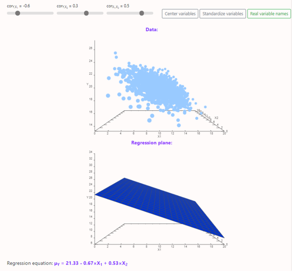
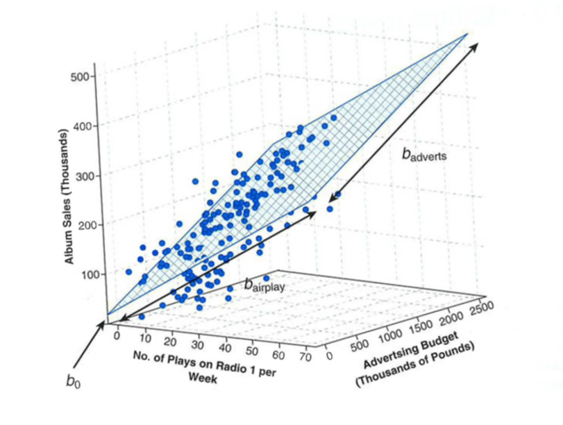

```{r setup, include=FALSE}
## libraries
library(learnr)
library(tidyr)
library(dplyr)
library(ggplot2)
library(scales)
library(RMariaDB)
library(DBI)
library(pool)

### FILL IN YOUR DATABASE DETAILS HERE ###

################################################################################

pool <- dbPool(
  drv = RMySQL::MySQL(), ## Check that this corresponds to the type of database you are using (MySQL/MariaDB, etc.)
  dbname = "YOUR DATABASE NAME",
  host = "DATABASE IP", 
  username = "USERNAME", ## Make sure the user has read & write rights for the selected database
  password = "PASSWORD"
)

dbtable = "THE TABLE YOU WANT TO STORE QUIZ/EXERCISE DATA IN FOR THIS MODULE"
################################################################################


select_query = paste("SELECT * FROM", dbtable)

## options
knitr::opts_chunk$set(echo = TRUE)
tutorial_options(exercise.eval = FALSE, exercise.checker=FALSE)

## recording data
new_recorder <- function(tutorial_id, tutorial_version, user_id, event, data) {
    cat(user_id, ", ", event, ",", data$label, ", ", data$answer, ", ", data$correct, "\n", sep = "", append = TRUE)
  
d_tibble <- tibble::tibble(
user_id  = user_id, 
event = event,
label = data$label,
correct = data$correct,
question = data$question,
answer = data$answer
  )

## send to mysql
dbWriteTable(pool, "module7", d_tibble, append=TRUE, row.names = FALSE)}

options(tutorial.event_recorder = new_recorder)

# exercise setup
albumsales2<-read.delim(file="data/Album Sales 2.dat",header=TRUE)
library(psych)
library(QuantPsyc)
library(gvlma)
library(performance)
library(MASS)
```

## Introduction

```{r, echo=FALSE, out.width="100%", fig.align = "center"}
## HEADER ###
HTML("  <div class='jumbotron jumbotron-fluid'>
    <div class='container'>
    <h2 class='mb-3' style='color:rgba(31, 56, 100, 0.85);'><u>Multiple Regression</u></h2>
    <h4 class='mb-3'>Statistics for CSAI II</h4>
    <h6 class='mb-3'>Travis J. Wiltshire, Ph.D.</h6>
    </div>
  </div>")
```


### Outline

What we will cover today:

1. Simple vs Multiple Regression
2. Multiple Regression 
3. Beta coefficients (standardized)
4. Comparing models
5. Entry methods

## Quiz

### Question 1

```{r Quiz1,  echo=FALSE}
  question("Which of the following models shows orthogonal polynomial regression with a quadratic term?",
    answer("`lm(affect ~ stress + I(stress^2))`"),
    answer("`lm(affect ~ stress * performance)`"),
    answer("`lm(affect ~ poly(stress, 2) + performance)`", correct = TRUE),
    answer("`lm(affect ~ poly(stress, 3) + performance)`"),
    allow_retry = FALSE
    )
```

### Results

#### 1. Which of the following models shows orthogonal polynomial regression with a quadratic term?

```{r, Quiz1O, echo = FALSE}
plotOutput("Q1")
```

```{r, Quiz1R, context="server", echo = FALSE, warning = FALSE, message=FALSE, out.width="100%", fig.align = "center"}

output$Q1 <- renderPlot({
  
  data <- dbGetQuery(pool, select_query)
  answers <- subset(data, data$label == "Quiz1",)
  answers[answers==""] <- NA
  answers <- na.omit(answers)

  answers_count <- as.data.frame(answers %>% 
  count(answer))
  total_n = nrow(answers)
  answers_count$percentage <- (answers_count$n/total_n)*100
  answers_count$correct <- ifelse(answers_count$answer == "`lm(affect ~ poly(stress, 2) + performance)`", "Correct", "Incorrect")

  ggplot(answers_count,
         aes(x = percentage,
             y = answer,
             fill=correct
             )
         ) +
    geom_col(width=0.6) +theme_minimal() + scale_fill_brewer(palette="Paired", direction=-1)  +
    xlab("Percentage (%)") + ylab("Answer") + labs(fill = "Correct")
})
```

### Question 2

```{r Quiz2,  echo=FALSE}
  question("Which of the following is the most accurate interpretation of intra-class correlation (ICC) in mixed modeling?",
    answer("How much variation in the model is due to random effects", correct = TRUE),
    answer("How correlated the random effects are with the fixed effects"),
    answer("How much variation in the model is due to the fixed effects"),
    answer("How much correlation there is between the random intercepts and random slopes"),
    allow_retry = FALSE
    )
```

### Results

#### 2. Which of the following is the most accurate interpretation of ICC in mixed modeling?

```{r, Quiz2O, echo = FALSE}
plotOutput("Q2")
```

```{r, Quiz2R, context="server", echo = FALSE, warning = FALSE, message=FALSE, out.width="100%", fig.align = "center"}

output$Q2 <- renderPlot({
  
  data <- dbGetQuery(pool, select_query)
  answers <- subset(data, data$label == "Quiz2",)
  answers[answers==""] <- NA
  answers <- na.omit(answers)

  answers_count <- as.data.frame(answers %>% 
  count(answer))
  total_n = nrow(answers)
  answers_count$percentage <- (answers_count$n/total_n)*100
  answers_count$correct <- ifelse(answers_count$answer == "How much variation in the model is due to random effects", "Correct", "Incorrect")

  ggplot(answers_count,
         aes(x = percentage,
             y = answer,
             fill=correct
             )
         ) +
    geom_col(width=0.6) +theme_minimal() + scale_fill_brewer(palette="Paired", direction=-1)  +
    xlab("Percentage (%)") + ylab("Answer") + labs(fill = "Correct")
})
```


### Question 3

```{r Quiz3,  echo=FALSE}
  question("Which of the following is true regarding growth curve modeling and mixed effects modeling?",
    answer("Growth curve models do not feature random slopes or random intercepts"),
    answer("Growth curve models use both latent and observed variables to look at trajectories of change over time"),
    answer("Mixed effects models cannot capture the growth of variables over time"),
    answer("Growth curve modeling is a form of mixed modeling that focuses on modeling the shape over time", correct = TRUE),
    allow_retry = FALSE
    )
```

### Results

#### 3. Which of the following is true regarding growth curve modeling and mixed effects modeling?

```{r, Quiz3O, echo = FALSE}
plotOutput("Q3")
```

```{r, Quiz3R, context="server", echo = FALSE, warning = FALSE, message=FALSE, out.width="100%", fig.align = "center"}

output$Q3 <- renderPlot({
  
  data <- dbGetQuery(pool, select_query)
  answers <- subset(data, data$label == "Quiz3",)
  answers[answers==""] <- NA
  answers <- na.omit(answers)

  answers_count <- as.data.frame(answers %>% 
  count(answer))
  total_n = nrow(answers)
  answers_count$percentage <- (answers_count$n/total_n)*100
  answers_count$correct <- ifelse(answers_count$answer == "Growth curve modeling is a form of mixed modeling that focuses on modeling the shape over time", "Correct", "Incorrect")

  ggplot(answers_count,
         aes(x = percentage,
             y = answer,
             fill=correct
             )
         ) +
    geom_col(width=0.6) +theme_minimal() + scale_fill_brewer(palette="Paired", direction=-1)  +
    xlab("Percentage (%)") + ylab("Answer") + labs(fill = "Correct")
})
```


## Simple vs. Multiple Regression

### Simple Regression


$$Y_i=b_0+b_iX_i+\epsilon_i$$


- $b_i$
  - Regression coefficient for the predictor
  - Gradient **(slope)** of the regression line
  - Direction/strength of relationship
- $b_0$
  - **Intercept** (value of Y when X = 0)
  - Point at which the regression line crosses the Y-axis (ordinate)


### Simple vs. Multiple Regression

**Simple**

$$Y_i=b_0+b_iX_i+\epsilon_i$$

- One dependent variable Y predicted from one independent variable X
- One regression coefficient
- $R^2:$ proportion of variation in dependent variable Y predictable from X


**Multiple**

$$Y_i=b_0+b_1X_2+b_2X_2+ ...+b_nX_n+\epsilon_i$$
- One dependent variable Y predicted from **a set of** independent variables ($X_1, X_2, …X_k$)
- One regression coefficient for each independent variable
- $R^2:$ proportion of variation in dependent variable Y predictable by <u>**set of**</u> independent variables (X’s)


[A more in depth comparison here](https://www.youtube.com/watch?v=zITIFTsivN8)


### Multiple Regression Analysis (MRA)


- Method for studying the relationship between a dependent variable and two or more independent variables.
- An equation based model of the data
- Purposes: 
  - Prediction
  - Explanation
  - Theory building


### Assumptions

- **Independence:** the scores of any particular subject are independent of the scores of all other subjects
- **Normality:** in the population, the scores on the dependent variable are normally distributed for each of the possible combinations of the level of the X variables; each of the variables is normally distributed
- **Homoscedasticity:** in the population, the variances of the dependent variable for each of the possible combinations of the levels of the X variables are equal.
- **Linearity:** In the population, the relation between the dependent variable and the independent variable is linear when all the other independent variables are held constant.
- **Multicollinearity:** Two predictors should not be too highly correlated (.8 or .9).


### Example: Self Concept and Academic Achievement (N=103)


Shavelson, Text example p 530  (Table 18.1) (Example 18.1 p 538)

### Proportion of Predictable and Unpredictable Variation


- Where:
  - Y= AA
  - $X_1$ = ASC
  - $X_2$ =GSC
  


### Example: The Model


$$Y_i=b_0+b_1X_2+b_2X_2+ ...+b_nX_n+\epsilon_i$$
- The b’s are called **partial regression coefficients**

- **Our example-Predicting AA:**
  - $Y_i = 36.83 + (3.52)X_{ASC} + (-.44)X_{GSC}$ 

- Predicted AA for person with GSC of 4 and ASC of 6
  - $Y_i = 36.83 + (3.52)(6) + (-.44)(4)  = 56.23$

### Various Significance Tests

- Testing $R^2$
  - Test $R^2$  through an F test
  - Test of competing models (difference between R2) through an F test of difference of $R^2$s
- Testing b
  - Test of each partial regression coefficient (b) by t-tests
  - Comparison of partial regression coefficients with each other - t-test of difference between **standardized** partial regression coefficients ($\beta$)

### Comparing Partial Regression Coefficients

- Which is the stronger predictor? Comparing $b_{GSC}$ and $b_{ASC}$ 
- Convert to **standardized** partial regression coefficients (beta weights, $\beta$’s)
  - $\beta_{GSC} = -.038$
  - $\beta_{ASC}  = .417$
  - On same scale so can compare: ASC is stronger predictor than GSC
- Beta weights ($\beta$’s ) can also be tested for significance  with t tests.

### Different Ways of Building Regression Models

- **Hierarchical:** independent variables entered in stages (based on theory)
- **Simultaneous Forced Entry:**  all independent variables entered together
- **Stepwise:** independent variables entered according to some order
  - By size or correlation with dependent variable
  - In order of significance


### Visualizing the Regression Plane


- **Check out:** [http://statkat.com/visualization-regression-two-predictors.php](http://statkat.com/visualization-regression-two-predictors.php)


     
## Multiple Regression in R    
     
### Multiple Regression in R    

- Still use `lm()` but we just add more variables into the equation
- Need to use `lm.beta()` from QuantPsyc package for standardized Beta coefficients
- Confidence intervals using `confint()`




## Exercise

### Run a regression on Album sales 2 data

- Load the Album Sales 2.dat file into R.
- Generate descriptive statistics for the data and interpret them
- Make (and save) a simple linear model predicting albums sales from advertising
  - Interpret the output
- Make (and save) a multiple regression model prediction albums sales from advertising and airplay
- Generate beta estimates and confidence intervals for your b/beta estimates using `confint()`
- Interpret the results

**Compare model fit**

- We often want to know if the model with more variables is better, because parsimoniously modeling is preferred
- Using anova (model 1, model 2)
- Comparing AIC the Akaike Information Criterion using extractAIC()
  - Smaller AIC values are better
- Root mean square  error using performance() from performance package
  - Square root of the variance of the residuals (an absolute measure of fit)
  - Useful for models with aim of prediction 
  - Smaller is better

### Load the Album Sales 2.dat and generate descriptive statistics

In this online coding environment it’s not needed to load the data, because they are pre-loaded. However, do not forget to load the data and libraries when running R studio on your computer!

- Generate descriptive statistics for the data and interpret them

```{r ex11, exercise=TRUE}
# your code here
head(albumsales2)

#Make (and save) a simple linear model predicting albums sales from advertising

#interpret the output

# Make (and save) a multiple regression model prediction albums sales from advertising and airplay

# Generate beta estimates and confidence intervals for your b/beta estimates using confint()

# Generate confidence intervals for the standardized estimates .. - Use `lm.beta()` from QuantPsyc package

# Compare model fit
#Compare the improvement of fit for the models

# Check out the AIC using extractAIC()

# Do a quick global assessment of model assumptions using gvlma()

# Try plot(compare_performance(mod1, mod2)) from performance package

```
```{r ex11-hint}

psych::describe(albumsales2)#generate descriptives statistics
cor(albumsales2)


albumsales.1<-lm(sales~adverts,data=albumsales2)
summary(albumsales.1)
#Run a multiple linear regression model
albumsales.2<-lm(sales~adverts+airplay,data=albumsales2)

confint(albumsales.2)

anova(albumsales.1,albumsales.2)

extractAIC(albumsales.1)
extractAIC(albumsales.2)


check_model(albumsales.2)
gvlma(albumsales.2)

performance::compare_performance(albumsales.1,albumsales.2)
plot(performance::compare_performance(albumsales.1,albumsales.2))
#Generate confindence intervals for the model
confint(albumsales.2)
```
```{r ex11-check}
#store
```


### Generate standardized beta coefficients

In this online coding environment it’s not needed to load the data, because they are pre-loaded. However, do not forget to load the data and libraries when running R studio on your computer!


## Comparing models


### Comparing model fit

- We often want to know if the model with more variables is better, because parsimoniously modeling is preferred
- Using anova (model 1, model 2)
- Comparing AIC the Akaike Information Criterion using extractAIC()
  - Smaller AIC values are better
- Root mean square  error using performance() from performance package
  - Square root of the variance of the residuals (an absolute measure of fit)
  - Useful for models with aim of prediction 
  - Smaller is better

$$R^2 = 1-\frac{SS_{residuals}}{SS_{total}}$$
$$Adjusted R^2 = 1-\frac{\frac{SS_{residuals}}{n-K}}{\frac{SS_{total}}{n-1}}$$


- Links:
  - [More details here on regression fit](https://www.theanalysisfactor.com/assessing-the-fit-of-regression-models/)
  - [Details of AIC here](https://www.r-bloggers.com/2018/04/how-do-i-interpret-the-aic/)


### Exercise: Lets compare the models

- Compare your two models and see if the second one improved the fit using the `anova()` function
  - F test here tells you if there is a difference in fit of the data by the two models
- Check out the AIC using `extractAIC()`
- Now do a quick global assessment of model assumptions using `gvlma()`
- Or try plot(`compare_performance(mod1, mod2)`) from performance package


### Compare your two models and see if the second one improved the fit using the anova() function

- F test here tells you if there is a difference in fit of the data by the two models

```{r ex21, exercise=TRUE}


```
```{r ex21-hint}

#Compare the improvement of fit for the models
anova(albumsales.1,albumsales.2)
```
```{r ex21-check}
#store
```

### Check out the AIC using extractAIC()

```{r ex22, exercise=TRUE}

 
```
```{r ex22-hint}
extractAIC(albumsales.1)
extractAIC(albumsales.2)
```
```{r ex22-check}
#store
```

### Do a quick global assessment of model assumptions using gvlma()


```{r ex23, exercise=TRUE}

```
```{r ex23-hint}
# quick global analysis of assumptions
require(gvlma)
check_model(albumsales.2)
gvlma(albumsales.2)
```
```{r ex23-check}
#store
```

### Try plot(compare_performance(mod1, mod2)) from performance package

```{r ex24, exercise=TRUE}
#Require 
```
```{r ex24-hint}
# Use the performance package to compare the fit of the two models
performance::compare_performance(albumsales.1,albumsales.2)
plot(performance::compare_performance(albumsales.1,albumsales.2))
```
```{r ex24-check}
#store
```


## Entry methods

### Different Entry Methods in R

- We’ve  been using hierarchical method
- Can do stepwise with s`tepAIC()` function from MASS package
- ‘backward’ – puts all variables in model and sees if AIC is lowered by removing variables
  - Preferable option*
- ‘forward’ – enters variables one at a time and tests if the model is improved


- Link:
  - [Why there are problems with this method and some alternatives here](https://towardsdatascience.com/stopping-stepwise-why-stepwise-selection-is-bad-and-what-you-should-use-instead-90818b3f52df)


### Exercise: Try out the stepwise model

- First create (and save) a new model that has all predictors in the data
- Then save a new model using the `stepAIC()` from the MASS package on that model and specify the direction
- Use your-model-name-here$anova to get the results

**Evaluate and compare the final model to the last model**

- Look at the summary of this model with all variables and interpret them
- Generate standardized beta estimates and CIs
- Compare this last model that includes all the variables to the one with only two of the predictors
- Do check of the assumptions of the model both visual and with gvlma


### Create a new model that has all predictors in the data

```{r ex31, exercise=TRUE}
#create new model albumsales.4

# Save a new model using the `stepAIC()` from the MASS package on that model and specify the direction

# Evaluate and compare models - Look at the summary of this model with all variables and interpret them
# Look at the summary of this model with all variables and interpret them

#Generate confindence intervals for the model

#Standardizing the coefs or variables

# Compare this last model that includes all the variables to the one with only two of the predictors

```
```{r ex31-hint}

albumsales.4<-lm(sales~adverts+airplay+attract,data=albumsales2)

albumsales.5<-MASS::stepAIC(albumsales.4,direction='backward')
albumsales.5$anova

albumsales.5<-MASS::stepAIC(albumsales.4,direction='backward')
albumsales.5$anova

summary(albumsales.5)

#Generate confindence intervals for the model
confint(albumsales.5)

#Standardizing the coefs
QuantPsyc::lm.beta(albumsales.5)
#or we can standardize the variables
albumsales.6<-lm(scale(sales)~scale(adverts)+scale(airplay)+scale(attract),data=albumsales2)
summary(albumsales.6)
confint(albumsales.6)

# Compare this last model that includes all the variables to the one with only two of the predictors
gvlma(albumsales.6)
performance::check_model(albumsales.6)

```
```{r ex31-check}
#store
```


### Extra code

```{r ex44, exercise=TRUE}

```
```{r ex44-hint}

```
```{r ex44-check}
#store
```


## Conculsion


### Thanks!

See you next week!
**Questions?**
