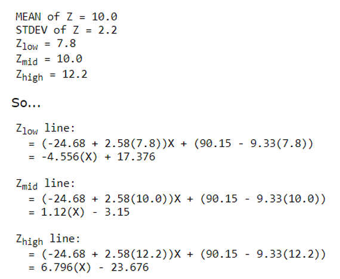

```{r setup, include=FALSE}
## libraries
library(learnr)
library(tidyr)
library(dplyr)
library(ggplot2)
library(scales)
library(RMariaDB)
library(DBI)
library(pool)


pool <- dbPool(
  drv = RMySQL::MySQL(),
  dbname = "statistics_II",
  host = "185.57.8.99",
  username = "admin",
  password = "SeamlessAdmin2022!"
)

## options
knitr::opts_chunk$set(echo = TRUE)
tutorial_options(exercise.eval = FALSE, exercise.checker=FALSE)

## recording data
new_recorder <- function(tutorial_id, tutorial_version, user_id, event, data) {
    cat(user_id, ", ", event, ",", data$label, ", ", data$answer, ", ", data$correct, "\n", sep = "", append = TRUE)
  
d_tibble <- tibble::tibble(
user_id  = user_id, 
event = event,
label = data$label,
correct = data$correct,
question = data$question,
answer = data$answer
  )

## send to mysql
dbWriteTable(pool, "module8", d_tibble, append=TRUE, row.names = FALSE)}

options(tutorial.event_recorder = new_recorder)


## exercise setup
GPA.Data <- read.csv("data/GPA.DATA.csv", header=TRUE)
library(performance)
library(QuantPsyc)
library(gvlma)
library(lme4)
library(lmtest)
library(emmeans)
library(rockchalk)
library(interactions)
```


## Introduction

```{r, echo=FALSE, out.width="100%", fig.align = "center"}
## HEADER ###
HTML("  <div class='jumbotron jumbotron-fluid'>
    <div class='container'>
    <h2 class='mb-3' style='color:rgba(31, 56, 100, 0.85);'><u>Multiple Regression II</u></h2>
    <h4 class='mb-3'>Statistics for CSAI II</h4>
    <h6 class='mb-3'>Travis J. Wiltshire, Ph.D.</h6>
    </div>
  </div>")
```


### Outline

What we will cover today:

1. Simple vs multiple regression
2. Multiple regression with interactions
3. Creating interaction terms
4. Understanding interactions


## Quiz

### Question 1

```{r, Quiz1,  echo=FALSE}
  question("What is the common goal of doing empirical work utilizing statistics in CSAI?",
    answer("Become famous"),
    answer("Earn a degree"),
    answer("Use knowledge of sample to make inference", correct = TRUE),
    allow_retry = FALSE
    )
```

### Results

#### 1. What is the common goal of doing empirical work utilizing statistics in CSAI?

```{r, Quiz1O, echo = FALSE}
plotOutput("Q1")
```

```{r, Quiz1R, context="server", echo = FALSE, warning = FALSE, message=FALSE, out.width="100%", fig.align = "center"}

output$Q1 <- renderPlot({
  
  data <- dbGetQuery(pool, "SELECT * FROM module8")
  
  answers <- subset(data, data$label == "Quiz1",)
  answers[answers==""] <- NA
  answers <- na.omit(answers)

  answers_count <- as.data.frame(answers %>% 
  count(answer))
  total_n = nrow(answers)
  answers_count$percentage <- (answers_count$n/total_n)*100
  answers_count$correct <- ifelse(answers_count$answer == "Use knowledge of sample to make inference", "Correct", "Incorrect")

  ggplot(answers_count,
         aes(x = percentage,
             y = answer,
             fill=correct
             )
         ) +
    geom_col(width=0.6) +theme_minimal() + scale_fill_brewer(palette="Paired", direction=-1)  +
    xlab("Percentage (%)") + ylab("Answer") + labs(fill = "Correct")
})
```

### Question 2

```{r Quiz2, echo=FALSE}
  question("In a regression equation, b0 describes which of the following?",
    answer("The x intercept"),
    answer("The regression coefficient of the predictor"),
    answer("The correlation coefficients"),
    answer("The y intercept", correct = TRUE),
    allow_retry = FALSE
    )
```

### Results

#### 2. In a regression equation, b0 describes which of the following?

```{r, Quiz2O, echo = FALSE}
plotOutput("Q2")
```

```{r, Quiz2R, context="server", echo = FALSE, warning = FALSE, message=FALSE, out.width="100%", fig.align = "center"}

output$Q2 <- renderPlot({
  
  data <- dbGetQuery(pool, "SELECT * FROM module8")
  
  answers <- subset(data, data$label == "Quiz2",)
  answers[answers==""] <- NA
  answers <- na.omit(answers)

  answers_count <- as.data.frame(answers %>% 
  count(answer))
  total_n = nrow(answers)
  answers_count$percentage <- (answers_count$n/total_n)*100
  answers_count$correct <- ifelse(answers_count$answer == "The y intercept", "Correct", "Incorrect")

  ggplot(answers_count,
         aes(x = percentage,
             y = answer,
             fill=correct
             )
         ) +
    geom_col(width=0.6) +theme_minimal() + scale_fill_brewer(palette="Paired", direction=-1)  +
    xlab("Percentage (%)") + ylab("Answer") + labs(fill = "Correct")
})
```

### Question 3
```{r Quiz3, echo=FALSE}
 question("The null hypothesis for a correlation test is which of the following?",
    answer("The correlation is positive"),
    answer("The correlation is negative"),
    answer("The correlation is different than 0"),
    answer("The correlation is equal to 0", correct = TRUE),
    allow_retry = FALSE
    )
```

### Results

#### 3. The null hypothesis for a correlation test is which of the following?

```{r, Quiz3O, echo = FALSE}
plotOutput("Q3")
```

```{r, Quiz3R, context="server", echo = FALSE, warning = FALSE, message=FALSE, out.width="100%", fig.align = "center"}

output$Q3 <- renderPlot({
  
  data <- dbGetQuery(pool, "SELECT * FROM module8")
  
  answers <- subset(data, data$label == "Quiz3",)
  answers[answers==""] <- NA
  answers <- na.omit(answers)

  answers_count <- as.data.frame(answers %>% 
  count(answer))
  total_n = nrow(answers)
  answers_count$percentage <- (answers_count$n/total_n)*100
  answers_count$correct <- ifelse(answers_count$answer == "The correlation is equal to 0", "Correct", "Incorrect")

  ggplot(answers_count,
         aes(x = percentage,
             y = answer,
             fill=correct
             )
         ) +
    geom_col(width=0.6) +theme_minimal() + scale_fill_brewer(palette="Paired", direction=-1)  +
    xlab("Percentage (%)") + ylab("Answer") + labs(fill = "Correct")
})
```

### Question 4
```{r Quiz4, echo=FALSE}
  question("An estimate of the the correlation between Scoville Heat Units in various chili peppers and
perceived pain is .7. What size effect is this?",
    answer("Small"),
    answer("Medium"),
    answer("Large", correct = TRUE),
    answer("No idea"),
    allow_retry = FALSE
    )
```

### Results

#### 4. An estimate of the the correlation between Scoville Heat Units in various chili peppers and perceived pain is .7. What size effect is this?

```{r, Quiz4O, echo = FALSE}
plotOutput("Q4")
```

```{r, Quiz4R, context="server", echo = FALSE, warning = FALSE, message=FALSE, out.width="100%", fig.align = "center"}

output$Q4 <- renderPlot({
  
  data <- dbGetQuery(pool, "SELECT * FROM module6")
  
  answers <- subset(data, data$label == "Quiz4",)
  answers[answers==""] <- NA
  answers <- na.omit(answers)

  answers_count <- as.data.frame(answers %>% 
  count(answer))
  total_n = nrow(answers)
  answers_count$percentage <- (answers_count$n/total_n)*100
  answers_count$correct <- ifelse(answers_count$answer == "Large", "Correct", "Incorrect")

  ggplot(answers_count,
         aes(x = percentage,
             y = answer,
             fill=correct
             )
         ) +
    geom_col(width=0.6) +theme_minimal() + scale_fill_brewer(palette="Paired", direction=-1)  +
    xlab("Percentage (%)") + ylab("Answer") + labs(fill = "Correct")
})
```


## Simple vs. Multiple Regression

### Simple vs. Multiple Regression

**Simple**

$$Y_i=b_0+b_iX_i+\epsilon_i$$

- One dependent variable Y predicted from one independent variable X
- One regression coefficient
- $R^2:$ proportion of variation in dependent variable Y predictable from X


**Multiple**

$$Y_i=b_0+b_1X_2+b_2X_2+ ...+b_nX_n+\epsilon_i$$
- One dependent variable Y predicted from **a set of** independent variables ($X_1, X_2, …X_k$)
- One regression coefficient for each independent variable
- $R^2:$ proportion of variation in dependent variable Y predictable by <u>**set of**</u> independent variables (X’s)

### Multiple Regression with an Interaction

$$Y_i=b_0+b_1X_2+b_2X_2+\color{red}{b_3X_1X_2}+\epsilon_i$$

- **Interaction:**
  - When the effect of one predictor differs based on the level or magnitude of another predictor variable
  - This is also a form of moderation effect

### Some interaction examples


  
### What kind of research questions can we answer with interactions? 

- What is the predicted Y given a particular $X_1$ and $X_2$? (predicted value)
- What is relationship of $X_1$ on $Y$ at particular values of $X_2$? (simple slopes/effects)
- Is there a difference in the relationship of $X_1$ on $Y$ for different values of $X_2$? (comparing simple slopes)

### Creating interaction terms

- We could simply create a new variable by multiplying our two predictors
- `Newvar<-var1*var2`
- Then we can include this in our linear model `lm()`
- This could be useful for checking out issues with multicollinearity (but it’s not how we would typically model interactions)

### Avoiding Multi Collinearity

- Can use centering to avoid issues with multicollinearity arising from interaction terms
- Not always necessary
  - See: Iacobucci, D., Schneider, M. J., Popovich, D. L., & Bakamitsos, G. A. (2016). Mean centering helps alleviate “micro” but not “macro” multicollinearity. Behavior research methods, 48(4), 1308-1317.


## Exercises

### Preparing some data to test an interaction

- Load the GPA.Data.csv file
- Create an interaction variable for IQ and Work.Ethic
- Generate descriptive statistics for the data and interpret them
- Generate correlation matrix and evaluate that
- Center IQ and Work.Ethic (save these as new variables)
  - hint: use scale function, but not all arguments should be true
- Create a new interaction term with the centered IQ and Work.Ethic
- Check out the correlation matrix now

**After that, run multiple regression on the data in same code chunk**

- Create a linear model with only the centered version of IQ and Work.Ethic as predictors
  - Check out and interpret the summary of the model
- Create a linear model with the centered version of IQ and Work.Ethic AND the centered interaction term as predictors
  - Check out and interpret the summary of the model
- Compare the models to see which is the better fit
- Get your standardized coefficients using lm.beta()
- Do a global check and visual check of the assumptions for the model
- Check out and interpret the summary of the model

In this online coding environment it’s not needed to load the data, because they are pre-loaded. However, do not forget to load the data and libraries when running R studio on your computer!

```{r ex1, exercise=TRUE}
#The GPA dataset is stored in a variable called 'GPA.Data'
head(GPA.Data)
#  Create an interaction variable for IQ and Work.Ethic

# Generate descriptive statistics for the data and interpret them

# Generate correlation matrix and evaluate that

# Center IQ and Work.Ethic (save these as new variables)

# Create a new interaction term with the centered IQ and Work.Ethic

### Create a linear model with only the centered version of IQ and Work.Ethic as predictors and inspect it

# Create a linear model with the centered version of IQ and Work.Ethic AND the centered interaction term as predictors

#Compare the models to see which is the better fit

#Get your standardized coefficients using lm.beta()

# Do a global check and visual check of the assumptions for the model
```
```{r ex1-hint}
#  Create an interaction variable for IQ and Work.Ethic
GPA.Data$IQ.WE.INT<-GPA.Data$IQ*GPA.Data$Work.Ethic #This one creates a multicollinearity problem
## Generate descriptive statistics for the data and interpret them
psych::describe(GPA.Data)
# Generate correlation matrix and evaluate that
cor(GPA.Data)
### Center IQ and Work.Ethic (save these as new variables)
GPA.Data$IQ.C <- scale(GPA.Data$IQ, center = TRUE, scale = FALSE)[,]
GPA.Data$Work.Ethic.C <- scale(GPA.Data$Work.Ethic, center = TRUE, scale = FALSE)[,]
GPA.Data$IQ.C <- as.numeric(scale(GPA.Data$IQ, center = TRUE, scale = FALSE))
# Create a new interaction term with the centered IQ and Work.Ethic
GPA.Data$IQ.WE.INT.c<-GPA.Data$IQ.C*GPA.Data$Work.Ethic.C #This one looks much better
cor(GPA.Data)
# Create a linear model with only the centered version of IQ and Work
gpa.mod1<-lm(GPA~IQ.C+Work.Ethic.C,data=GPA.Data)
# Create a linear model with the centered version of IQ and Work.Ethic AND the centered interaction term as predictors
gpa.mod2<-lm(GPA~IQ.C+Work.Ethic.C+IQ.WE.INT.c,data=GPA.Data)
gpa.mod3<-lm(GPA~IQ.C*Work.Ethic.C,data=GPA.Data)

#Compare the models to see which is the better fit
anova(gpa.mod1,gpa.mod2)
extractAIC(gpa.mod1)
extractAIC(gpa.mod2) #Note how the AIC for this one is lower (more negative*)
performance::performance(gpa.mod1)
performance::performance(gpa.mod2)
plot(performance::compare_performance(gpa.mod1,gpa.mod2))
anova(gpa.mod2,gpa.mod3)
#Get your standardized coefficients using lm.beta()
QuantPsyc::lm.beta(gpa.mod3) #note that now I am using the mod3 using the *
# Do a global check and visual check of the assumptions for the model
gvlma(gpa.mod3)
performance::check_model(gpa.mod3)
```


## Interactions

### How do we further our understanding of interactions? 

- **decompose:** to break down the interaction into its lower order components (i.e., predicted means or simple slopes)
- **probe:** to use hypothesis testing to assess the statistical significance of simple slopes and simple slope differences (i.e., interactions)
- **plot:** to visually display the interaction in the form of simple slopes such as values of the dependent variable are on the y-axis, values of the predictor is on the x-axis, and the moderator separates the lines or bar graph’

Ideas from: 
https://stats.idre.ucla.edu/r/seminars/interactions-r/

### Calculating Simple Slopes: 
$$Y_i=b_0+b_1X_2+b_2X_2+b_3X_1X_2+\epsilon_i$$


$Y_i=\color{red}{\overbrace{(b_1+b_3X_2)X_1}^{Simple slope}}+\color{blue}{\overbrace{(b_0+b_2X_2)}^{Simple intercept}}$


$$Y_i=(b_1+b_3X_2)X_1+(b_0+b_2X_2)$$
$\hat{Y}=90.15-24.68(X) -9.33(Z)+2.58(XZ)$

$\hat{Y}= \color{red}{(b_1+b_3Z)}X_1+\color{blue}{(b_0+b_2(Z))}\\=(-24.68+2.58(Z))X+(90.15-9.33(Z))$


### Plotting Simple Slopes to Understand the Interactions

- Choose certain values of one of our predictors to compute simple slopes
  - Commonly use +/- 1 SD from the mean
  - Can also choose your own (or may be limited if there is categories)
  - Or use quantiles



### Plotting Simple Slopes to Understand the Interactions


### Easy plotting of simple slopes in R

- Using “rockchalk” package:
  - `plotSlopes(model.object, plotx=X1, modx=X2, modxVals='std.dev', legendTitle=‘X2’)`
- Using “interactions” package:
  - `interact_plot(model.object, pred = X1, modx = X2)`


### Using the emmeans package to get simple slopes

-Decompose:


From: https://stats.idre.ucla.edu/r/seminars/interactions-r/


### Probe

- Probe: 


From: 
https://stats.idre.ucla.edu/r/seminars/interactions-r/

## Exercises

### Decompose and Probe the interaction effect (s18)

- Install and load the ‘emmeans’ package
- Check out the arguments of the `emtrends()` function
- Create a list variable that includes the three values of IQ.C at the mean, plus 1 SD above the mean, and minus 1 SD below the mean
- Examine the simple slopes for WorkEthic.C using `emtrends()`. What do they show? Do they appear different?
- Modify your input to the `emtrends()` function to Probe the simple slopes and test if any of these are different than each other. 

In this online coding environment it’s not needed to load the data, because they are pre-loaded. However, do not forget to load the data and libraries when running R studio on your computer!

```{r ex31, exercise=TRUE}
#The GPA dataset is stored in a variable called 'GPA.Data'
GPA.Data$IQ.C <- as.numeric(scale(GPA.Data$IQ, center = TRUE, scale = FALSE))
GPA.Data$Work.Ethic.C <- scale(GPA.Data$Work.Ethic, center = TRUE, scale = FALSE)[,]
GPA.Data$IQ.WE.INT.c<-GPA.Data$IQ.C*GPA.Data$Work.Ethic.C 
gpa.mod1<-lm(GPA~IQ.C+Work.Ethic.C,data=GPA.Data)
gpa.mod2<-lm(GPA~IQ.C+Work.Ethic.C+IQ.WE.INT.c,data=GPA.Data)
gpa.mod3<-lm(GPA~IQ.C*Work.Ethic.C,data=GPA.Data)

# Create IQ values at, and +/1 1 SD from the mean

# Now examine the simple slopes of work ethic at the levels of IQ

# Modify input for esting the simple slopes
```
```{r ex31-hint}
#
library(emmeans)
summary(GPA.Data$IQ.C)
# Create IQ values at, and +/1 1 SD from the mean
IQplus <- round(mean(GPA.Data$IQ.C) + sd(GPA.Data$IQ.C),1)
IQ <- round(mean(GPA.Data$IQ.C),1)
IQminus <-round(mean(GPA.Data$IQ.C) - sd(GPA.Data$IQ.C),1)
mylist <- list(IQ.C=c(IQplus,IQ,IQminus) )
# Now examine the simple slopes of work ethic at the levels of IQ
emtrends(gpa.mod3,~IQ.C,var = "Work.Ethic.C", at=mylist)

emtrends(gpa.mod3,pairwise ~IQ.C,var = "Work.Ethic.C" ,at=mylist,adjusts='none')


```

### Plot the simple slopes

1. Load the ‘rockchalk’ and ‘interactions’ package
2. Check out the arguments of the `plotSlopes()` function
3. Use `plotSlopes` to make a graph that shows the simple slopes for IQ.C
3. Reverse the order of entry of the IVs and plot the simple slopes
4. Check out the arguments of the `interact_plot()` function
5. Use `interact_plot()` to make a graph that shows the simple slopes for IQ.C

In this online coding environment it’s not needed to load the data, because they are pre-loaded. However, do not forget to load the data and libraries when running R studio on your computer!

```{r ex41, exercise=TRUE}
# Run this code before continuing exercise
GPA.Data$IQ.C <- as.numeric(scale(GPA.Data$IQ, center = TRUE, scale = FALSE))
GPA.Data$Work.Ethic.C <- scale(GPA.Data$Work.Ethic, center = TRUE, scale = FALSE)[,]
GPA.Data$IQ.WE.INT.c<-GPA.Data$IQ.C*GPA.Data$Work.Ethic.C 
gpa.mod1<-lm(GPA~IQ.C+Work.Ethic.C,data=GPA.Data)
gpa.mod2<-lm(GPA~IQ.C+Work.Ethic.C+IQ.WE.INT.c,data=GPA.Data)
gpa.mod3<-lm(GPA~IQ.C*Work.Ethic.C,data=GPA.Data)
# Use `plotSlopes` to make a graph that shows the simple slopes for IQ.C

## Use `interact_plot()` to make a graph that shows the simple slopes for IQ.C
```
```{r ex41-hint}
#Use `plotSlopes` to make a graph that shows the simple slopes for IQ.C
gpa.simp<-plotSlopes(gpa.mod3,plotx='Work.Ethic.C',modx='IQ.C',modxVals='std.dev', legendTitle='IQ.C')
gpa.simp<-plotSlopes(gpa.mod3,plotx='IQ.C',modx='Work.Ethic.C',modxVals='std.dev', legendTitle='IQ.C')
## Use `interact_plot()` to make a graph that shows the simple slopes for IQ.C
interact_plot(gpa.mod3, pred = Work.Ethic.C, modx = IQ.C)
interact_plot(gpa.mod3, pred = IQ.C, modx = Work.Ethic.C)
```

### Data analysis of Dutch Lexicon Project

1. retrieve the tab delimited files for stimulus characteristics and average reaction times from http://crr.ugent.be/programs-data/lexicon-projects
2. load the data in R
3. merge the two data frames such that for each spelling we have its OLD20 (the average distance of the 20 most similar words based on orthography), its lexicality (whether it is a word or a non-word), its frequency in the subtlex corpus and its average reaction time (RT)
4. fit a linear regression predicting RTs as a linear combination of OLD20 and lexicality
5. fit a linear regression predicting RTs based on the interaction between OLD20 and lexicality
6. compare the two models and determine which one provides the best fit
7. fit a linear regression predicting RTs using frequency. How could you decide whether this model is better than the best model you found before?


## Conculsion


### Thanks!

See you next week!
**Questions?**


