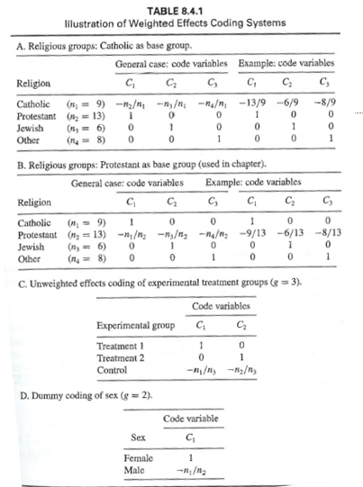

```{r setup, include=FALSE}
## libraries
library(learnr)
library(tidyr)
library(dplyr)
library(ggplot2)
library(scales)
library(RMariaDB)
library(DBI)
library(pool)


pool <- dbPool(
  drv = RMySQL::MySQL(),
  dbname = "statistics_II",
  host = "185.57.8.99",
  username = "admin",
  password = "SeamlessAdmin2022!"
)

## options
knitr::opts_chunk$set(echo = TRUE)
tutorial_options(exercise.eval = FALSE, exercise.checker=FALSE)

## recording data
new_recorder <- function(tutorial_id, tutorial_version, user_id, event, data) {
    cat(user_id, ", ", event, ",", data$label, ", ", data$answer, ", ", data$correct, "\n", sep = "", append = TRUE)
  
d_tibble <- tibble::tibble(
user_id  = user_id, 
event = event,
label = data$label,
correct = data$correct,
question = data$question,
answer = data$answer
  )

## send to mysql
dbWriteTable(pool, "module9", d_tibble, append=TRUE, row.names = FALSE)}

options(tutorial.event_recorder = new_recorder)

## EXCERCISE SETUP

## exercise setup
library(gvlma)
library(lme4)
library(lmtest)
library(wec)
library(psych)
data(BMI)

```


## 1. Introduction


```{r, echo=FALSE, out.width="100%", fig.align = "center"}
## HEADER ###
HTML("  <div class='jumbotron jumbotron-fluid'>
    <div class='container'>
    <h2 class='mb-3' style='color:rgba(31, 56, 100, 0.85);'><u>Coding and Effects</u></h2>
    <h4 class='mb-3'>Statistics for CSAI II</h4>
    <h6 class='mb-3'>Travis J. Wiltshire, Ph.D.</h6>
    </div>
  </div>")
```


### Outline

1. Multiple Regression 
2. Dummy Coding
3. Unweighted Effects
4. Weighted Effects 
5. Contrast Coding

## Quiz

### Question 1

```{r Quiz1, echo=FALSE}
  question("In a regression equation, b0 describes which of the following?",
    answer("The x intercept"),
    answer("The regression coefficient of the predictor"),
    answer("The correlation coefficients"),
    answer("The y intercept", correct = TRUE),
    allow_retry = FALSE
    )
```

### Results

#### 1. In a regression equation, b0 describes which of the following?

```{r, Quiz1O, echo = FALSE}
plotOutput("Q1")
```

```{r, Quiz1R, context="server", echo = FALSE, warning = FALSE, message=FALSE, out.width="100%", fig.align = "center"}

output$Q1 <- renderPlot({
  
  data <- dbGetQuery(pool, "SELECT * FROM module9")
  
  answers <- subset(data, data$label == "exercise_submission",)
  answers[answers==""] <- NA
  answers <- na.omit(answers)

  answers_count <- as.data.frame(answers %>% 
  count(answer))
  total_n = nrow(answers)
  answers_count$percentage <- (answers_count$n/total_n)*100
  answers_count$correct <- ifelse(answers_count$answer == "The y intercept", "Correct", "Incorrect")

  ggplot(answers_count,
         aes(x = percentage,
             y = answer,
             fill=correct
             )
         ) +
    geom_col(width=0.6) +theme_minimal() + scale_fill_brewer(palette="Paired", direction=-1)  +
    xlab("Percentage (%)") + ylab("Answer") + labs(fill = "Correct")
})
```

### Question 2

```{r Quiz2, echo=FALSE}
  question("Which of the following is the most efficient way run multiple regression with an interaction term and all lower order terms in R?",
    answer("lm(y ~ x1*x2)", correct = TRUE),
    answer("lm(y ~ x1 + x2 + x1*x2)"),
    answer("lm(y ~ x1:x2)"),
    answer("lm(y ~ x1 + x2 + x3"),
    allow_retry = FALSE
    )
```

### Results

#### 2. Which of the following is the most efficient way run multiple regression with an interaction term and all lower order terms in R?

```{r, Quiz2O, echo = FALSE}
plotOutput("Q2")
```

```{r, Quiz2R, context="server", echo = FALSE, warning = FALSE, message=FALSE, out.width="100%", fig.align = "center"}

output$Q2 <- renderPlot({
  
  data <- dbGetQuery(pool, "SELECT * FROM module9")
  
  answers <- subset(data, data$label == "Quiz2",)
  answers[answers==""] <- NA
  answers <- na.omit(answers)

  answers_count <- as.data.frame(answers %>% 
  count(answer))
  total_n = nrow(answers)
  answers_count$percentage <- (answers_count$n/total_n)*100
  answers_count$correct <- ifelse(answers_count$answer == "lm(y ~ x1*x2)", "Correct", "Incorrect")

  ggplot(answers_count,
         aes(x = percentage,
             y = answer,
             fill=correct
             )
         ) +
    geom_col(width=0.6) +theme_minimal() + scale_fill_brewer(palette="Paired", direction=-1)  +
    xlab("Percentage (%)") + ylab("Answer") + labs(fill = "Correct")
})
```

## Multiple Regression

### Simple vs. Multiple Regression


**Simple**

$$Y_i=b_0+b_iX_i+\epsilon_i$$

- One dependent variable Y predicted from one independent variable X
- One regression coefficient
- $R^2:$ proportion of variation in dependent variable Y predictable from X


**Multiple**

$$Y_i=b_0+b_1X_2+b_2X_2+ ...+b_nX_n+\epsilon_i$$
- One dependent variable Y predicted from **a set of** independent variables ($X_1, X_2, …X_k$)
- One regression coefficient for each independent variable
- $R^2:$ proportion of variation in dependent variable Y predictable by <u>**set of**</u> independent variables (X’s)

### When do we need to think about categories for regression analysis?

- We have nominal/ordinal predictor variables 
- There are 2 or more groups/categories for our predictors


### Coding Systems in Multiple Regression

- All coding systems use g-1 predictor variables to represent all g (groups).
- Each represents a single distinction among the groups
- All groups are:
  - Mutually exclusive
  - Exhaustive


## Dummy coding

- Need to carefully consider the reference group
  - A useful comparison (e.g., control group)
  - Size of group should not be too small compared to size of other groups
  - Standardized coefficients are not very useful
- The intercept of the reference group is the mean of the reference group
- Each regression coefficient is a **comparison of the mean of the group to the mean of the reference group. **


## Exercise 1

### Preparing some data to run a model with dummy codes

- 1. Install and load the ‘wec’ package (In online enviornment it's pre-loaded)
- 2. Load the ‘BMI’ data that is within that package (and check out the variables)
- 3. Check out the `dummy.code()` function from the psych package 
- 4. Create a set of dummy coded variables for the education variable in the BMI data set
- 5. Get some descriptive statistics on the data set

**Run multiple regression on the data**

- 1. Create a linear model with your dummy codes as predictors of BMI (be sure to choose a referent group)
- 2. Check out and interpret the summary of the model
- 3. Do a global and visual check of the assumptions for the model


```{r ex1, exercise=TRUE}
#The data is stored in a variable called BMI
head(BMI)
# Create a set of dummy coded variables for the education variable in the BMI data set and get some descriptive data
```
```{r ex1-hint}
#
data(BMI)
options(scipen=999)
# Create a set of dummy coded variables for the education variable in the BMI data set and get some descriptive data
dum<-psych::dummy.code(BMI$education)
bmi_ed<-data.frame(BMI,dum)
summary(bmi_ed)
# Predict BMI from using 'medium' education as the referent group
mod.1<-lm(BMI~lowest + highest, data=bmi_ed)
summary(mod.1)
gvlma(mod.1)
performance::check_model(mod.1)
```


## (unweighted) Effects Coding

- Used to compare how the outcome for each group differs from the grand mean (mean of group means)
- Base group gets all -1
  - Group that is of least interest
- Regression coefs represent the deviation of the outcome for each separate group to the mean of the sample
- Mean difference for base group: $M = - B_1 – B_2 – B_3…B_i + B_0$


## Exercise 2

- 1. Try out the `contr.sum()` function to generate effects coding matrices for variables with 3 and 4 groups
- 2. Run a linear model with:
  - BMI as the outcome,
  - Education as the predictor
  - Figure out how to use the contrasts argument of `lm()` by creating a list that includes the `contr.sum` for the education variable
- 3. Generate and interpret the summary
- 4. Get the mean of the base group

- Bonus: Figure out the difference between ANOVA and categorical regression


### 1. Check out and interpret the summary of the model

```{r ex2, exercise=TRUE}
# The data is stored in a variable called BMI, don't forget to run the rest of the code to create new df
head(BMI)

dum<-psych::dummy.code(BMI$education)
bmi_ed<-data.frame(BMI,dum)
# Predict BMI from education using unweighted effects coding 

# Print out group means

# Calculate grand mean (mean of means)

# Calculate the mean of the base group

# Bonus: Figure out the difference between ANOVA and categorical regression
```
```{r ex2-hint}
#Unweighted effects coding
contrasts(BMI$education)<-contr.sum(3)#use this to check out the contrast matrix
contr.sum(3)
contr.sum(4)

# Predict BMI from education using unweighted effects coding 
mod.2<-lm(BMI~education, data=BMI,contrasts=list(education=contr.sum))
mod.1<-lm(BMI~education, data=BMI)
summary(mod.2)
# Print out group means
aggregate(x = BMI$BMI, by = list(BMI$education), FUN = mean) #Get group means
# Calculate grand mean (mean of means)
(26.14770 + 24.97839 + 24.29695)/3
# Calculate the mean of the base group
-1.00669-(-.16262)+25.14101 #Base group mean
# Bonus: Figure out the difference between ANOVA and categorical regression
# Compare results with anova model
anova.results<-aov(BMI ~ education, data= bmi_ed)
summary(anova.results)
psych::describeBy(bmi_ed,group='education')
TukeyHSD(anova.results)
```


## Weighted Effects Coding


- Useful when the proportion of cases from each group ‘represents’ the population
  - (e.g., ethnic makeup, cognitive ability, etc.)
- Or when sample size of groups is different
 


## Exercise 3 

Run a model with weighted effects codes

- 1. Make a weighted contrast matrix using the `contr.wec()` function from wec package
- 2. Make two new variables the represent contrasts either omitting the ‘lowest’ or highest’ education group
- 3. Now run two models including those new variables
- 4. Generate summaries, interpret, and compare


```{r ex3, exercise=TRUE}
#The data is stored in a variable called BMI
dum<-psych::dummy.code(BMI$education)
bmi_ed<-data.frame(BMI,dum)

```
```{r ex3-hint}
wec::contr.wec(BMI$education, omitted='highest')
BMI$educ.wec.lowest <- BMI$educ.wec.highest <- BMI$education
model.wec.lowest <- lm(BMI ~ educ.wec.lowest, data=BMI)
model.wec.highest <- lm(BMI ~ educ.wec.highest, data=BMI)
summary(model.wec.lowest)
summary(model.wec.highest)
mean(bmi_ed$BMI) #See the intercept is the sample mean
mean(BMI$BMI)

```


## Contrast Coding

- When there are mean expected differences between groups or combinations of groups
- Good for testing specific hypotheses 
  - E.g., group a + b will be less than group c
- Can increase power of the statistical analysis
- **Rules**
  1. Sum of weights across all groups must equal 0
  2. Sum of the products of each pair of code variables must equal 0
  3. Difference between positive set of weights and negative set should equal 1


## Exercise 4

- 1. Create a matrix that allows you to compare the lowest education to the middle and highest matrix (hint: see Table 8.5.1 D)
- 2. Run the model including this matrix in the contrasts arguments
- 3. Generate and interpret the summary


```{r ex4, exercise=TRUE}
#The data is stored in a variable called BMI


```
```{r ex4-hint}
mat = matrix(c(-2/3,1/3,1/3,0,1/2,-1/2), ncol = 2)
mod.3<-lm(BMI~education,contrasts=list(education=mat),data=BMI)
summary(mod.3)

```


## Conclusion

### More coding systems

- There are many more types of coding systems:
- https://stats.idre.ucla.edu/r/library/r-library-contrast-coding-systems-for-categorical-variables/#User

- Next week:
  -Polynomial regression


### Thanks!

See you next week!
**Questions?**


