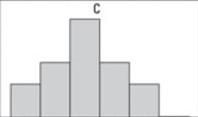
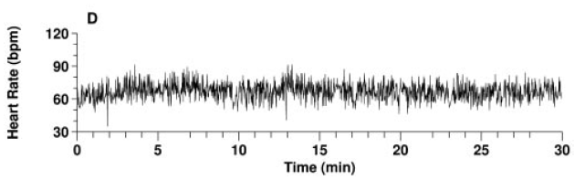
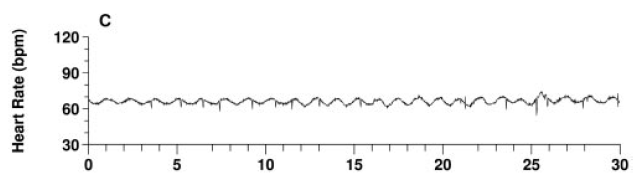

```{r, context="server-start", include = FALSE}
library(RMariaDB)
library(DBI)
library(pool)

### FILL IN YOUR DATABASE DETAILS HERE ###

################################################################################

pool <- dbPool(
  drv = RMariaDB::MariaDB(), ## Check that this corresponds to the type of database you are using (MySQL/MariaDB, etc.)
  dbname = "database_name",
  host = "database IP address", 
  username = "user", ## Make sure the user has read & write rights for the selected database
  password = "password"
)

################################################################################

dbtable = "table_name" ## Set the table name here!

select_query = paste("SELECT * FROM", dbtable)
```


```{r setup, include=FALSE}

########################################## SEAMLESS SETUP ###########################################
## You generally don't need to change this part ##

## Loading packages
library(shiny)
library(learnr)
library(tidyr)
library(dplyr)
library(ggplot2)
library(scales)

## RMD Options
knitr::opts_chunk$set(echo = TRUE)
tutorial_options(exercise.eval = FALSE, exercise.checker=FALSE)

## RECORDING DATA

## Recorder function
initialize_recorder <- function(tutorial_id, tutorial_version, user_id, event, data) {
    cat(user_id, ", ", event, ",", data$label, ", ", data$answer, ", ", data$correct, "\n", sep = "", append = TRUE)
  
d_tibble <- tibble::tibble(
user_id  = user_id, 
event = event,
label = data$label,
correct = data$correct,
question = data$question,
answer = data$answer
  )

## Send to mysql
dbWriteTable(pool,dbtable, d_tibble, append=TRUE, row.names = FALSE)}

options(tutorial.event_recorder = initialize_recorder)

## QUIZ FUNCTIONS

quizQuestion <- function(question, answers, correct) {
  answer_list <- lapply(1:length(answers), function(i) {
    if (i == correct) {
      rlang::expr(answer(!!answers[i], correct = TRUE))
    } else {
      rlang::expr(answer(!!answers[i]))
    }
  })

  question_args <- c(
    list(
      question,
      incorrect = "Hint: Try again, you can pick another answer!",
      allow_retry = TRUE
    ),
    answer_list
  )

  do.call(learnr::question, question_args)
}

## PLOT FUNCTIONS

# UI part of the function
quizPlotUI <- function(id) {
  ns <- NS(id)
  plotOutput(ns("quiz_plot"))
}

# Server part of the function
quizPlot <- function(input, output, session, quiz_number, correct_answer) {
  label_name <- paste0("Quiz", quiz_number)

  output$quiz_plot <- renderPlot({
    data <- dbGetQuery(pool, select_query)
    answers <- subset(data, data$label == label_name)
    answers[answers=="<NA>"] <- NA
    answers <- na.omit(answers)

    answers_count <- as.data.frame(answers %>% count(answer))
    total_n = nrow(answers)
    answers_count$percentage <- (answers_count$n / total_n) * 100
    answers_count$correct <- ifelse(answers_count$answer == correct_answer, "Correct", "Incorrect")

    ggplot(answers_count, aes(x = percentage, y = answer, fill = correct)) +
      geom_col(width = 0.6) +
      theme_minimal() +
      scale_fill_brewer(palette = "Paired", direction = -1) +
      xlab("Percentage (%)") +
      ylab("Answer") +
      labs(fill = "Correct")
  })
}

#################################### MODULE SETUP ##########################################################

## Load your module specific data and packages here to have them globally accessible throughout different code blocks 

fractaldata <- read.csv("data/filename.csv", sep=";") # Your filepath is data/filename.filetype
# (Make sure to put the data in a folder called data and deploy it with your rmd)

```

## Word cloud

A question with a short text answer that can be plotted as a word cloud.

### Where are you from?
```{r Quiz1,  echo=FALSE}
## There is no correct answer here but LearnR quizzes require one. I have set the correct answer to an arbitrary answer and both
## correct/incorrect responses will get a response of "Answer saved"

question1 = "WRITE YOUR QUESTION HERE"
question_text(
  "Where are you from?", ## Write your question here
  answer("secret", correct = TRUE), 
  allow_retry = FALSE,
  trim = FALSE,
  incorrect = "Answer saved",
  correct = "Answer saved"

)
```

### Results: Where are you from?
```{r, Quiz1O, echo = FALSE}
## Displaying the plot
plotOutput("Q1")
```

```{r, Quiz1R, context="server", echo = FALSE, warning = FALSE, message=FALSE, out.width="100%", fig.align = "center"}
## Creating the plot

## This needs to match what is inside plotoutput(), Q1 in this case
output$Q1 <- renderPlot({
  
  library(ggwordcloud) ## Extra library needed for this plot
  ## Getting the data
  data <- dbGetQuery(pool, select_query)
  ## Cleaning the data
  answers <- subset(data, data$label == "Quiz1",) ## The label must match the label of your question, in this case {r Quiz1,..
  answers[answers==""] <- NA
  answers <- na.omit(answers)
  answers_count <- as.data.frame(answers %>% 
  count(answer))
  total_n = nrow(answers)
  answers_count$percentage <- (answers_count$n/total_n)*100


  ## Making the plot
  ggplot(
    answers_count,
    aes(
      label = answer, size = n,
      color = factor(sample.int(10, nrow(answers_count), replace = TRUE))
      )
  ) +
    geom_text_wordcloud_area() +
    scale_size_area(max_size = 24) +
    theme_minimal()
})
```

## Regular quizzes

An example of a basic question and plot. Helper functions defined in the setup block can be used to simplify making quizzes and plots, which cuts down on code throughout the file if you have a number of questions. These help functions can also be used for the following questions with pictures.

### Which of the following models shows orthogonal polynomial regression with a quadratic term?

```{r Quiz2,  echo=FALSE}
## Note that each code chunk needs to have a unique label ({r, Quiz2..), you can increment the number for each question

## You can add or remove answer options by copypasting another line of answer("answer option"), or deleting one of the lines below

quizQuestion(
  question = "Which of the following models shows orthogonal polynomial regression with a quadratic term?",
  answers = c(
    "`lm(affect ~ stress + I(stress^2))`",
    "`lm(affect ~ stress * performance)`",
    "`lm(affect ~ poly(stress, 2) + performance)`",
    "`lm(affect ~ poly(stress, 3) + performance)`" # You can add more lines here for more answer options
  ),
  correct = 3 # The order nr of the answer option that is correct
)
```


### Results: Which of the following models shows orthogonal polynomial regression with a quadratic term?

```{r, Quiz2O, echo = FALSE}
plotOutput("Q2")
```

```{r, Quiz2R, context="server", echo = FALSE, warning = FALSE, message=FALSE, out.width="100%", fig.align = "center"}

quizPlot(
  input,
  output,
  session,
  quiz_number = "Quiz2", # This should match the name in the question's code chunk header
  correct_answer = "`lm(affect ~ poly(stress, 2) + performance)`" # Copy-paste the correct answer here
)
```

## Pictures in quizzes

Examples of quizzes with pictures as answer options. Make sure your images are in the "images" folder and type their names after "images/" in the answer options.


### Which one of these shows a normal distribution?
```{r Quiz3,  echo=FALSE}

	question("Which one of these shows a normal distribution?",
	 	 answer(
			htmltools::img( src = "images/A.png"), ## Replace A.png with your image name
			),
	         
	 answer(
			htmltools::img( src = "images/B.png"), 
			),
	 
		answer(
			htmltools::img(
				src = "images/C.png"
			), 
			correct = TRUE ## Move ", correct = TRUE" after the correct answer
		),
	  incorrect = "Hint: Try again, you can pick another answer!",
    allow_retry = TRUE
	)

```

### Results: Which one of these shows a normal distribution?

```{r, Quiz3O, echo = FALSE}
plotOutput("Q3")
```


```{r, Quiz3R, context="server", echo = FALSE, warning = FALSE, message=FALSE, out.width="100%", fig.align = "center"}

## Write the correct answer here (it must be an exact match inside quotation marks)
correct_answer = '' ## In this case, it is the code used to display the image

output$Q3 <- renderPlot({

data <- dbGetQuery(pool, select_query)

answers <- subset(data, data$label == "Quiz3",) ## Make sure this matches the question
answers[answers=="<NA>"] <- NA
answers <- na.omit(answers)

answers_count <- as.data.frame(answers %>% 
  count(answer))
total_n = nrow(answers)
answers_count$percentage <- (answers_count$n/total_n)*100
answers_count$correct <- ifelse(answers_count$answer == correct_answer, "Correct", "Incorrect")

ggplot(answers_count,
       aes(x = percentage,
           y = answer,
           fill=correct
           )
       ) +
  geom_col(width=0.6) +theme_minimal() + scale_fill_brewer(palette="Paired", direction=-1)  +
  xlab("Percentage (%)") + ylab("Answer") + labs(fill = "Correct") 
})
```


### Which of the following heart rate signals comes from a healthy person? 

```{r Quiz4,  echo=FALSE}

	question("Which of the following heart rate signals comes from a healthy person? ",
	 	 answer(
			htmltools::img( src = "images/Heartrate_A.png"), 
			),
	         
	 answer(
			htmltools::img( src = "images/Heartrate_B.png"), 
			),
	 
		answer(
			htmltools::img(
				src = "images/Heartrate_C.png"
			), 
			correct = TRUE
		),
	 		answer(
			htmltools::img(
				src = "images/Heartrate_D.png"
			), 
			correct = TRUE
		),
	  incorrect = "Hint: Try again, you can pick another answer!",
    allow_retry = TRUE
	)

```


### Results: Which of the following heart rate signals comes from a healthy person? 

```{r, Quiz4O, echo = FALSE}
plotOutput("Q23")
```


```{r, Quiz4R, context="server", echo = FALSE, warning = FALSE, message=FALSE, out.width="100%", fig.align = "center"}

## Write the correct answer here (it must be an exact match inside quotation marks)
## If multiple answers are correct, you can list them as c('answer text 1', 'answer text 2', 'answer text 3') and so on
correct_answer = c('','')


output$Q4 <- renderPlot({

data <- dbGetQuery(pool, select_query)

answers <- subset(data, data$label == "Quiz4",) ## Make sure this matches the question
answers[answers=="<NA>"] <- NA
answers <- na.omit(answers)

answers_count <- as.data.frame(answers %>% 
  count(answer))
total_n = nrow(answers)
answers_count$percentage <- (answers_count$n/total_n)*100
answers_count$correct <- ifelse(answers_count$answer %in% correct_answer, "Correct", "Incorrect")
ggplot(answers_count,
       aes(x = percentage,
           y = answer,
           fill=correct
           )
       ) +
  geom_col(width=0.6) +theme_minimal() + scale_fill_brewer(palette="Paired", direction=-1)  +
  xlab("Percentage (%)") + ylab("Answer") + labs(fill = "Correct")
})
```

### What kind of change is this?

An example of a question with an image. Make sure your image is in the "images" folder and type its name in place of sine-wave-change.PNG.

{#id .class width=100%} 


```{r Quiz5,  echo=FALSE}

	question("What kind of change is this?" ,
	 	 answer(
			"A) First-Order", 
			),
	         
	 answer(
			"B) Second-Order", 
			),
	 
		answer(
			"C) Third-Order", 
			correct = TRUE
		),
	  incorrect = "Hint: Try again, you can pick another answer!",
    allow_retry = TRUE
	)

```

### Results: What kind of change is this?

```{r, Quiz5O, echo = FALSE}
plotOutput("Q5")
```


```{r, Quiz5R, context="server", echo = FALSE, warning = FALSE, message=FALSE, out.width="100%", fig.align = "center"}
output$Q5 <- renderPlot({

data <- dbGetQuery(pool, select_query) 

answers <- subset(data, data$label == "Quiz5",) ## Make sure this matches the question
answers[answers=="<NA>"] <- NA
answers <- na.omit(answers)

answers_count <- as.data.frame(answers %>% 
  count(answer))
total_n = nrow(answers)
answers_count$percentage <- (answers_count$n/total_n)*100
answers_count$correct <- ifelse(answers_count$answer == "C) Third-Order", "Correct", "Incorrect")

ggplot(answers_count,
       aes(x = percentage,
           y = answer,
           fill=correct
           )
       ) +
  geom_col(width=0.6) +theme_minimal() + scale_fill_brewer(palette="Paired", direction=-1)  +
  xlab("Percentage (%)") + ylab("Answer") + labs(fill = "Correct")
})
```


### Do you think it exhibits self-organization?

{#id .class width=100%}

```{r Quiz6,  echo=FALSE}

	question("Do you think it exhibits self-organization?" ,
	 	 answer(
			"Yes", correct = TRUE, 
			),
	         
	 answer(
			"No", 
			),
	 
	  incorrect = "Hint: Try again, you can pick another answer!",
    allow_retry = TRUE
	)

```

### Results: Do you think it exhibits self-organization?

```{r, Quiz6O, echo = FALSE}
plotOutput("Q6")
```


```{r, Quiz6R, context="server", echo = FALSE, warning = FALSE, message=FALSE, out.width="100%", fig.align = "center"}

## Write the correct answer here (it must be an exact match inside quotation marks)
correct_answer = "Yes"


output$Q6 <- renderPlot({

data <- dbGetQuery(pool, select_query)

answers <- subset(data, data$label == "Quiz6",) ## Make sure this matches the question
answers[answers=="<NA>"] <- NA
answers <- na.omit(answers)

answers_count <- as.data.frame(answers %>% 
  count(answer))
total_n = nrow(answers)
answers_count$percentage <- (answers_count$n/total_n)*100
answers_count$correct <- ifelse(answers_count$answer == correct_answer, "Correct", "Incorrect")

ggplot(answers_count,
       aes(x = percentage,
           y = answer,
           fill=correct
           )
       ) +
  geom_col(width=0.6) +theme_minimal() + scale_fill_brewer(palette="Paired", direction=-1)  +
  xlab("Percentage (%)") + ylab("Answer") + labs(fill = "Correct")
})
```

## Exercise progress

Check how many R coding exercises have been completed by the students. 

### Exercises completed
```{r, Quiz3O, echo = FALSE}
plotOutput("Q3")
```


```{r, Quiz3R, context="server", echo = FALSE, warning = FALSE, message=FALSE, out.width="100%", fig.align = "center"}

## Enter the labels of the exercises you're interested in here

exercise_labels = c('ex1_1', 'ex1_2', 'ex2_1', 'ex2_2', 'ex2_2', 'ex3_1')

## The rest doesn't need to be modified

output$Q3 <- renderPlot({

data <- dbGetQuery(pool, select_query)
answers <- subset(data, event == 'exercise_submitted', select = label)
answers <- subset(answers, label %in% c('ex1_1', 'ex1_2', 'ex2_1', 'ex2_2', 'ex2_2', 'ex3_1'))
answers[answers==""] <- NA
answers <- na.omit(answers)
answers_count <- as.data.frame(answers %>% 
count(label))
total_n = nrow(answers)
answers_count$percentage <- (answers_count$n/total_n)*100

## Making the plot
ggplot(answers_count,
         aes(x = n,
             y = label,
             fill = label)
         ) +
    geom_col(width=0.8) +theme_minimal() + scale_fill_brewer(palette="Paired") +  xlab("Nr. of submissions") + ylab("Exercise nr.") 
})
```


### Hints used

Check how many hints were used per exercise.

```{r, Quiz4O, echo = FALSE}
plotOutput("Q4")
```


```{r, Quiz4R, context="server", echo = FALSE, warning = FALSE, message=FALSE, out.width="100%", fig.align = "center"}

## Enter the labels of the exercises you're interested in here
exercise_labels = c('ex1_1', 'ex1_2', 'ex2_1', 'ex2_2', 'ex2_2', 'ex3_1')

## The rest doesn't need to be modified

output$Q4 <- renderPlot({

data <- dbGetQuery(pool, select_query)
answers <- subset(data, event == 'exercise_hint', select = label)
answers <- subset(answers, label %in% c('ex1_1', 'ex1_2', 'ex2_1', 'ex2_2', 'ex2_2', 'ex3_1'))
answers[answers==""] <- NA
answers <- na.omit(answers)
answers_count <- as.data.frame(answers %>% 
count(label))
total_n = nrow(answers)
answers_count$percentage <- (answers_count$n/total_n)*100

## Making the plot
ggplot(answers_count,
         aes(x = n,
             y = label,
             fill = label)
         ) +
    geom_col(width=0.8) +theme_minimal() + scale_fill_brewer(palette="Paired") +  xlab("Nr. of submissions") + ylab("Exercise nr.") 
})
```
